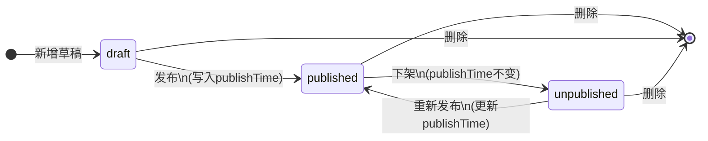
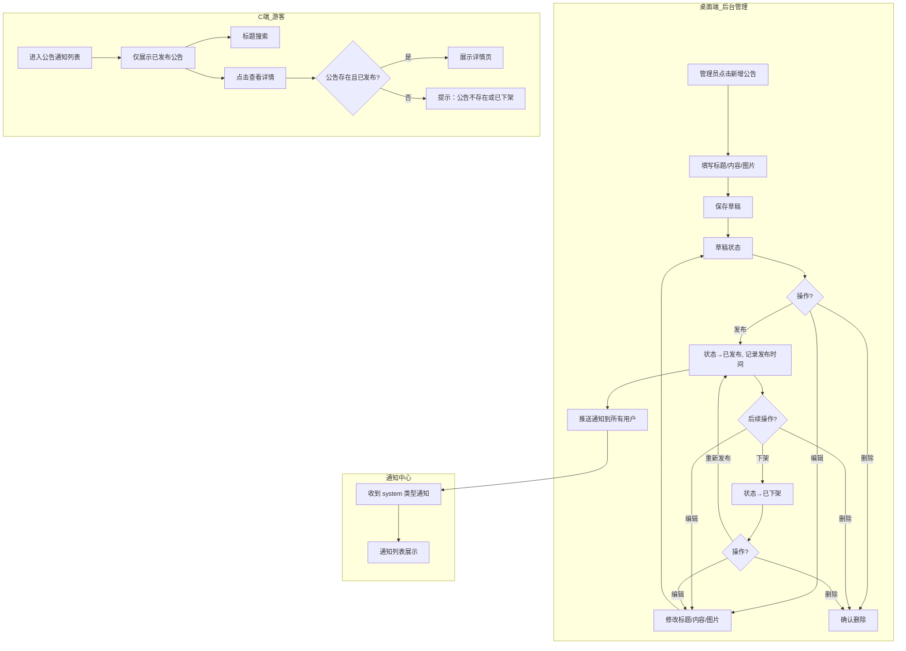

# 公告通知模块 — 产品需求文档

> **文档版本**：v1.0
> **更新日期**：2026-07-07
> **产品定位**：面向丽江古城的运营广播系统，平台管理员发布公告，C 端游客在线查看
> **关联模块**：通知中心（notification）
> **实现状态**：已完整实现 MVP，本文档基于当前代码实际实现

---

## 一、产品定位与边界

### 1.1 我们在做什么

公告通知模块是丽江古城旅游服务平台的一个轻量级运营广播工具。它的本质是 **运营人员→游客的单向信息发布通道**，用于发布古城游览安全提醒、水系清淤通知、节假日攻略、景区运营动态等。

**核心目标：**

- ✅ 平台管理员在桌面端后台创建、编辑、发布、下架、删除公告
- ✅ 公告发布后 C 端游客可在「公告通知」页面查看列表和详情
- ✅ 公告发布时自动推送到平台通知中心，所有用户收到系统通知
- ✅ 公告支持三态管理：草稿 / 已发布 / 已下架，生命周期完整

### 1.2 MVP 原则

| 优先级 | 原则 | 说明 |
|--------|------|------|
| 必须 | 公告生命周期闭环 | 新增草稿 → 发布 → 下架 → 重新发布，每一步不中断 |
| 必须 | 发布→通知推送闭环 | 发布时自动推送 system 类型通知到所有用户 |
| 必须 | 三端覆盖 | 桌面端管理、C 端查看、通知中心广播 |
| 可以简化 | 纯文本正文 | 公告正文仅支持纯文本，不支持富文本/HTML |
| 可以简化 | 固定类型 | 全部公告 type 固定为"公告"，无子类型分类 |
| 可以简化 | 无定时发布 | 不支持定时发布，仅支持「立即发布」 |
| 以后做 | 公告分类 | 应急通知、活动通知、政策通知等子类型 |
| 以后做 | 富文本编辑 | 正文支持图文混排、段落样式 |
| 以后做 | 统计功能 | 阅读量统计、用户触达率 |

### 1.3 明确不做的（MVP 边界）

- 公告定时发布（仅支持立即发布）
- 公告分类/子类型（全部固定为"公告"）
- 定向推送（仅支持全量用户广播）
- 公告阅读统计/阅读回执
- 富文本编辑器（仅支持纯文本 + 图片）
- 公告有效期设置（长期有效，不下架则不消失）
- 公告置顶/排序手动干预（按发布时间倒序固定）
- 前端分页接口（当前使用前端 useLoadMore 做本地分页，非后端分页）

---

## 二、核心用户角色

### 2.1 两类角色

| 角色 | 端 | 核心诉求 |
|------|----|----------|
| **平台管理员（platform_admin）** | 桌面端后台 | 创建公告草稿、发布、下架、编辑、删除，管理公告生命周期 |
| **C 端游客（tourist）** | C 端小程序 | 查看已发布的公告列表、搜索公告、查看公告详情 |

### 2.2 角色权限

| 操作 | 平台管理员 | C 端游客 |
|------|-----------|----------|
| 查看公告列表 | ✅（全部） | ✅（仅已发布） |
| 查看公告详情 | ✅（全部） | ✅（仅已发布） |
| 新增公告 | ✅ | — |
| 编辑公告 | ✅（任意状态） | — |
| 发布公告 | ✅（草稿→已发布，已下架→已发布） | — |
| 下架公告 | ✅（已发布→已下架） | — |
| 删除公告 | ✅（物理删除，不可恢复） | — |
| 搜索公告 | ✅（按标题） | ✅（按标题） |
| 状态筛选 | ✅（全部/已发布/已下架/草稿） | — |

---

## 三、核心业务流程

### 3.1 公告生命周期流程图



### 3.2 完整业务流程图



### 3.3 发布时间规则

| 操作 | publishTime 行为 | 说明 |
|------|-----------------|------|
| 新增草稿 | 空字符串 `""` | 未发布状态，无发布时间 |
| 首次发布（草稿→已发布） | 写入当前时间 | 开始对 C 端可见 |
| 下架（已发布→已下架） | 保持不变 | 保留历史发布时间记录 |
| 重新发布（已下架→已发布） | 更新为当前时间 | C 端看到的是最近一次发布时间 |

---

## 四、功能模块清单

### 4.1 桌面端 — 公告下发管理（P0）

| 功能 | 优先级 | 说明 | 实现状态 |
|------|--------|------|----------|
| 公告列表展示 | P0 | 表格展示所有公告，按 updatedAt 倒序 | 已实现 |
| 状态筛选 | P0 | 全部/已发布/已下架/草稿 四档筛选 | 已实现 |
| 标题搜索 | P0 | 按标题关键字搜索 | 已实现 |
| 新增公告 | P0 | 弹窗表单：标题（必填）、内容（必填）、图片（最多3张） | 已实现 |
| 编辑公告 | P0 | 任意状态下可编辑标题、内容、图片 | 已实现 |
| 发布公告 | P0 | 草稿→已发布；已下架→已发布 | 已实现 |
| 下架公告 | P0 | 已发布→已下架 | 已实现 |
| 删除公告 | P0 | 确认后物理删除，不可恢复 | 已实现 |
| 图片上传校验 | P1 | 仅支持 JPG/PNG/WebP，单张≤2MB，最多3张 | 已实现 |
| 标题/内容空值校验 | P0 | 保存时提示"请输入标题"/"请输入内容" | 已实现 |

### 4.2 C 端 — 公告列表页（P0）

| 功能 | 优先级 | 说明 | 实现状态 |
|------|--------|------|----------|
| 仅展示已发布公告 | P0 | 按 publishTime 倒序排列 | 已实现 |
| 标题搜索 | P0 | 过滤 title.includes(keyword) | 已实现 |
| 本地分页加载 | P0 | 每次加载 10 条，点击"加载更多"追加 | 已实现 |
| 列表项展示 | P0 | 左侧图片（无图📢占位）、标题、摘要60字、日期 | 已实现 |
| 空状态展示 | P0 | 无数据：暂无公告；搜索无结果：未找到相关公告 | 已实现 |
| 首页聚合展示 | P2 | 在首页「景区综合资讯」区域展示最近公告 | 未实现 |

### 4.3 C 端 — 公告详情页（P0）

| 功能 | 优先级 | 说明 | 实现状态 |
|------|--------|------|----------|
| 图片轮播 | P0 | 多图时支持触摸滑动和点击翻页，显示页码/圆点指示器 | 已实现 |
| 公告信息展示 | P0 | 标签（公告）、发布时间、标题、正文 | 已实现 |
| 返回导航 | P0 | 顶部导航栏，支持返回上一页 | 已实现 |
| 不存在态展示 | P0 | 公告不存在或已下架 → 显示提示文案 | 已实现 |
| 有图/无图双布局 | P0 | 有图时全屏轮播+浮动导航，无图时默认渐变背景 | 已实现 |

### 4.4 通知中心联动（P0）

| 功能 | 优先级 | 说明 | 实现状态 |
|------|--------|------|----------|
| 发布时推送通知 | P0 | 公告发布 → 向所有用户推送 system 类型通知 | 已实现 |
| 通知内容 | P0 | 通知标题为"新公告"，摘要为公告标题，含跳转链接 | 已实现 |

### 4.5 后端 API（P0）

| 端点 | 方法 | 说明 | 实现状态 |
|------|------|------|----------|
| `GET /api/v1/announcements` | GET | 列表查询，支持 status 筛选、title 搜索、排序、分页 | 已实现 |
| `GET /api/v1/announcements/:id` | GET | 单条查询 | 已实现 |
| `POST /api/v1/announcements` | POST | 新增公告 | 已实现 |
| `PATCH /api/v1/announcements/:id` | PATCH | 更新公告（支持修改 status、publishTime 等） | 已实现 |
| `DELETE /api/v1/announcements/:id` | DELETE | 删除公告 | 已实现 |

---

## 五、核心数据模型

### 5.1 Announcement

| 字段 | 类型 | 约束 | 说明 |
|------|------|------|------|
| id | TEXT | PRIMARY KEY | 主键，格式 `announcements_{timestamp}_{random}` 或 `ann-{index}` |
| title | TEXT | NOT NULL | 公告标题，必填 |
| content | TEXT | DEFAULT '' | 公告正文，纯文本，必填 |
| images | TEXT | DEFAULT '[]' | 图片 base64 数组，JSON 字符串存储，最多 3 张 |
| type | TEXT | DEFAULT 'system' | 当前固定为"公告" |
| publishTime | TEXT | — | 发布时间（ISO 8601）；草稿/下架态可为空或保留历史值 |
| status | TEXT | DEFAULT 'published' | 状态：`draft` / `published` / `unpublished` |
| createdAt | TEXT | NOT NULL DEFAULT datetime('now') | 创建时间，自动写入 |
| updatedAt | TEXT | NOT NULL DEFAULT datetime('now') | 更新时间，每次更新时自动刷新 |

### 5.2 TypeScript 接口定义

```typescript
interface Announcement {
  id: string
  title: string
  content: string
  images: string[]
  type: "公告"
  publishTime: string
  status: "draft" | "published" | "unpublished"
  createdAt: string
  updatedAt: string
}

interface AddAnnouncementInput {
  title: string
  content: string
  images: string[]
  type: "公告"
}
```

### 5.3 状态枚举

| 状态值 | 标签 | 说明 | 游客可见 |
|--------|------|------|----------|
| draft | 草稿 | 已创建但未发布，仅管理员可见 | 否 |
| published | 已发布 | 已发布，对 C 端游客可见 | 是 |
| unpublished | 已下架 | 已下架，对 C 端游客不可见 | 否 |

### 5.4 种子数据

4 条预置公告，全部已发布，覆盖不同图片数量场景：

| ID | 标题 | 图片数 | 场景 |
|----|------|--------|------|
| ann-1 | 古城游览安全提醒 | 1张 | 带图公告 |
| ann-2 | 古城特产对外销售备案申请通道开放 | 0张 | 纯文字公告 |
| ann-3 | 古城水系清淤维护通知 | 2张 | 多图公告 |
| ann-4 | 五一假期旅游攻略 | 3张 | 三图公告 |

### 5.5 数据存储

- 数据结构：SQLite 数据库，通过通用 CRUD 路由 `server/routes/announcements.js` 操作
- 前端状态：应用启动时通过 `src/api/hydrate.ts` 从 `GET /api/v1/announcements` 全量加载到 Zustand store（内存），无 localStorage 持久化
- 种子数据：4 条预置公告（`server/db/seed.js`），均在启动时写入数据库

---

## 六、验收标准

### 6.1 桌面端管理功能验收

| 编号 | 验收项 | 预期结果 | 当前状态 |
|------|--------|----------|----------|
| A-01 | 新增公告：填写标题、内容、上传图片，点击保存 | 保存成功，列表中出现一条"草稿"状态公告 | ✅ 通过 |
| A-02 | 新增公告：标题为空，点击保存 | 提示"请输入标题"，不保存 | ✅ 通过 |
| A-03 | 新增公告：内容为空，点击保存 | 提示"请输入内容"，不保存 | ✅ 通过 |
| A-04 | 编辑公告：修改标题、内容、图片，点击保存 | 更新成功，updatedAt 刷新 | ✅ 通过 |
| A-05 | 发布公告：草稿→发布 | 状态变为"已发布"，publishTime 写入当前时间 | ✅ 通过 |
| A-06 | 发布公告：已下架→发布 | 状态变为"已发布"，publishTime 更新为当前时间 | ✅ 通过 |
| A-07 | 下架公告：已发布→下架 | 状态变为"已下架"，publishTime 保持不变 | ✅ 通过 |
| A-08 | 删除公告：点击删除，确认弹窗 | 确认后公告从列表消失，不可恢复 | ✅ 通过 |
| A-09 | 状态筛选：全部/已发布/已下架/草稿 | 筛选正确 | ✅ 通过 |
| A-10 | 标题搜索：输入关键字 | 仅展示标题包含关键字的公告 | ✅ 通过 |
| A-11 | 图片上传：格式非 JPG/PNG/WebP | 提示"仅支持 JPG、PNG、WebP 格式" | ✅ 通过 |
| A-12 | 图片上传：单张超过 2MB | 提示"图片大小不能超过 2MB" | ✅ 通过 |
| A-13 | 图片上传：已上传3张，上传按钮 | 上传按钮自动隐藏，不可再上传 | ✅ 通过 |
| A-14 | 图片删除：点击图片右上角 X | 图片从列表中移除 | ✅ 通过 |

### 6.2 C 端列表页验收

| 编号 | 验收项 | 预期结果 | 当前状态 |
|------|--------|----------|----------|
| B-01 | 进入公告通知页 | 展示所有已发布公告，按发布时间倒序 | ✅ 通过 |
| B-02 | 列表项展示 | 左侧图片/占位符、标题、摘要、日期 | ✅ 通过 |
| B-03 | 搜索公告 | 仅展示标题匹配的公告 | ✅ 通过 |
| B-04 | 搜索无结果 | 显示"未找到相关公告" | ✅ 通过 |
| B-05 | 无数据 | 显示"暂无公告" | ✅ 通过 |
| B-06 | 点击加载更多 | 追加 10 条 | ✅ 通过 |
| B-07 | 草稿/已下架公告 | 不在列表中展示 | ✅ 通过 |

### 6.3 C 端详情页验收

| 编号 | 验收项 | 预期结果 | 当前状态 |
|------|--------|----------|----------|
| C-01 | 查看公告详情 | 展示图片轮播、标签、发布时间、标题、正文 | ✅ 通过 |
| C-02 | 多图轮播：触摸滑动 | 支持左右滑动切换图片 | ✅ 通过 |
| C-03 | 多图轮播：点击翻页 | 左右区域点击可切换 | ✅ 通过 |
| C-04 | 多图轮播：页码/圆点指示器 | 正确显示当前图片位置 | ✅ 通过 |
| C-05 | 无图公告 | 显示默认渐变背景，不展示轮播组件 | ✅ 通过 |
| C-06 | 公告不存在或已下架 | 显示"公告不存在或已下架" | ✅ 通过 |
| C-07 | 返回导航 | 点击返回按钮回到上一页 | ✅ 通过 |

### 6.4 通知中心联动验收

| 编号 | 验收项 | 预期结果 | 当前状态 |
|------|--------|----------|----------|
| D-01 | 发布公告后通知推送 | 通知中心收到一条 system 类型通知，标题为"新公告"，摘要为公告标题 | ✅ 通过 |
| D-02 | 通知点击跳转 | 点击通知跳转到公告详情页 `/c/announcement/:id` | ✅ 通过 |

### 6.5 后端 API 验收

| 编号 | 验收项 | 预期结果 | 当前状态 |
|------|--------|----------|----------|
| E-01 | GET /api/v1/announcements | 返回公告列表，支持 status 筛选、search 搜索、sort 排序 | ✅ 通过 |
| E-02 | GET /api/v1/announcements/:id | 返回单条公告 | ✅ 通过 |
| E-03 | POST /api/v1/announcements | 新增公告，返回完整对象 | ✅ 通过 |
| E-04 | PATCH /api/v1/announcements/:id | 更新公告字段 | ✅ 通过 |
| E-05 | DELETE /api/v1/announcements/:id | 删除公告，返回成功 | ✅ 通过 |

### 6.6 已知缺陷 / 未实现功能

| 编号 | 缺陷说明 | 影响 | 优先级 |
|------|----------|------|--------|
| F-01 | 公告正文无字数限制，C 端预览用 `content.slice(0, 60)` 截断 | 极端长文本截断可能不自然 | P2 |
| F-02 | 无公告分类，全部为 type: "公告" | 无法区分紧急通知、活动通知 | P2 |
| F-03 | 无定时发布功能 | 仅支持立即发布 | P3 |
| F-04 | 无公告阅读统计 | 无法知道公告触达率 | P3 |
| F-05 | 无公告有效期设置 | 公告长期有效，需手动下架 | P3 |
| F-06 | 已发布公告可直接编辑 | 未限制已发布公告需先下架再编辑（设计上允许直接编辑） | 设计决策 |
| F-07 | 后端无分页（全量返回由前端 useLoadMore 分页） | 数据量大时传输效率低 | P2 |
| F-08 | 首页「景区综合资讯」区域聚合展示未实现 | 公告仅在独立列表页展示，未在首页信息流中展示 | P2 |

---

## 七、附录

### 7.1 页面路径

| 页面 | 路由 | 端 | 组件 |
|------|------|----|------|
| 公告下发管理 | `/desktop/announcement-manage` | 桌面端 | `AnnouncementManagePage` |
| 公告通知列表 | `/c/notice` | C 端 | `AnnouncementPage` |
| 公告详情 | `/c/announcement/:id` | C 端 | `AnnouncementDetailPage` |

### 7.2 文件结构

```
src/features/announcement/
├── c-end/pages/
│   ├── AnnouncementPage.tsx          # C 端公告列表页
│   └── AnnouncementDetailPage.tsx    # C 端公告详情页
├── store/
│   ├── index.ts                      # barrel 导出
│   └── announcement-store.ts         # Zustand store（CRUD + 状态管理）
└── shared/                           # （无跨端共享类型，类型在 store 中内联定义）

src/desktop/pages/gates/
└── AnnouncementManagePage.tsx        # 桌面端公告管理页

server/routes/
└── announcements.js                  # 后端路由（基于通用 crudRoutes）
```

### 7.3 依赖关系

- **通知中心（notification）**：发布公告时推送 system 类型通知（`useNotificationStore.addNotification`）
- **通用 CRUD 路由（crud.js）**：后端增删改查基于 `crudRoutes("announcements")` 自动生成
- **useLoadMore**：前端列表页本地分页使用 `shared/hooks/useLoadMore`
- **桌面端导航**：菜单项 `announcement-manage` 配置在 `src/desktop/nav.ts`，权限码 `content`