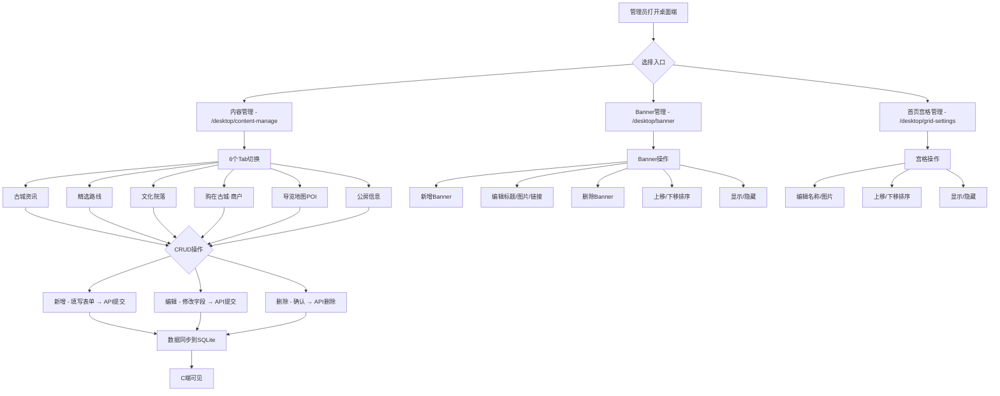
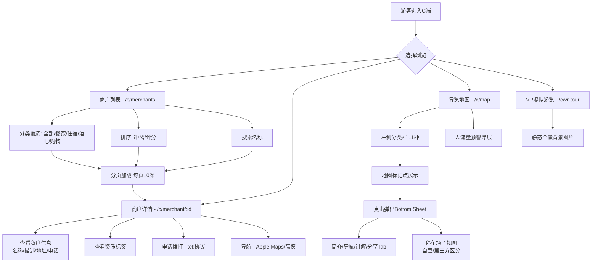

# 内容管理平台 v1.0 产品需求文档

> **文档版本**：v1.0
> **更新日期**：2026-07-07
> **产品定位**：丽江古城旅游服务平台「内容」功能域，基于实际代码实现编写
> **配套文档**：`docs/superpowers/specs/003-content.md`（功能规格）
> **关联功能**：homepage（Banner/宫格）、housing、merchant-review

---

## 一、产品定位与边界

### 1.1 产品定位

内容管理是丽江古城旅游服务平台的信息底座，为C端游客提供商户信息展示、导览地图、VR虚拟游览等消费场景，同时为平台管理员提供内容数据的增删改查和首页配置能力。

**核心原则**：本模块是**信息展示平台**，不做在线交易。商户展示能力帮助游客发现"古城有什么店、在哪、有什么特色"。

### 1.2 边界与依赖

| 功能域 | 关系 | 说明 |
|---|---|---|
| **homepage** | 上游 | BannerManagePage（桌面端 `/desktop/banner`）和 GridSettingsPage（`/desktop/grid-settings`）属于 homepage 功能域，但导航菜单归在 content 权限下 |
| **housing** | 共享 | 公房信息 CRUD 路由挂载在 `/api/v1/content/housing`，Server 端统一管理；但前端 store 和 C 端页面独立为 `features/housing/` |
| **merchant-review** | 消费 | 商户认领/信息变更使用 content 的 Merchant 数据模型 |
| **flow-warning** | 消费 | 导览地图 MapPage 展示人流量预警数据 |
| **booking** | 消费 | 院落 POI 预约使用 content 管理的 POI 数据 |

### 1.3 明确不做的（v1.0 边界）

- ❌ B 端商户自主管理内容（商户信息变更走 merchant-review 审核流程）
- ❌ VR 全景/360度全景游览（VRTourPage 保持静态占位图片）
- ❌ 导览地图实时位置追踪（仅展示静态 POI 标记和用户大致位置）
- ❌ 内容审核工作流（新增内容直接发布，无审核环节）
- ❌ 内容多语言（中英文对照）
- ❌ 内容版本管理/历史记录
- ❌ 商户入驻自助注册（走 merchant-review 功能域）
- ❌ 百度/高德地图 SDK 集成（当前无第三方地图SDK）

---

## 二、核心用户角色

| 角色 | 端 | 核心诉求 |
|---|---|---|
| **C 端游客（tourist）** | 手机小程序 | 浏览古城商户列表/详情、查看导览地图标记点、VR虚拟游览 |
| **平台管理员（platform_admin）** | 桌面端后台 | 管理全部内容类型的增删改查、配置首页 Banner/宫格 |

---

## 三、核心业务流程

### 3.1 内容管理主流程（管理员视角）



### 3.2 C 端消费流程



---

## 四、功能模块清单

### 4.1 P0 — 核心功能（已实现）

#### C端游客功能

| 模块 | 功能 | 页面 | 实现细节 |
|---|---|---|---|
| 商户列表 | 分类筛选（全部/餐饮/住宿/酒吧/购物） | `MerchantListPage` | 顶部 Tab 切换，对应 `MerchantCategory` 类型 |
| 商户列表 | 距离排序 | `MerchantListPage` | 基于 `navigator.geolocation` 获取位置，Haversine 公式计算距离，降序排列 |
| 商户列表 | 评分排序 | `MerchantListPage` | 按 `rating` 字段降序 |
| 商户列表 | 关键词搜索 | `MerchantListPage` | `useSearch` Hook，按 `name.includes(query)` 过滤 |
| 商户列表 | 分页加载 | `MerchantListPage` | `useLoadMore`，每页 10 条 |
| 商户列表 | 附近模式 | `MerchantListPage` | 路由参数 `?nearby=1` 控制标题和文案 |
| 商户详情 | 信息展示 | `MerchantDetailPage` | 封面/名称/描述/地址/电话 |
| 商户详情 | 资质展示 | `MerchantDetailPage` | 3 个静态资质徽章（实名认证/诚信商户/品质保证） |
| 商户详情 | 电话拨打 | `MerchantDetailPage` | `window.open("tel:" + phone)` |
| 商户详情 | 导航跳转 | `MerchantDetailPage` | 有坐标时跳 Apple Maps，否则按地址/古城中心跳转 |
| 导览地图 | 分类切换（11种） | `MapPage` | 左侧62px宽分类面板，含景点/院落/服务/停车/洗手台/厕所/应急避难/餐饮/住宿/酒吧/出入口 |
| 导览地图 | 地图标记点 | `MapPage` | 15 个硬编码 pin 对象，基于 Unsplash 图片 |
| 导览地图 | 停车场子视图 | `MapPage` | 切换至"停车"分类后展示自营（蓝色）/第三方（橙色）区分 |
| 导览地图 | 底部详情 Sheet | `MapPage` | 4 个 Tab：简介/导航/讲解/分享 |
| 导览地图 | 人流量预警 | `MapPage` | 联动 `flow-warning` store，浮层展示各区域人流百分比 |
| VR虚拟游览 | 静态全景图 | `VRTourPage` | 导入 VR.png 静态图片全屏展示 |

#### 桌面端管理功能

| 模块 | 页面 | 功能 | 实现细节 |
|---|---|---|---|
| 内容管理总页 | `ContentManagePage` | 6 个 Tab 切换 | 资讯/路线/院落/商户/POI/公房 |
| 古城资讯 | `NewsManageContent` | 增删改查 + 搜索 + 分页 | 字段：标题/分类/标签/日期/摘要/图片URL |
| 精选路线 | `RouteManageContent` | 增删改查 + 搜索 + 分页 | 字段：名称/时长/距离/途经点/封面/简介 |
| 文化院落 | `CourtyardManageContent` | 增删改查 + 搜索 + 分页 | 字段：名称/位置/开放时间/简介/图片URL |
| 商户管理 | `MerchantManageContent` | 增删改查 + 搜索 + 分页 | 字段：名称/分类/地址/电话/描述 |
| 导览POI | `POIManageContent` | 增删改查 + 搜索 + 分页 | 字段：名称/分类/地址/经纬度 |
| 公房管理 | `HousingManageContent` | 增删改查 + 搜索 + 分页 | 字段：名称/地址/状态/区域/附加信息 |
| Banner管理 | `BannerManagePage` | 增删改查 + 排序 + 显隐 | 最多 5 个，支持图片上传（JPG/PNG/WebP ≤2MB） |
| 宫格管理 | `GridSettingsPage` | 编辑名称/图片 + 排序 + 显隐 | 自动分页（每页 8 个），最多 3 页 |

### 4.2 P1 — 重要但未实现

| 模块 | 功能 | 现状 |
|---|---|---|
| 商户管理 | Claim状态标注、审核状态展示 | `claimStatus`/`reviewStatus`/`source` 字段仅在前端类型定义，DB schema 和桌面端表单未包含 |
| 商户详情 | 诚信分/评分展示 | `creditScore`/`reviewCount` 字段仅在前端类型定义 |
| 内容管理 | store 初始化加载 | 5 个 store 全部初始化为空数组，无 fetch/load 方法，页面刷新后数据丢失 |
| 导览地图 | 动态 POI 数据驱动 | MapPage 15 个标记点为硬编码，未从 POI store 加载 |
| 资讯 | 富文本内容编辑 | `body` 字段支持 JSON 内容块，但桌面端表单未包含 |
| 路线 | 途经点详情编辑 | `spots`/`contentBlocks` 字段支持完整途经点数据，表单仅包含简单字段 |

### 4.3 P2 — 远期规划

| 模块 | 功能 | 说明 |
|---|---|---|
| VR全景 | 360度全景容器 | 当前仅为静态图片占位 |
| 导览地图 | Leaflet/OSM 动态地图 | spec 指定 Leaflet+OSM，当前为静态背景图 |
| 导览地图 | 百度/高德 SDK 集成 | 当前无第三方地图SDK |
| 浏览器导航 | 实时位置追踪 | 当前跳转第三方地图 App |
| 内容管理 | 图片上传组件 | 当前仅支持手动输入 URL |
| 内容管理 | 批量删除/导入 | 无批量操作能力 |
| 宫格管理 | 新增/删除宫格项 | 当前仅支持编辑/排序/显隐 |
| 商户管理 | 种子数据 | 无预设商户数据（不同于 convenience 的 seed.ts） |

---

## 五、核心数据模型

### 5.1 内容类型总览

| 类型 | DB 表 | 前端 Store | 路由前缀 |
|---|---|---|---|
| 古城资讯 | `content_news` | `useContentNewsStore` | `/api/v1/content/news` |
| 精选路线 | `content_routes` | `useContentGuideStore` | `/api/v1/content/routes` |
| 文化院落 | `content_courtyards` | `useContentCourtyardStore` | `/api/v1/content/courtyards` |
| 古城商户 | `content_merchants` | `useContentMerchantStore` | `/api/v1/content/merchants` |
| 导览POI | `content_pois` | `useContentPOIStore` | `/api/v1/content/pois` |
| 公房信息 | `content_housing` | `useHousingStore` | `/api/v1/content/housing` |

### 5.2 商户（content_merchants）

| 字段 | 类型 | DB 实现 | 前端类型 |
|---|---|---|---|
| id | TEXT PK | ✅ | ✅ |
| name | TEXT NOT NULL | ✅ | ✅ |
| category | TEXT（餐饮/客栈/购物/文化/酒吧） | ✅ | ✅（food/hotel/bar/shopping + culture 映射） |
| address | TEXT | ✅ | ✅ |
| phone | TEXT | ✅ | ✅ |
| description | TEXT | ✅ | ✅ |
| cover | TEXT | ✅ | ✅ |
| hours | TEXT | ✅ | ✅ |
| logo | TEXT | ✅ | ✅ |
| images | TEXT(JSON) | ✅ | ❌（前端用 gallery: string[]） |
| lat | REAL | ✅ | ✅ |
| lng | REAL | ✅ | ✅ |
| rating | REAL | ✅ | ✅ |
| source | - | ❌ | ✅ 前端类型有 |
| reviewStatus | - | ❌ | ✅ 前端类型有（通过/不通过/待审核） |
| creditScore | - | ❌ | ✅ 前端类型有 |
| claimStatus | - | ❌ | ✅ 前端类型有（unclaimed/pending/claimed） |
| reviewCount | - | ❌ | ✅ 前端类型有 |
| openYear | - | ❌ | ✅ 前端类型有 |
| certificates | - | ❌ | ✅ 前端类型有 |
| gallery | - | ❌ | ✅ 前端类型有 |
| publishedAt | - | ❌ | ✅ 前端类型有 |

> **重要**：`source`/`reviewStatus`/`claimStatus`/`creditScore`/`certificates`/`gallery`/`reviewCount`/`openYear`/`publishedAt` 等字段**仅存在于前端 TypeScript 类型定义**（`content-types.ts`），Server 端 `content_merchants` 表不包含这些列。使用时需扩展 schema。

### 5.3 POI（content_pois）

| 字段 | 类型 | 说明 |
|---|---|---|
| id | TEXT PK | 主键 |
| name | TEXT NOT NULL | 点位名称 |
| category | TEXT | 分类（scenic_spot/facility/service/other） |
| address | TEXT | 地址 |
| lat | REAL NOT NULL | 纬度 |
| lng | REAL NOT NULL | 经度 |
| imageUrl | TEXT | 图片 URL |
| phone | TEXT | 电话 |
| hours | TEXT | 开放时间 |
| description | TEXT | 描述 |

### 5.4 资讯（content_news）

| 字段 | 类型 | 说明 |
|---|---|---|
| id | TEXT PK | 主键 |
| title | TEXT NOT NULL | 标题 |
| summary | TEXT | 摘要 |
| category | TEXT | 分类（公房公告/房屋信息/举贤纳仕/其它） |
| tag | TEXT | 标签文本 |
| tagColor | TEXT | 标签颜色 |
| imageUrl | TEXT | 图片 URL |
| date | TEXT | 日期 |
| heroTitle | TEXT | 头图标题 |
| body | TEXT(JSON) | 正文内容块数组 |
| subImage | TEXT | 配图 |

### 5.5 路线（content_routes）

| 字段 | 类型 | 说明 |
|---|---|---|
| id | TEXT PK | 主键 |
| name | TEXT NOT NULL | 路线名称 |
| tags | TEXT(JSON) | 标签数组 |
| duration | TEXT | 时长 |
| difficulty | TEXT | 难度（默认"中等"） |
| stops | INTEGER | 途经点数量 |
| distance | TEXT | 距离 |
| spotNames | TEXT(JSON) | 途经点名数组 |
| description | TEXT | 描述 |
| cover | TEXT | 封面图 |
| spots | TEXT(JSON) | 途经点详情数组 |
| hasVideo | INTEGER | 是否有视频 |
| videoUrl | TEXT | 视频 URL |
| contentBlocks | TEXT(JSON) | 富文本内容块数组 |

### 5.6 院落（content_courtyards）

| 字段 | 类型 | 说明 |
|---|---|---|
| id | TEXT PK | 主键 |
| name | TEXT NOT NULL | 院落名称 |
| description | TEXT | 描述 |
| location | TEXT | 位置 |
| hours | TEXT | 开放时间 |
| imageUrl | TEXT | 图片 URL |
| phone | TEXT | 电话 |
| lat | REAL | 纬度 |
| lng | REAL | 经度 |
| gallery | TEXT(JSON) | 图库 |
| contentBlocks | TEXT(JSON) | 内容块 |

### 5.7 Banner（banners）

| 字段 | 类型 | 说明 |
|---|---|---|
| id | TEXT PK | 主键 |
| imageUrl | TEXT NOT NULL | 图片 URL |
| title | TEXT | 标题 |
| subtitle | TEXT | 副标题 |
| badge | TEXT | 徽章 |
| link | TEXT | 跳转链接 |
| scene | TEXT | 场景（home/shop） |
| visible | INTEGER | 是否可见 |
| order | INTEGER | 排序号 |

### 5.8 宫格（grid_items）

| 字段 | 类型 | 说明 |
|---|---|---|
| id | TEXT PK | 主键 |
| imageUrl | TEXT | 图片 URL |
| label | TEXT NOT NULL | 名称 |
| route | TEXT | 跳转路由 |
| search | TEXT | 搜索关键字 |
| page | INTEGER | 分页码 |
| visible | INTEGER | 是否可见 |
| order | INTEGER | 排序号 |

---

## 六、验收标准

### 6.1 C端功能验收

| # | 验收项 | 预期结果 | 状态 |
|---|---|---|---|
| AC-01 | 商户列表分类筛选 | 全部/餐饮/住宿/酒吧/购物 五类切换，数据正确过滤 | ✅ |
| AC-02 | 商户列表距离排序 | 开启定位后按 Haversine 距离升序排列 | ✅ |
| AC-03 | 商户列表评分排序 | 按 rating 字段降序排列 | ✅ |
| AC-04 | 商户列表搜索 | 输入关键词按名称实时过滤 | ✅ |
| AC-05 | 商户列表分页 | 每页10条，"加载更多"按钮工作 | ✅ |
| AC-06 | 商户列表附近模式 | `?nearby=1` 参数切换标题为"附近" | ✅ |
| AC-07 | 商户详情展示 | 封面/名称/描述/地址/电话/资质徽章 | ✅ |
| AC-08 | 商户电话拨打 | 点击电话按钮唤起 `tel:` 协议 | ✅ |
| AC-09 | 商户导航 | 有坐标跳 Apple Maps，无坐标跳地址搜索 | ✅ |
| AC-10 | 导览地图分类 | 11 种分类侧边栏切换正常 | ✅ |
| AC-11 | 导览地图标记点 | 15 个硬编码 pin 按分类过滤展示 | ✅ |
| AC-12 | 导览地图停车场 | 停车分类显示自营/第三方区分和图例 | ✅ |
| AC-13 | 导览地图底部Sheet | 点击 pin 弹起详情，4 Tab（简介/导航/讲解/分享） | ✅ |
| AC-14 | 导览地图人流量联动 | 浮层展示各区域人流百分比 | ✅ |
| AC-15 | VR虚拟游览 | 展示静态全景图片 | ✅ |

### 6.2 桌面端功能验收

| # | 验收项 | 预期结果 | 状态 |
|---|---|---|---|
| AC-16 | 内容管理总页 | 6 个 Tab 切换正常 | ✅ |
| AC-17 | 资讯 CRUD | 新增/编辑/删除资讯，搜索标题，分页 | ✅ |
| AC-18 | 路线 CRUD | 新增/编辑/删除路线 | ✅ |
| AC-19 | 院落 CRUD | 新增/编辑/删除院落 | ✅ |
| AC-20 | 商户 CRUD | 新增/编辑/删除商户 | ✅ |
| AC-21 | POI CRUD | 新增/编辑/删除 POI | ✅ |
| AC-22 | 公房 CRUD | 新增/编辑/删除公房 | ✅ |
| AC-23 | Banner 管理 | 新增/编辑/删除/排序/显隐，最多5个 | ✅ |
| AC-24 | Banner 图片上传 | JPG/PNG/WebP格式，≤2MB，base64存储 | ✅ |
| AC-25 | 宫格管理 | 编辑名称/图片/排序/显隐 | ✅ |
| AC-26 | 宫格自动分页 | 每 8 个一页，最多 3 页 | ✅ |

### 6.3 数据同步验收

| # | 验收项 | 预期结果 | 状态 |
|---|---|---|---|
| AC-27 | 数据持久化 | 所有CRUD通过API同步到SQLite | ✅ |
| AC-28 | 搜索功能 | 按 name 字段模糊搜索（LIKE %query%） | ✅ |
| AC-29 | POI 分类过滤 | 支持 `?category=` 参数按分类筛选 | ✅ |

### 6.4 已知差距与未实现项

| # | 问题 | 影响 | 建议 |
|---|---|---|---|
| GAP-01 | 5 个 content store 全部初始化为空数组，无 fetch/load 方法 | 页面刷新后数据清空，无法从 Server 恢复 | 每个 store 添加 fetch/load 方法，在页面挂载时调用 `contentApi.xxx.list()` |
| GAP-02 | MapPage 使用 15 个硬编码 pin 对象，而非 POI store 数据 | 导览地图 POI 无法通过后台管理动态更新 | 将 MapPage 标记点数据迁移至从 POI store 动态加载 |
| GAP-03 | 商户表（content_merchants）缺少前端 Merchant 类型中的多个字段 | `source`/`reviewStatus`/`claimStatus`/`creditScore`/`gallery`/`certificates`/`openYear` 等字段仅在前端类型定义 | 若商户认领/审核流程需要，扩展 schema |
| GAP-04 | 无内容种子数据 | 首次启动后内容表为空，C端无数据展示 | 在 `server/db/seed.js` 中添加每种内容类型 2-5 条示例数据 |
| GAP-05 | VRTourPage 仅为单张静态背景图 | 与"VR"命名不符 | MVP 阶段保持占位，添加"功能开发中"标注 |
| GAP-06 | 导览地图讲解 Tab 为静态占位 | 无真实语音文件 | 后续集成语音导览 |
| GAP-07 | 导览地图分享 Tab 为静态占位 | 按钮无真实分享逻辑 | 集成 Web Share API |
| GAP-08 | BannerManagePage/GridSettingsPage 引用 homepage store | 跨 feature 引用（content → homepage）违反架构约束 | 记录为例外，后续可将 homepage store 提升至 platform/ |

---

## 附录：技术实现概要

### 文件结构

```
features/content/                    feature 核心
├── store/                           zustand store（5个模块）
│   ├── index.ts                     barrel export
│   ├── merchant-store.ts            商户 CRUD
│   ├── poi-store.ts                 POI + 停车场 CRUD
│   ├── courtyard-store.ts           院落 CRUD
│   ├── guide-store.ts               路线 CRUD
│   └── news-store.ts                资讯 CRUD
└── c-end/pages/                     C 端页面
    ├── MerchantListPage.tsx          商户列表
    ├── MerchantDetailPage.tsx        商户详情
    ├── MapPage.tsx                   导览地图
    └── VRTourPage.tsx               VR 游览

desktop/pages/gates/                 桌面端内容管理
├── ContentManagePage.tsx             内容管理总页（6 Tab）
├── BannerManagePage.tsx              Banner管理（依赖 homepage store）
├── GridSettingsPage.tsx              宫格管理（依赖 homepage store）
└── content/                          各 Tab 管理子组件
    ├── NewsManageContent.tsx
    ├── RouteManageContent.tsx
    ├── CourtyardManageContent.tsx
    ├── MerchantManageContent.tsx
    ├── POIManageContent.tsx
    └── HousingManageContent.tsx（依赖 features/housing store）
```

### API 接口

所有内容接口通过通用 `crudRoutes` 生成，挂载于 `/api/v1/content/`，注册于 `server/routes/content.js`：

| 路径 | 方法 | 说明 |
|---|---|---|
| `/api/v1/content/news` | GET | 列表（支持 `?search=`、`?sort=`、?page=、?pageSize=） |
| `/api/v1/content/news/:id` | GET/PATCH/DELETE | 单条操作 |
| 其余 5 类（routes/courtyards/merchants/pois/housing）同上模式 | | |
| `/api/v1/content/pois` | GET | 额外支持 `?category=` 过滤 |
| `/api/v1/banners` | - | 通过 homepage 路由注册 |
| `/api/v1/grid-items` | - | 通过 homepage 路由注册 |

### 路由对照

| 端 | 页面 | 路由 | 导航菜单 |
|---|---|---|---|
| C | 商户列表 | `/c/merchants` | 首页 > 购在古城宫格 |
| C | 商户详情 | `/c/merchant/:id` | 商户列表点击进入 |
| C | 导览地图 | `/c/map` | 首页 > 导览地图宫格 |
| C | VR游览 | `/c/vr-tour` | 首页 > VR游览宫格 |
| 桌面端 | 内容管理 | `/desktop/content-manage` | 运营管理 > 内容管理 |
| 桌面端 | Banner管理 | `/desktop/banner` | 运营管理 > Banner管理 |
| 桌面端 | 宫格管理 | `/desktop/grid-settings` | 运营管理 > 首页宫格管理 |

### Store 模式

所有 5 个 content store 遵循同一模式：
- **存储层**：Zustand + `syncAction` 封装
- **数据源**：初始化为空数组（`[]`），需调用 API 手动加载
- **操作**：CRUD 各自调用 `contentApi.xxx.create/update/remove`，成功后乐观更新本地状态
- **同步**：通过 `syncAction` 保证 API 请求按顺序执行，失败时自动重试

### 导航注册

桌面端导航注册在 `desktop/nav.ts`，相关条目全部标记 `permissionCode: "content"`，受权限系统过滤：
- `content-manage` → 内容管理
- `banner` → Banner管理
- `grid-settings` → 首页宫格管理
- `photo-records` → 文化院落打卡记录
- `point-rules` → 积分规则配置
- `volunteer` → 志愿服务
- `announcement-manage` → 公告管理
- `ai-knowledge` → AI 知识库管理