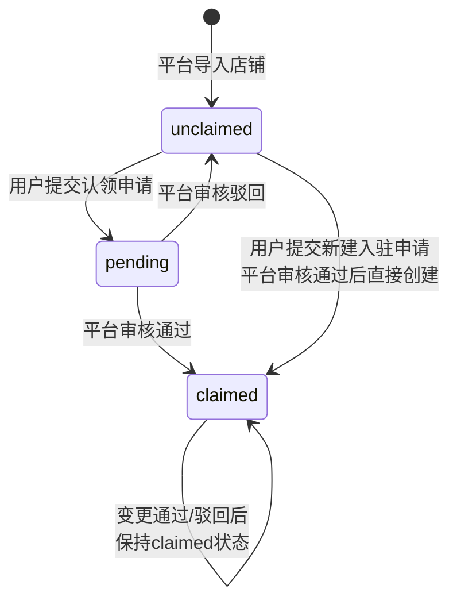

# 古城商户审核 — 产品需求文档

> **文档版本:** v1.0
> **上次更新:** 2026-07-07
> **关联代码路径:** `src/features/merchant-review/`
> **后端路径:** `server/routes/` (通用 CRUD) + `server/db/schema.sql`

---

## 1. 产品定位与边界

### 1.1 产品定位

古城商户审核是丽江古城游平台中**商户身份认证与信息管理**的核心子系统。它解决的是：

> **"丽江古城里的实体店铺，谁来认领、谁来管理、平台如何背书"** 的完整闭环。

商户审核系统提供以下能力：

- **店铺认领** — 已有店铺的经营者可认领自己的店铺，绑定管理员身份
- **新建入驻** — 新商户可提交店铺信息，平台审核后入库
- **信息变更** — 已认证商户可修改店铺信息，每次修改需平台审核
- **平台审核** — 管理员在桌面端统一审核认领、入驻、变更三类申请

### 1.2 业务边界

本系统**不包含**以下功能（它们是独立的子系统）：

| 功能 | 所属 Feature | 说明 |
|------|------------|------|
| 线上商城供应商入驻 | `features/supplier/` | 供应商为平台商城提供商品/服务的资质认证 |
| 便民服务人员入驻 | `features/convenience/` | 保洁/维修等便民服务人员的入驻审核 |
| 购在古城（商品陈列） | `features/content/` | 游客端浏览古城商户列表和详情 |

### 1.3 角色身份关系

同一个用户可以是多种身份的叠加：

```
用户账户
├── 普通游客 (role: tourist)       ← 可浏览店铺
├── 古城商户 (role: supplier)      ← 认领/入驻审核通过后获得，可管理店铺
└── 线上商城供应商 (role: supplier) ← 供应商入驻审核通过后获得，可上架商品
```

---

## 2. 核心用户角色

| 角色 | 展示名 | 操作端 | 核心诉求 |
|------|--------|--------|---------|
| 普通游客 | 游客 | C端 | 浏览古城店铺信息 |
| 待认证商户 | 候选人 | C端 | 认领已有店铺 / 提交新店铺入驻 |
| 已认证商户 | 商户 | C端 | 管理自己认领的店铺信息，提交信息变更 |
| 平台管理员 | 管理员 | 桌面端 | 审核认领/入驻/变更申请，管控商户信息准确性 |

---

## 3. 核心业务流程

### 3.1 整体流程

```mermaid
graph TD
    A[游客/C端用户] --> B{已在古城拥有实体店?}
    B -->|是| C[认领已有店铺]
    B -->|否| D[新建店铺入驻]

    C --> C1[搜索已有店铺]
    C1 --> C2[填写认领信息: 联系人+电话]
    C2 --> C3[提交认领申请]
    C3 --> C4[平台管理员审核]
    C4 -->|通过| C5[店铺绑定商户身份<br/>用户获得 supplier 角色]
    C4 -->|驳回| C6[通知申请人驳回原因]

    D --> D1[填写店铺信息: 店名/类型/地址等]
    D1 --> D2[提交入驻申请]
    D2 --> D3[平台管理员审核]
    D3 -->|通过| D4[创建新商家记录<br/>绑定商户身份<br/>用户获得 supplier 角色]
    D3 -->|驳回| D5[通知申请人驳回原因]

    C5 --> E[已认证商户]
    D4 --> E

    E --> F[在"我的店铺"管理信息]
    F --> G[修改营业时间/电话/简介]
    G --> H[提交信息变更审核]
    H --> I[平台管理员审核]
    I -->|通过| J[变更生效<br/>更新商家信息]
    I -->|驳回| K[通知商户驳回原因]
```

### 3.2 店铺认领状态机



### 3.3 通知闭环

审核流程的每个关键节点均触发系统通知推送给申请人：

| 触发点 | 通知标题 | 通知内容 |
|--------|---------|---------|
| 认领审核通过 | 店铺认领审核通过 | 您的店铺「xxx」已审核通过，您现在可以管理店铺信息了。 |
| 认领审核驳回 | 店铺认领审核未通过 | 您的申请未通过。原因：xxx。 |
| 入驻审核通过 | 店铺认领审核通过 | 您的店铺「xxx」已审核通过，您现在可以管理店铺信息了。 |
| 入驻审核驳回 | 店铺认领审核未通过 | 您的申请未通过。原因：xxx。 |
| 信息变更通过 | 店铺信息变更已通过 | 您提交的「xxx」信息变更已审核通过。 |
| 信息变更驳回 | 店铺信息变更未通过 | 「xxx」的信息变更未通过。原因：xxx。 |

---

## 4. 功能模块清单

### 4.1 优先级说明

- **P0** — 核心流程必须完整，缺失则无法上线
- **P1** — 重要体验优化，建议在上线前完成
- **P2** — 增值功能，可在后续迭代中加入

### 4.2 C端 — 商户端功能

| 编号 | 模块 | 功能点 | 优先级 | 状态 |
|------|------|-------|--------|------|
| C-01 | 商户服务入口页 | 展示商户相关服务入口（入驻/认领入口、我的店铺、便民服务、供应商入驻、投诉等） | P0 | ✅ 已实现 |
| C-02 | C-01 细分 | 已认证商户身份提示（绿色标识"已验证商户身份"） | P0 | ✅ 已实现 |
| C-03 | 认领/入驻统一入口 | 搜索已有店铺（支持按名称/地址搜索） | P0 | ✅ 已实现 |
| C-04 | 认领/入驻统一入口 | 展示可认领店铺列表（仅展示 claimStatus !== "claimed" 的店铺） | P0 | ✅ 已实现 |
| C-05 | 认领/入驻统一入口 | 认领已有店铺流程（填写联系人、联系电话 -> 提交） | P0 | ✅ 已实现 |
| C-06 | 认领/入驻统一入口 | 新建店铺入驻流程（填写店名/类型/地址/电话/营业时间/简介 -> 提交） | P0 | ✅ 已实现 |
| C-07 | 认领/入驻统一入口 | 经营类型选择（餐饮/住宿/酒吧/购物） | P0 | ✅ 已实现 |
| C-08 | 认领/入驻统一入口 | 提交成功页（提示 1-3 个工作日审核） | P0 | ✅ 已实现 |
| C-09 | 认领/入驻统一入口 | 表单客户端校验（必填项 + 手机号格式） | P0 | ✅ 已实现 |
| C-10 | 我的店铺 | 非商户身份展示入驻引导页（"您还不是商户" + 立即入驻按钮） | P0 | ✅ 已实现 |
| C-11 | 我的店铺 | 已认证商户展示店铺信息（封面图、店名、评分、地址） | P0 | ✅ 已实现 |
| C-12 | 我的店铺 | 营业状态切换（营业中/休息中） | P1 | ✅ 已实现（本地状态，非持久化） |
| C-13 | 我的店铺 | 展示最近变更审核状态（审核中/已通过/已驳回） | P0 | ✅ 已实现 |
| C-14 | 我的店铺 | 编辑店铺信息（营业时间/联系电话/店铺简介） | P0 | ✅ 已实现 |
| C-15 | 我的店铺 | 提交信息变更（记录变更字段 diff） | P0 | ✅ 已实现 |
| C-16 | 我的店铺 | 编辑时取消操作还原表单 | P0 | ✅ 已实现 |
| C-17 | 供应商入驻 | 线上商城供应商入驻表单（公司名/联系人/电话/经营类型/地址/营业执照/经营范围） | P1 | ✅ 已实现（`supplier` feature） |

### 4.3 桌面端 — 管理后台功能

| 编号 | 模块 | 功能点 | 优先级 | 状态 |
|------|------|-------|--------|------|
| D-01 | 审核面板 | 三 Tab 导航（认领审核 / 新建入驻审核 / 信息变更审核） | P0 | ✅ 已实现 |
| D-02 | 认领审核 Tab | 列表展示：店铺名称/申请人/联系电话/提交时间/状态 | P0 | ✅ 已实现 |
| D-03 | 认领审核 Tab | 操作：查看详情、通过、驳回（填写原因） | P0 | ✅ 已实现 |
| D-04 | 认领审核 Tab | 详情弹窗展示：申请人信息、认领店铺信息 | P0 | ✅ 已实现 |
| D-05 | 认领审核 Tab | 待审核数量徽标提示 | P0 | ✅ 已实现 |
| D-06 | 认领审核 Tab | 审核通过后：更新店铺 claimStatus -> claimed / 绑定商户身份 / 追加 supplier 角色 / 推送通知 | P0 | ✅ 已实现 |
| D-07 | 认领审核 Tab | 审核驳回后：更新状态 + 推送通知 | P0 | ✅ 已实现 |
| D-08 | 新建入驻审核 Tab | 列表展示：店铺名称/申请人/经营类型/联系电话/提交时间/状态 | P0 | ✅ 已实现 |
| D-09 | 新建入驻审核 Tab | 操作：查看详情、通过、驳回 | P0 | ✅ 已实现 |
| D-10 | 新建入驻审核 Tab | 详情弹窗展示：申请人信息 + 店铺完整信息（名称/类型/地址/电话/时间/简介） | P0 | ✅ 已实现 |
| D-11 | 新建入驻审核 Tab | 审核通过后：创建新 Merchant 记录 / 绑定商户身份 / 追加 supplier 角色 / 推送通知 | P0 | ✅ 已实现 |
| D-12 | 新建入驻审核 Tab | 审核驳回后：更新状态 + 推送通知 | P0 | ✅ 已实现 |
| D-13 | 信息变更审核 Tab | 列表展示：店铺名称/提交商户/变更字段/提交时间/状态 | P0 | ✅ 已实现 |
| D-14 | 信息变更审核 Tab | 操作：查看详情（展示 old→new diff）、通过、驳回 | P0 | ✅ 已实现 |
| D-15 | 信息变更审核 Tab | 详情弹窗展示：变更字段的旧值→新值对比 | P0 | ✅ 已实现 |
| D-16 | 信息变更审核 Tab | 审核通过后：自动应用到 merchants store / 推送通知 | P0 | ✅ 已实现 |
| D-17 | 信息变更审核 Tab | 审核驳回后：更新状态 + 推送通知 | P0 | ✅ 已实现 |
| D-18 | 侧边栏导航 | "古城商户审核"导航项 + 待审核数量徽标 | P0 | ✅ 已实现（nav.ts badge: 2） |

### 4.4 后端功能

| 编号 | 模块 | 功能点 | 优先级 | 状态 |
|------|------|-------|--------|------|
| B-01 | API | `GET /api/v1/merchant-registrations` — 列表查询（支持 status/userId 过滤） | P0 | ✅ 已实现 |
| B-02 | API | `POST /api/v1/merchant-registrations` — 创建认领/入驻申请 | P0 | ✅ 已实现 |
| B-03 | API | `PATCH /api/v1/merchant-registrations/:id` — 审核更新状态 | P0 | ✅ 已实现 |
| B-04 | API | `GET /api/v1/merchant-reviews` — 信息变更列表查询 | P0 | ✅ 已实现 |
| B-05 | API | `POST /api/v1/merchant-reviews` — 创建信息变更申请 | P0 | ✅ 已实现 |
| B-06 | API | `PATCH /api/v1/merchant-reviews/:id` — 审核更新状态 | P0 | ✅ 已实现 |
| B-07 | 数据库 | `merchant_registrations` 表 — 认领/入驻申请持久化 | P0 | ✅ 已实现 |
| B-08 | 数据库 | `merchant_reviews` 表 — 信息变更申请持久化 | P0 | ✅ 已实现 |
| B-09 | 数据库 | `content_merchants` 表 — 店铺信息持久化 | P0 | ✅ 已有（内容管理） |
| B-10 | 种子数据 | 2 条 merchant_registrations（1 pending / 1 approved） | P0 | ✅ 已实现 |
| B-11 | 种子数据 | 3 条 merchant_reviews（2 pending / 1 approved） | P0 | ✅ 已实现 |

### 4.5 未实现功能（P2 / 待规划）

| 编号 | 功能点 | 优先级 | 备注 |
|------|-------|--------|------|
| FUT-01 | "购在古城"页面展示 claimStatus 认领状态标记（已认领/审核中/待认领） | P2 | spec 有设计，商户端未实现增量优化 |
| FUT-02 | 店铺详情页底部"认领此店铺"入口 | P2 | C端详情页增量优化 |
| FUT-03 | 认领/入驻申请的搜索匹配优化（模糊匹配增强） | P2 | 当前仅名称/地址精确搜索 |
| FUT-04 | 重复申请检测（同一个人对同一家店重复认领） | P2 | 边界处理 |
| FUT-05 | 已认领店铺被他人尝试认领时的提示 | P2 | 边界处理 |
| FUT-06 | 营业状态持久化到服务器 | P2 | 当前仅本地 useState |
| FUT-07 | 我的店铺增加"申请成为线上商城供应商"入口链接 | P2 | 桥接两个子系统 |
| FUT-08 | "购在古城"（MerchantListPage）认领状态增量优化 | P2 | 见 spec iteration step 2 |
| FUT-09 | 审核待办推送通知给管理员 | P2 | 当前无管理员通知 |
| FUT-10 | 审核面板「认领审核」Tab 中增加店铺地址列 | P2 | 当前缺少地址信息 |
| FUT-11 | 审核面板按时间排序/筛选 | P2 | 今日/本周/全部 |

---

## 5. 核心数据模型

### 5.1 Merchant（商家店铺）

定义在 `src/shared/types/content-types.ts`，核心字段（仅列出与审核相关的）：

```typescript
interface Merchant {
  id: string
  name: string             // 店铺名称
  category: string         // 经营类型: "food" | "hotel" | "bar" | "shopping"
  source: "后台添加" | "商家提交"
  reviewStatus: "通过" | "不通过" | "待审核"
  description: string      // 店铺简介
  address: string          // 店铺地址
  phone: string            // 联系电话
  hours: string            // 营业时间
  logo: string             // 店铺 Logo
  cover: string            // 店铺封面图
  rating: number           // 评分
  relatedUser?: string     // 关联的店主姓名

  // === 认领相关（新增字段） ===
  claimStatus?: "unclaimed" | "pending" | "claimed"
  claimedBy?: string       // 认领者的 userId
  claimedAt?: string       // 认领时间
}
```

**数据库表** `content_merchants`：

```sql
CREATE TABLE IF NOT EXISTS content_merchants (
  id TEXT PRIMARY KEY,
  name TEXT NOT NULL,
  category TEXT DEFAULT '餐饮',
  address TEXT,
  phone TEXT,
  description TEXT DEFAULT '',
  cover TEXT DEFAULT '',
  hours TEXT,
  logo TEXT,
  images TEXT DEFAULT '[]',
  lat REAL,
  lng REAL,
  tags TEXT DEFAULT '[]',
  rating REAL DEFAULT 0,
  createdAt TEXT NOT NULL DEFAULT (datetime('now')),
  updatedAt TEXT NOT NULL DEFAULT (datetime('now'))
);
```

> **注意：** 数据库表中未包含 `claimStatus`/`claimedBy`/`claimedAt` 等字段。这些字段当前仅存在于前端 Zustand store 的内存状态中。认领状态在 `useContentMerchantStore` 中管理，未持久化到服务器。

### 5.2 ShopClaimRequest（认领/入驻申请）

定义在 `src/features/merchant-review/store/registration-store.ts`：

```typescript
interface ShopClaimRequest {
  id: string
  type: "claim" | "new_shop"    // 认领已有店铺 OR 新建店铺
  userId: string
  userName: string
  userPhone: string

  // claim 场景：用户声称的店铺
  claimedShopId?: string        // 用户声称的店铺 ID
  claimedShopName?: string      // 用户声称的店铺名

  // new_shop 场景：用户提交的新店铺信息
  newShopName?: string
  newCategory?: string
  newAddress?: string
  newPhone?: string
  newDescription?: string
  newHours?: string

  // 审核信息
  status: "pending" | "approved" | "rejected"
  submittedAt: string
  reviewedAt?: string
  reviewer?: string
  rejectReason?: string
}
```

**数据库表** `merchant_registrations`：

```sql
CREATE TABLE IF NOT EXISTS merchant_registrations (
  id TEXT PRIMARY KEY,
  userId TEXT NOT NULL,
  merchantName TEXT NOT NULL,
  category TEXT DEFAULT '',
  address TEXT DEFAULT '',
  contactName TEXT DEFAULT '',
  contactPhone TEXT DEFAULT '',
  images TEXT DEFAULT '[]',
  status TEXT DEFAULT 'pending',
  remark TEXT,
  createdAt TEXT NOT NULL DEFAULT (datetime('now')),
  updatedAt TEXT NOT NULL DEFAULT (datetime('now'))
);
```

> **注意：** 数据库表的字段与前端界面存在差异。前端 `ShopClaimRequest` 的 `type`（claim/new_shop）、`claimedShopId`、`claimedShopName`、`newShopName`/`newCategory`/`newAddress`/`newPhone`/`newDescription`/`newHours` 等字段在数据库表 `merchant_registrations` 中没有直接对应的列。数据库采用通用字段 `merchantName`/`category`/`address` 存储。这是因为初始 schema 设计时未考虑"认领"场景，后续前端迭代新增了 `type` 和 `claimed*` 字段但未同步更新数据库 schema。

### 5.3 MerchantChangeRequest（信息变更申请）

定义在 `src/features/merchant-review/store/store.ts`：

```typescript
interface MerchantChangeRequest {
  id: string
  supplierId: string
  supplierName: string
  merchantName: string          // 店铺名
  fields: {
    field: string               // 字段名（如 "hours"、"phone"、"description"）
    label: string               // 展示标签（如 "营业时间"、"联系电话"）
    oldValue: string
    newValue: string
  }[]
  status: "pending" | "approved" | "rejected"
  submittedAt: string
  reviewedAt?: string
  reviewer?: string
  rejectReason?: string
}
```

**数据库表** `merchant_reviews`：

```sql
CREATE TABLE IF NOT EXISTS merchant_reviews (
  id TEXT PRIMARY KEY,
  merchantId TEXT NOT NULL,
  userId TEXT NOT NULL,
  fields TEXT DEFAULT '[]',
  status TEXT DEFAULT 'pending',
  remark TEXT,
  createdAt TEXT NOT NULL DEFAULT (datetime('now')),
  updatedAt TEXT NOT NULL DEFAULT (datetime('now'))
);
```

其中 `fields` 列存储 JSON 字符串（通过通用 CRUD 中间件的 `JSON_FIELDS` 集合自动序列化/反序列化）。

### 5.4 数据关系图

```
┌──────────────┐       ┌──────────────────────┐
│    users     │       │  content_merchants   │
│──────────────│       │──────────────────────│
│ id (PK)      │◄──────│ id (PK)              │
│ name         │       │ name                 │
│ phone        │       │ category             │
│ roles        │       │ address/phone/hours  │
│ supplierId   │       │ claimStatus*         │ <- 仅前端内存
└──────────────┘       │ claimedBy/At*        │
       ▲               └──────────────────────┘
       │                         ▲
       │                         │ (审核通过后创建/更新)
       ▼                         │
┌──────────────────────┐        │
│ merchant_registrations│────────┘
│──────────────────────│
│ id (PK)              │
│ userId (FK → users)  │
│ merchantName         │
│ category/address     │
│ contactName/Phone    │
│ status (pending/    │
│        approved/     │
│        rejected)     │
│ remark               │
└──────────────────────┘

┌──────────────────────┐
│  merchant_reviews    │
│──────────────────────│
│ id (PK)              │
│ merchantId           │
│ userId (FK → users)  │
│ fields (JSON [])     │ <- 变更字段 diff
│ status               │
│ remark               │
└──────────────────────┘
```

---

## 6. 验收标准

### 6.1 认领流程（P0）

| # | 验收项 | 预期结果 | 状态 |
|---|--------|---------|------|
| AC-01 | C端用户进入认领/入驻页面（`/c/merchant-register`） | 展示未认领店铺列表 + 搜索框 | ✅ 通过 |
| AC-02 | 用户搜索已存在的店铺名称 | 搜索结果正确过滤 | ✅ 通过 |
| AC-03 | 用户点击"认领"，填写联系人+电话，提交认领申请 | 提示提交成功，跳转到成功页面 | ✅ 通过 |
| AC-04 | 手机号格式校验 | 非 11 位手机号提示"手机号格式不正确" | ✅ 通过 |
| AC-05 | 管理员在审核面板"认领审核"Tab 看到待审核申请 | 列表展示申请人、店铺、状态等字段 | ✅ 通过 |
| AC-06 | 管理员点击"通过" | 提示已通过；店铺 claimStatus 变为 claimed | ✅ 通过 |
| AC-07 | 审核通过后申请人获得 supplier 角色 | 用户 roles 包含 "supplier" | ✅ 通过 |
| AC-08 | 审核通过后申请人收到系统通知 | 通知标题"店铺认领审核通过" | ✅ 通过 |
| AC-09 | 管理员点击"驳回"，填写原因 | 提示已驳回；申请人收到驳回通知 | ✅ 通过 |
| AC-10 | 管理员审核弹窗展示申请详情 | 申请人信息 + 认领店铺信息完整展示 | ✅ 通过 |
| AC-11 | 搜索无结果时展示正确提示 | "暂无未认领的店铺" | ✅ 通过 |
| AC-12 | 搜索框空展示全部未认领店铺 | 初始化时所有 unclaimed 店铺可见 | ✅ 通过 |
| AC-13 | 审核已通过的申请不再显示"通过/驳回"按钮 | 仅待审核状态展示操作按钮 | ✅ 通过 |

### 6.2 新建入驻流程（P0）

| # | 验收项 | 预期结果 | 状态 |
|---|--------|---------|------|
| AC-14 | 用户在认领页点击"没找到您的店？点此提交新店铺信息" | 跳转到新建入驻表单 | ✅ 通过 |
| AC-15 | 新建入驻表单包含：店名、联系人、电话、经营类型、地址、电话、营业时间、简介 | 所有字段正确展示 | ✅ 通过 |
| AC-16 | 经营类型可选餐饮/住宿/酒吧/购物 | 标签按钮选择 | ✅ 通过 |
| AC-17 | 非必填字段（营业时间）可不填，必填字段校验 | 必填项为空时提示 | ✅ 通过 |
| AC-18 | 提交入驻申请成功 | 提示提交成功，跳转到成功页面 | ✅ 通过 |
| AC-19 | 管理员在"新建入驻审核"Tab 看到待审核申请 | 列表展示完整信息 | ✅ 通过 |
| AC-20 | 管理员审核通过后系统创建新的 Merchant 记录 | Merchant 入库 | ✅ 通过 |
| AC-21 | 新建入驻审核通过后申请人获得 supplier 角色 | 用户 roles 追加 "supplier" | ✅ 通过 |
| AC-22 | 新建入驻审核通过后申请人收到通知 | 通知正确 | ✅ 通过 |
| AC-23 | 新建入驻审核驳回后申请人收到通知（含原因） | 通知内容含驳回原因 | ✅ 通过 |

### 6.3 信息变更流程（P0）

| # | 验收项 | 预期结果 | 状态 |
|---|--------|---------|------|
| AC-24 | 非商户用户访问"我的店铺"（`/c/my-shop`） | 展示"您还不是商户"入驻引导 | ✅ 通过 |
| AC-25 | 已认证商户访问"我的店铺" | 展示店铺信息卡片（封面/名称/评分等） | ✅ 通过 |
| AC-26 | 商户点击"编辑"进入编辑模式 | 营业时间、联系电话、店铺简介可编辑 | ✅ 通过 |
| AC-27 | 商户编辑后点击"提交审核" | 提示"变更已提交，等待平台审核" | ✅ 通过 |
| AC-28 | 商户编辑后点击"取消" | 表单还原为初始值 | ✅ 通过 |
| AC-29 | 无修改时点击"提交审核" | 提示"未修改任何信息" | ✅ 通过 |
| AC-30 | 管理员在"信息变更审核"Tab 看到列表 | 展示店铺/商户/变更字段/时间/状态 | ✅ 通过 |
| AC-31 | 管理员查看变更详情 | 展示 old→new diff，已通过/已驳回时展示审核信息 | ✅ 通过 |
| AC-32 | 管理员审核通过变更 | 变更自动应用到 merchants store；商户收到通知 | ✅ 通过 |
| AC-33 | 管理员审核驳回变更 | 商户收到含驳回原因的通知 | ✅ 通过 |
| AC-34 | "我的店铺"页面展示最近变更的审核状态 | 蓝色/绿色/红色状态提示条 | ✅ 通过 |

### 6.4 种子数据覆盖（P0）

| # | 验收项 | 预期结果 | 状态 |
|---|--------|---------|------|
| AC-35 | 种子数据包含 1 条待审核认领/入驻申请 | `merchant_registrations` 中 `mr1` status = pending | ✅ 通过 |
| AC-36 | 种子数据包含 1 条已通过的认领/入驻申请 | `merchant_registrations` 中 `mr2` status = approved | ✅ 通过 |
| AC-37 | 种子数据包含 2 条待审核信息变更申请 | `merchant_reviews` 中 `mcr1`/`mcr2` status = pending | ✅ 通过 |
| AC-38 | 种子数据包含 1 条已通过信息变更申请 | `merchant_reviews` 中 `mcr3` status = approved | ✅ 通过 |
| AC-39 | 种子数据中 `mcr3`（已通过）展示审核时间 | `updatedAt` 记录审核通过时间 | ✅ 通过 |

### 6.5 边界情况与体验（P1/P2）

| # | 验收项 | 预期结果 | 优先级 | 状态 |
|---|--------|---------|--------|------|
| AC-40 | 审核面板空状态展示 | 各 Tab 无数据时展示"暂无xxx申请" | P0 | ✅ 通过 |
| AC-41 | 营业状态切换本地生效 | 显示"营业中/休息中"切换 | P1 | ✅ 通过（本地状态，刷新后重置） |
| AC-42 | "我的店铺"商户身份标识 | 绿色标识"已验证商户" | P1 | ✅ 通过 |
| AC-43 | 认领/入驻申请提交后通知显示时间 | 提交时间正确记录 | P1 | ✅ 通过 |
| AC-44 | "购在古城"展示认领状态标记（已认领/审核中） | 对已登录商户端展示 | P2 | ❌ 未实现 |
| AC-45 | 认领/入驻列表中展示已认领店铺不可重复认领 | claimStatus 过滤 | P0 | ✅ 通过（列表只显示 unclaimed） |
| AC-46 | 手机上阅览适配 | MerchantReviewPage 桌面端仅在桌面端可用 | P0 | ✅ 通过（DesktopLayout 保护） |
| AC-47 | 重复变更申请提交防护 | 同字段无新变更时不重复提交 | P0 | ✅ 通过（已实现 fields 为空时提示） |
| AC-48 | 营业状态持久化 | 刷新页面后营业状态保留 | P2 | ❌ 未实现 |
| AC-49 | 管理员审核待办通知 | 有新申请时通知管理员 | P2 | ❌ 未实现 |

---

## 附录

### A. 页面路由清单

| 端 | 页面组件 | 路由 | 功能 |
|----|---------|------|------|
| C端 | `MerchantServicesPage` | `/c/merchant-services` | 商户服务导航入口 |
| C端 | `MerchantRegistrationPage` | `/c/merchant-register` | 认领/入驻统一入口 |
| C端 | `MyShopPage` | `/c/my-shop` | 我的店铺（信息维护） |
| C端 | `SupplierEntryPage` | `/c/supplier-entry` | 线上商城供应商入驻（独立子系统） |
| 桌面端 | `MerchantReviewPage` | `/desktop/merchant-review` | 审核面板（3 Tab） |

### B. API 端点清单

| 方法 | 路径 | 说明 |
|------|------|------|
| GET | `/api/v1/merchant-registrations` | 认领/入驻申请列表（支持 `status`/`userId` 过滤） |
| POST | `/api/v1/merchant-registrations` | 创建认领/入驻申请 |
| PATCH | `/api/v1/merchant-registrations/:id` | 审核更新状态 |
| DELETE | `/api/v1/merchant-registrations/:id` | 删除申请 |
| GET | `/api/v1/merchant-reviews` | 信息变更列表 |
| POST | `/api/v1/merchant-reviews` | 创建信息变更申请 |
| PATCH | `/api/v1/merchant-reviews/:id` | 审核更新状态 |
| DELETE | `/api/v1/merchant-reviews/:id` | 删除申请 |
| GET | `/api/v1/content/merchants` | 商家列表 |
| GET | `/api/v1/content/merchants/:id` | 商家详情 |
| POST | `/api/v1/content/merchants` | 创建商家 |
| PATCH | `/api/v1/content/merchants/:id` | 更新商家信息 |

### C. 技术实现要点

1. **前端 Store 设计**：认领/入驻申请管理与信息变更审核管理分离为两个独立的 Zustand store（`registration-store.ts` 和 `store.ts`），职责清晰
2. **审核通过动作链**：审核通过后自动执行更新店铺状态/创建商户/追加角色/推送通知四个步骤，全部在前端 store 中完成
3. **角色叠加机制**：审核通过后调用 `useAuthStore.updateUser()` 追加 `supplier` 角色，不覆盖现有角色
4. **通知闭环**：通过 `useNotificationStore` 实现，审核进度全程可追踪
5. **持久化层级**：当前认领状态（claimStatus）仅在前端 useContentMerchantStore 内存中维护，未写入服务器 `content_merchants` 表。服务端 `merchant_registrations` 表的字段设计也落后于前端模型扩展
6. **API 同步**：所有写操作通过 `syncAction` 封装的 optimistic update 模式，先发送 API 请求，成功后更新本地 store

### D. 依赖关系

```
merchant-review (商户审核)
├── auth (角色权限——审核通过后追加 supplier 角色)
├── content/merchant-store (商家数据读写)
├── notification (推送通知)
└── supplier (供应商入驻——独立子系统，仅页面入口共享)
```