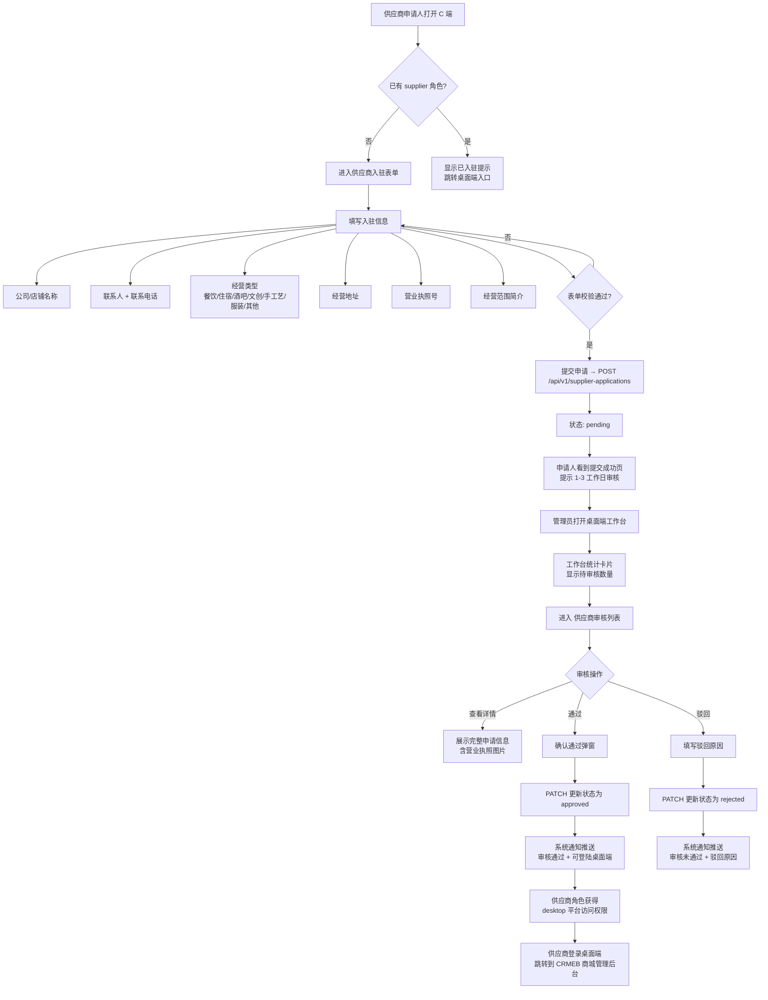

# 线上商城供应商入驻模块 产品设计文档

> **文档版本**：v1.0
> **更新日期**：2026-07-07
> **产品定位**：最小可用版本（MVP），验证供应商入驻审核闭环
> **配套文档**：线上商城（CRMEB 外部系统，本模块仅管理入驻流程）

---

## 一、产品定位与边界

### 1.1 我们在做什么

我们做的是 **线上商城供应商入驻模块 MVP 版本**——不是完整的供应商管理系统，而是第一个能跑通「申请提交 → 平台审核 → 状态通知」这条闭环的最小版本。

**核心目标：**

- ✅ 验证供应商能否在 C 端提交完整的入驻申请表单
- ✅ 验证平台管理员能否在桌面端查看并审核申请（通过/驳回）
- ✅ 验证审核结果能否通知到申请人（系统通知）
- ✅ 验证供应商角色能否正常登录桌面端

### 1.2 边界与正交性

**与古城商户系统的关系：**

| 维度 | 古城商户 | 线上商城供应商 |
|---|---|---|
| 面向场景 | 古城线下面向游客的实体经营 | 线上商城（CRMEB）商品售卖 |
| 入驻入口 | C端「商户导航」→ 商家审核 | C端「商户导航」→ 供应商入驻 |
| 审核流程 | 商家入驻审核（merchant-review feature） | 供应商入驻审核（supplier feature） |
| 角色叠加 | 一个用户可同时是古城商户 + 线上供应商 | 同一用户 |

两个系统是 **正交子系统**。同一用户（例如张老板）可同时具有 `supplier` 角色和古城商户身份，互不冲突。

### 1.3 MVP 原则：什么必须做，什么可以等

| 优先级 | 原则 | 说明 |
|---|---|---|
| 必须 | **申请提交必须完整** | 商户信息 + 营业执照 + 经营范围，缺一不可 |
| 必须 | **审核流程必须闭环** | 提交→审核→通过/驳回→通知申请人 |
| 必须 | **前后端数据一致性** | API 驱动的数据同步（syncAction），不做乐观更新 |
| 可以简化 | 营业执照 OCR 识别 | 先人工查看图片审核 |
| 可以简化 | 无需实名认证/人脸识别 | MVP 阶段人工审核即可 |
| 以后做 | 供应商自主管理商品 | 跳转到外部 CRMEB 系统 |
| 以后做 | 供应商结算/对账 | 外部系统已有 |
| 以后做 | 多店铺/多品牌管理 | 一个供应商一个账号 |

### 1.4 明确不做的（MVP 边界）

- 供应商自主上架/管理商品（跳转到外部 CRMEB 商城管理后台）
- 供应商结算、提现、对账功能
- 供应商后台数据统计（订单量、销售额等）
- 供应商多级账号（子账号权限）
- 入驻资质自动核验（工商接口、法人人脸识别）
- 入驻协议电子签章
- 自动审核（基于规则自动通过）
- 供应商评分/信用体系
- 供应商消息中心（除审核结果通知外）

---

## 二、核心用户角色

### 2.1 两个角色

| 角色 | 端 | 核心诉求 |
|---|---|---|
| **供应商申请人** | C 端移动端（390x844） | 填写资料提交入驻申请，知道审核进度 |
| **平台管理员** | 桌面端后台 Web | 查看申请列表，审核通过或驳回，处理异常 |

### 2.2 已上线账号覆盖

| 姓名 | 手机号 | 角色 | 供应商ID | 说明 |
|---|---|---|---|---|
| 张老板 | 13800001002 | `tourist + supplier` | sup_001 | 已验证供应商，可登录桌面端 |
| 管理员 | 18800003001 | `platform_admin` | - | 管理端审核申请 |

未入驻的用户登录 C 端后，可在「商户导航」→「供应商入驻」或「我的」页面看到入驻入口。

---

## 三、核心业务流程

### 3.1 供应商入驻主流程



### 3.2 桌面端入驻入口流程（未登录场景）

```mermaid
flowchart TD
    A[未登录用户访问 /desktop/supplier-entry] --> B[桌面端供应商入驻表单]
    B --> C[填写信息<br>包含营业执照图片上传]
    C --> D[提交申请]
    D --> E[提示提交成功<br>跳转登录页]
    
    F[供应商角色用户登录桌面端] --> G{`roles.includes(supplier)`?}
    G -->|是| H[仅显示 supplier-entry 和 login 路由<br>不展示后台管理界面]
    G -->|否| I[正常显示桌面端后台]
    
    H --> J[桌面端显示<br>入驻申请成功提示]
    H --> K[提示前往 CRMEB 管理商城]
```

### 3.3 桌面端审核流程

```mermaid
flowchart TD
    A[管理员进入后台] --> B[导航菜单<br>商户与供应商管理 > 线上商城供应商审核]
    B --> C[供应商审核列表页]
    
    C --> D[统计卡片区]
    D --> D1[全部申请: N]
    D --> D2[待审核: N]
    D --> D3[已通过: N]
    D --> D4[已驳回: N]
    
    C --> E[数据表格区]
    E --> E1[列: 公司名称/联系人/联系电话/经营类型/申请时间/状态]
    E --> E2[操作: 查看 / 通过 / 驳回]
    
    E2 -->|点击通过| F[确认通过弹窗]
    F --> F1[显示申请人信息]
    F --> F2[管理员确认]
    F --> F3[PATCH API → status=approved]
    
    E2 -->|点击驳回| G[进入详情页 + 驳回模式]
    G --> G1[显示完整申请信息]
    G --> G2[填写驳回原因]
    G --> G3[提交驳回 → PATCH API]
    
    E2 -->|点击查看| H[申请详情页]
    H --> H1[状态横幅: 待审核/已通过/已驳回]
    H --> H2[基本信息卡片]
    H --> H3[营业执照图片]
    H --> H4[驳回原因(如有)]
    H --> H5[操作按钮: 通过 / 驳回]
```

### 3.4 通知闭环

- 审核通过（`approved`）：发送系统通知，标题"供应商入驻审核通过"，内容"您的供应商入驻申请已通过，您现在可以登录桌面端管理商品了。"
- 审核驳回（`rejected`）：发送系统通知，标题"供应商入驻审核未通过"，内容"您的供应商入驻申请未通过。原因：{驳回原因}。"
- 通知会同时出现在通知中心，targetUrl 跳转到 `/c/merchant-services`

---

## 四、功能模块清单

### 4.1 P0 必须有（MVP 缺一不可）

#### C 端用户

- **供应商入驻申请表单**
  - 字段：公司/店铺名称、联系人、联系电话、经营类型（7 种标签选择器）、经营地址、营业执照号、经营范围简介
  - 前端校验：所有字段必填、手机号格式校验（1[3-9] 开头 11 位）
  - 提交 API：`POST /api/v1/supplier-applications`
  - 数据驱动：syncAction 确保前后端一致
- **提交成功状态页**
  - 显示"申请已提交" + 图标动画
  - 提示"平台将在 1-3 个工作日内完成审核"
  - 提示"审核通过后可在桌面端管理商品和服务"
  - 返回按钮 → `/c/merchant-services`
- **入驻入口**
  - 商户导航 → 「供应商入驻」图标入口
  - 我的页面 → 入驻入口

#### 桌面端管理员

- **审核列表页（SupplierApplicationsList）**
  - 统计卡片：全部申请 / 待审核 / 已通过 / 已驳回（带数字计数，点击切换筛选）
  - DataTable 展示：公司名称、联系人、联系电话、经营类型、申请时间、状态（带颜色标签）
  - 操作：查看详情、通过（弹窗确认）、驳回（跳转详情页进入驳回模式）
- **审核详情页（SupplierApplicationShow）**
  - 状态横幅：带颜色区分的状态展示（待审核=琥珀色/已通过=绿色/已驳回=红色）
  - 基本信息卡片：全部字段只读展示 + 营业执照图片
  - 驳回原因展示区（已被驳回的申请）
  - 操作区：待审核状态展示「通过」和「驳回」两个按钮
  - 驳回模式：切换为文本域填写驳回原因 + 确认通过/确认驳回按钮
- **工作台集成**
  - 统计数据卡片：展示待审核供应商申请数量
  - 快捷入口：入驻待办卡片，点击跳转审核列表

#### 桌面端供应商（独立入口）

- **桌面端入驻表单（SupplierEntryDesktop）**
  - 与 C 端表单相同字段 + 营业执照图片上传（ImageUpload 组件）
  - 不要求登录即可访问（公开页面）
  - 提交成功 → 跳转登录页

#### 系统能力

- **API 标准 CRUD**（server/routes/crud.js 通用路由）
  - `GET /api/v1/supplier-applications` — 列表（支持 status 筛选）
  - `POST /api/v1/supplier-applications` — 创建申请
  - `PATCH /api/v1/supplier-applications/:id` — 更新状态/审核信息
  - `GET /api/v1/suppliers` — 供应商列表
- **数据 Hydration**：启动时全量加载 `supplier-applications` 和 `suppliers` 数据到 zustand store
- **通知集成**：审核结果通过 useNotificationStore 推送给申请人

### 4.2 P1 建议有（提升体验）

- 申请提交后短信/公众号通知
- 供应商审核列表按时间排序/搜索
- 审核时展示供应商的历史申请记录
- 供应商申请进度跟踪（审核中/审核完成的状态时间线）
- 驳回后允许供应商修改并重新提交

### 4.3 P2 以后做（远期规划）

- 供应商自主管理商品（对接 CRMEB 商品管理能力）
- 供应商结算/对账后台
- 多店铺管理（一个供应商多个店铺）
- 自动审核规则引擎（基于营业执照信息自动比对）
- 供应商评分体系（订单量、好评率、发货速度等）
- 供应商入驻协议在线签署
- 供应商作废/注销流程
- 供应商信息变更申请流程

---

## 五、核心数据模型

### 5.1 供应商入驻申请表（supplier_applications）

#### 数据库表结构（SQLite）

```sql
CREATE TABLE IF NOT EXISTS supplier_applications (
  id TEXT PRIMARY KEY,
  companyName TEXT NOT NULL,
  contactName TEXT NOT NULL,
  contactPhone TEXT NOT NULL,
  businessLicense TEXT DEFAULT '',
  status TEXT DEFAULT 'pending',
  remark TEXT,
  createdAt TEXT NOT NULL DEFAULT (datetime('now')),
  updatedAt TEXT NOT NULL DEFAULT (datetime('now'))
);
```

#### 前端数据模型（TypeScript）

```typescript
interface SupplierApplication {
  id: string
  companyName: string
  contactName: string
  phone: string
  businessType: string
  address: string
  licenseNo: string
  licenseImg: string
  description: string
  status: "pending" | "approved" | "rejected"
  submittedAt: string
  reviewedAt?: string
  reviewer?: string
  rejectReason?: string
}
```

#### 字段说明

| 字段 | 类型 | 说明 | 来源 |
|---|---|---|---|
| id | TEXT | 主键，自动生成 | DB |
| companyName | TEXT | 公司/店铺名称 | 表单 |
| contactName | TEXT | 联系人姓名 | 表单 |
| contactPhone / phone | TEXT | 联系电话 | 表单 |
| businessLicense / licenseNo | TEXT | 营业执照号（DB中存businessLicense） | 表单 |
| licenseImg | TEXT | 营业执照图片 URL（仅桌面端表单支持上传） | 表单 |
| businessType | TEXT | 经营类型：餐饮/住宿/酒吧/文创/手工艺/服装/其他 | 表单 |
| address | TEXT | 经营地址 | 表单 |
| description | TEXT | 经营范围简介 | 表单 |
| status | TEXT | 'pending' 待审核 / 'approved' 已通过 / 'rejected' 已驳回 | 系统 |
| reviewedAt | TEXT | 审核时间 | 系统 |
| reviewer | TEXT | 审核人 | 系统 |
| rejectReason | TEXT | 驳回原因 | 管理员 |
| remark | TEXT | 管理员备注（DB 独立字段） | 管理员 |
| createdAt / submittedAt | TEXT | 创建/提交时间 | 系统 |
| updatedAt | TEXT | 更新时间 | 系统 |

> **注意**：前端 TypeScript 类型与后端 SQLite 表结构存在字段不一致（前端有多出的 businessType、address、description、phone 等字段），通过通用 CRUD 路由时会自动过滤掉不在表结构中的字段。这是已知的技术债，需后续对齐。

### 5.2 供应商表（suppliers）

```sql
CREATE TABLE IF NOT EXISTS suppliers (
  id TEXT PRIMARY KEY,
  name TEXT NOT NULL,
  contactName TEXT,
  contactPhone TEXT,
  address TEXT,
  status TEXT DEFAULT 'active',
  createdAt TEXT NOT NULL DEFAULT (datetime('now')),
  updatedAt TEXT NOT NULL DEFAULT (datetime('now'))
);
```

#### 种子数据

| 字段 | 值 |
|---|---|
| id | sup_001 |
| name | 古城服务管理公司 |
| contactName | 和经理 |
| contactPhone | 139****0000 |
| address | 古城区 |
| status | active |

### 5.3 关联数据

#### 用户的 supplierId 关联

用户表通过 `supplierId` 字段关联到 `suppliers.id`：

```sql
-- users 表
supplierId TEXT    -- 关联到 suppliers.id
```

种子示例：
- 张老板（13800001002）：`supplierId: "sup_001"`，`roles: ["tourist", "supplier"]`

#### 便民服务人员的 supplierId 关联

```sql
-- staff 表 / convenience_orders 表
supplierId TEXT NOT NULL   -- 服务人员所属供应商
```

所有便民服务人员（staff）和便民服务订单都通过 `supplierId` 关联到供应商，当前种子数据中所有 staff 和订单的 `supplierId` 均为 `sup_001`。

### 5.4 角色权限模型

```
UnifiedRole = "platform_admin" | "supplier" | "service" | "tourist"

User.roles = ["supplier"]  →  具有供应商角色
User.platform = ["c", "b", "desktop"]  →  可访问桌面端

Desktop 角色映射：
  platform_admin → "role_admin"（通配符权限）
  supplier      → "role_supplier"（有限权限）

导航权限控制（nav.ts）：
  "线上商城供应商审核" → permissionCode: "mall"
  "商城管理后台(外部链接)" → permissionCode: "mall"

DesktopLayout 展示逻辑：
  platform_admin → 完整后台导航
  supplier      → 仅展示 supplier-entry 路由，不展示后台管理界面
```

---

## 六、验收标准

### 6.1 主流程验收

- [x] C 端用户可以从「商户导航」进入供应商入驻表单
- [x] 表单包含所有必要字段：公司名称、联系人、电话、经营类型、地址、营业执照号、经营范围
- [x] 表单校验正常：空字段提示、手机号格式校验
- [x] 提交成功后显示成功页，内容提示清晰
- [x] 桌面端管理员可以查看申请列表，看到新提交的申请
- [x] 桌面端统计卡片显示准确的待审核数量、已通过数量、已驳回数量
- [x] 管理员点击「通过」后，弹窗确认，状态更新为 approved
- [x] 管理员点击「驳回」后，填写驳回原因，状态更新为 rejected
- [x] 审核通过后申请人收到系统通知（标题+内容正确）
- [x] 审核驳回后申请人收到系统通知（含驳回原因）

### 6.2 桌面端入驻验收

- [x] 桌面端入驻入口（/desktop/supplier-entry）无需登录即可访问
- [x] 桌面端表单与 C 端一致，额外包含营业执照图片上传
- [x] 提交成功后跳转到登录页

### 6.3 角色与权限验收

- [x] 供应商角色（张老板）登录桌面端后看到入驻入口
- [x] 供应商角色不展示完整的后台管理界面
- [x] 管理员可以看到供应商审核菜单项
- [x] 工作台首页展示供应商待审核统计

### 6.4 数据一致性验收

- [x] 前端 submit → API POST → 后端写入 DB → 返回结果 → 前端更新 store，流程完整
- [x] 所有 API 操作通过 syncAction 保证数据一致性，不做乐观更新
- [x] 页面刷新后数据从 API 重新加载，不丢失

### 6.5 未实现（技术债/待完善）

- [ ] 数据库 supplier_applications 表结构需要对齐前端 SupplierApplication 类型：缺 businessType、address、description、phone、licenseImg、reviewedAt、reviewer、rejectReason 字段
- [ ] 前端缺少营业执照图片上传组件（C 端表单没有 ImageUpload；只有桌面端版本有）
- [ ] 供应商入驻后自动赋予 desktop 平台权限（目前仅在通知中提示，需手动或联动调整用户角色）
- [ ] 供应商审核通过后未自动同步 users 表的 supplierId 和 roles
- [ ] 供应商列表页（/desktop/suppliers）有 CRUD API 但无 UI 页面
- [ ] 无 B 端供应商页面（非目标场景）
- [ ] 供应商信息变更/更新没有线上流程
- [ ] 重复申请校验（同一手机号/营业执照号不能重复提交）
- [ ] 没有申请进度查询页面（用户只能看到提交成功页，不能回来查状态）
- [ ] 没有审核操作日志记录
- [ ] 驳回后重新提交没有线上流程（需重新填写完整表单）
- [ ] 导航菜单的 permissionCode "mall" 在 seed 权限数据中未定义（可能不可见）