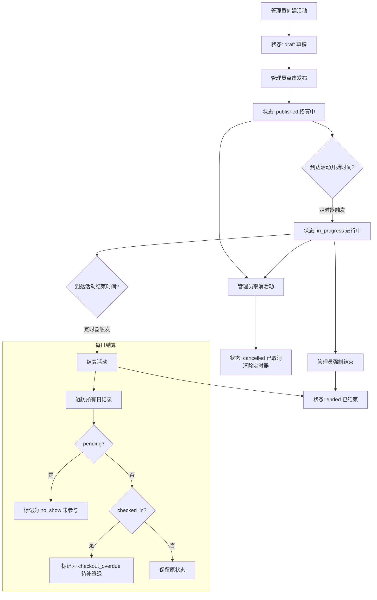
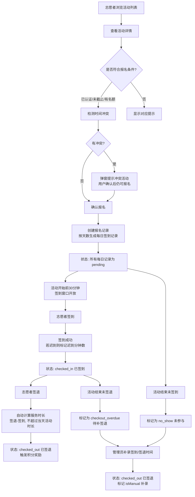

# 志愿服务平台 1.0 产品设计文档

> **文档版本**：v1.0
> **更新日期**：2026-07-07
> **产品定位**：最小可用版本（MVP），验证志愿服务核心业务闭环
> **配套文档**：业务逻辑流程图、API 设计文档（待补充）

---

## 一、产品定位与边界

### 1.1 我们在做什么

我们做的是 **丽江古城志愿服务平台 1.0 版本**——服务于古城志愿者招募、活动管理、签到签退、服务时长记录全流程的数字化管理平台。

**核心目标：**

- 验证「志愿者注册 → 管理员审核 → 活动发布 → 志愿者报名 → 每日签到/签退 → 服务时长记录 → 积分奖励」这条主线能不能跑通
- 验证志愿者愿不愿意通过平台参与古城服务
- 验证管理员能否高效管理志愿者和活动数据
- 验证服务时长自动化和异常处理机制的可行性

### 1.2 MVP 原则：什么必须做，什么可以等

| 优先级 | 原则 | 说明 |
|--------|------|------|
| 红色 必须 | **主流程必须闭环** | 注册→审核→报名→签到→签退→时长记录，每一步都不能断 |
| 红色 必须 | **数据结构必须完整** | 志愿者、活动、报名、每日记录四张表，关联关系清晰 |
| 红色 必须 | **Server 端提供数据持久化** | 数据通过 REST API 写入 SQLite，前端 Store 同步调用 |
| 黄色 可以简化 | 异常流程可以人工补录 | 签到/签退异常由管理员在桌面端手动补录 |
| 黄色 可以简化 | 活动状态自动流转由前端定时器触发 | 活动开始/结束、每日结算由前端 `setTimeout` 驱动，非服务端定时任务 |
| 绿色 以后做 | 体验优化类功能 | 活动推送通知、群发消息、志愿者排班表 |
| 绿色 以后做 | 复杂的体系化功能 | 诚信分体系、志愿者等级、服务时长排名、活动评价 |

### 1.3 明确不做的（MVP 边界）

以下功能 **1.0 绝对不做**，避免范围蔓延：

- 活动评价系统（志愿者对活动评价/管理员对志愿者评价）
- 志愿者等级/成长体系（只记录服务时长，不升级）
- 群发消息/活动推送（通知功能仅限审核结果和活动状态变更）
- 排班表/自动排班（管理员手动创建活动，志愿者自行报名）
- 地图可视化展示志愿者分布
- 服务时长兑换/商城功能
- 移动端管理员审批（桌面端专属）

### 1.4 依赖关系

| 依赖模块 | 关联点 | 实现状态 |
|----------|--------|----------|
| points（积分系统） | 签退完成时触发 `volunteer_service` 积分（2 分/次） | 已实现 |
| notification（通知中心） | 活动发布/取消时推送通知；志愿者审核结果推送通知 | 已实现 |
| auth（认证系统） | 用户需登录后通过 `useAuthStore` 获取 user.id 关联志愿者身份 | 已实现 |

---

## 二、核心用户角色

### 2.1 角色定义

| 角色 | 代号 | 目标用户 | 终端 | 核心职责 |
|------|------|----------|------|----------|
| 志愿者 | Volunteer | 古城居民、商户、游客 | C 端（移动端 390×844） | 注册认证、浏览活动、报名、签到/签退、查看服务记录 |
| 管理员 | Admin | 古城管理委员会工作人员 | 桌面端 | 审核志愿者、创建/管理活动、查看签到数据、异常补录、导出 Excel |

### 2.2 用户画像

**志愿者代表：张小游**
- 游客身份，自由职业者
- 希望通过志愿服务深度参与古城文化体验
- 主要关注活动报名、签到签退的便捷性
- 在意服务时长记录和累计数据

**管理员代表：古城管委会工作人员**
- 需要管理大量志愿者注册申请
- 需要快速创建和发布志愿活动
- 关注活动报名人数、签到率、异常记录
- 需要导出 Excel 进行数据统计

---

## 三、核心业务流程

### 3.1 志愿者注册审核流程

```mermaid
flowchart TD
    A[用户打开志愿服务入口] --> B{已有志愿者认证?}
    B -->|否| C[填写认证表单<br/>姓名/电话/政治面貌/工作单位/资质图片]
    B -->|是| D{审核状态?}
    
    D -->|approved| E[已通过 → 跳转活动列表]
    D -->|pending| F[审核中页面<br/>显示提交信息<br/>提供"演示快速通过"按钮]
    D -->|rejected| G[驳回页面<br/>显示驳回原因<br/>可重新上传资质]
    
    C --> H[提交注册]
    H --> I[状态: pending]
    I --> J[管理员桌面端审核]
    
    J --> K[通过]
    J --> L[驳回并填写原因]
    
    K --> M[状态: approved<br/>推送通知]
    L --> N[状态: rejected<br/>推送通知]
    
    M --> O[可报名活动]
    N --> G
    G --> P[重新提交后]
    P --> I
```

### 3.2 活动生命周期流程



### 3.3 报名签到签退流程



### 3.4 时间模式说明

**单天活动（single）**
- 示例：古城环境清洁日，7月4日 08:00~12:00
- 生成 1 天的签到记录

**多天活动（multi）**
- 示例：暑期古城秩序维护，7月5日~7月7日，每天 09:00~12:00
- 生成 3 天的签到记录，每天独立签到/签退
- 每日独立结算，某天未签到不影响其他天

---

## 四、功能模块清单

### 4.1 功能模块总览

| 模块 | 端 | 功能点 | 优先级 |
|------|----|--------|--------|
| 志愿者注册认证 | C | 填写认证表单（姓名/电话/政治面貌/工作单位/资质图片上传） | P0 |
| 志愿者注册认证 | C | 审核等待页面（状态展示 + 立即通过演示按钮） | P0 |
| 志愿者注册认证 | C | 驳回重审页面（驳回原因 + 重新上传资质） | P0 |
| 活动浏览报名 | C | 活动列表（搜索/状态筛选/容量进度条/加载更多） | P0 |
| 活动浏览报名 | C | 活动详情（轮播图/时间/地点/报名进度/描述） | P0 |
| 活动浏览报名 | C | 报名（含时间冲突检测弹窗） | P0 |
| 活动浏览报名 | C | 取消报名（无服务记录时可取消） | P0 |
| 签到签退 | C | 活动进行中签到（签到窗口：开始前30分钟至结束） | P0 |
| 签到签退 | C | 签到后签退（自动计算服务时长） | P0 |
| 签到签退 | C | 迟到检测与标记 | P0 |
| 我的活动 | C | 底部弹出面板（我的活动列表 + 待操作提示） | P0 |
| 我的活动 | C | 签到记录列表（按日期展示每日状态） | P0 |
| 我的活动 | C | 累计服务时长/参与活动统计 | P0 |
| 志愿者审核 | Desktop | 列表展示（姓名/电话/政治面貌/资质/状态/操作） | P0 |
| 志愿者审核 | Desktop | 审核通过/驳回（驳回需填写原因） | P0 |
| 志愿者审核 | Desktop | 审核历史记录查看 | P0 |
| 活动管理 | Desktop | 活动列表（名称/时间/地点/报名人数/状态/操作） | P0 |
| 活动管理 | Desktop | 创建活动（含地图搜索选点） | P0 |
| 活动管理 | Desktop | 编辑/发布/删除/结束/取消活动 | P0 |
| 签到管理 | Desktop | 签到明细查看（按活动查看所有志愿者的每日记录） | P0 |
| 签到管理 | Desktop | 异常记录补录（填写签到/签退时间 + 备注） | P0 |
| 签到管理 | Desktop | 导出 Excel | P0 |
| 积分奖励 | C | 签退时自动触发积分（2分/次） | P0 |
| 通知推送 | 系统 | 活动发布时推送通知 | P1 |
| 通知推送 | 系统 | 活动取消/结束时推送通知 | P1 |
| 通知推送 | 系统 | 志愿者审核通过/驳回时推送通知 | P1 |
| 个人统计 | C | 累计服务时长、参与活动数 | P1 |
| 活动可编辑 | Desktop | 已发布活动可编辑部分字段（描述/人数上限） | P1 |
| 活动状态自动流转 | 系统 | published 到达 startTime 自动变为 in_progress | P0 |
| 活动状态自动流转 | 系统 | in_progress 到达 endTime 自动结算并变为 ended | P0 |
| 活动状态自动流转 | 系统 | 每日结束时自动结算当日记录 | P0 |

### 4.2 P0 核心功能（必须实现）

| 序号 | 功能 | 端 | 用户故事 |
|------|------|----|----------|
| 1 | 志愿者注册认证 | C | 作为游客，我想提交个人信息和资质图片完成志愿者认证，以便参与志愿活动 |
| 2 | 志愿者审核 | Desktop | 作为管理员，我想查看志愿者申请并审核通过/驳回，以确保志愿者信息真实有效 |
| 3 | 活动管理 CRUD | Desktop | 作为管理员，我想创建、编辑、发布、结束志愿活动，以便志愿者参与 |
| 4 | 活动浏览报名 | C | 作为志愿者，我想浏览活动列表并报名感兴趣的活动 |
| 5 | 每日签到签退 | C | 作为志愿者，我想在活动日签到/签退，以记录服务时长 |
| 6 | 签到管理 + 异常补录 | Desktop | 作为管理员，我想查看签到明细并处理异常记录（补录签到/签退时间） |
| 7 | 服务时长自动计算 | 系统 | 系统根据签到/签退时间自动计算每次服务时长 |
| 8 | 活动状态自动流转 | 系统 | 活动在发布时间到达后自动变为进行中，结束后自动结算 |
| 9 | 积分奖励 | 系统 | 签退完成时自动发放 2 积分 |

### 4.3 P1 重要功能（推荐实现）

| 序号 | 功能 | 端 | 说明 |
|------|------|----|------|
| 1 | 活动搜索筛选 | C | 按活动名称/地点搜索 |
| 2 | 活动状态过滤 | Desktop | 按活动状态（草稿/已发布/进行中/已结束）筛选 |
| 3 | 志愿者搜索过滤 | Desktop | 按姓名/电话搜索 + 政治面貌/状态筛选 |
| 4 | 时间冲突检测 | C | 报名时检测与已有活动是否时间重叠并提示 |
| 5 | 迟到标记 | 系统 | 签到晚于活动开始时间 30 分钟标记迟到 |
| 6 | 导出 Excel | Desktop | 按活动导出报名签到明细 |
| 7 | 地图选点 | Desktop | 创建活动时通过 Leaflet 地图搜索并选择地点 |
| 8 | 通知推送 | 系统 | 活动状态变更、审核结果推送通知 |

### 4.4 P2 优化功能（以后实现）

| 序号 | 功能 | 端 | 说明 |
|------|------|----|------|
| 1 | 活动图片上传 | C/Desktop | 活动详情图上传（当前使用占位图） |
| 2 | 活动评价 | C | 对已结束的活动进行评价 |
| 3 | 服务时长排行榜 | C | 志愿者服务时长排名展示 |
| 4 | 多人报名管理 | Desktop | 批量审批/驳回志愿者 |
| 5 | 活动日历视图 | C | 按日历展示活动安排 |
| 6 | 签到提醒 | 系统 | 活动开始前推送签到提醒 |

---

## 五、核心数据模型

### 5.1 志愿者表（volunteers）

| 字段 | 类型 | 说明 | 示例 |
|------|------|------|------|
| id | TEXT PK | 志愿者 ID | "v1" |
| userId | TEXT | 关联用户 ID | "u_c_001" |
| name | TEXT | 姓名 | "张小游" |
| phone | TEXT | 电话 | "13800001001" |
| politicalStatus | TEXT | 政治面貌 | "群众"、"中共党员"、"共青团员"、"其他" |
| workUnit | TEXT | 工作单位 | "自由职业" |
| credentialImages | TEXT (JSON) | 资质图片 URL 数组 | ["url1", "url2"] |
| status | TEXT | pending / approved / rejected | "approved" |
| reviewNote | TEXT | 驳回原因 | "资质图片不清晰" |
| score | INTEGER | 积分累计 | 15 |
| reviewHistory | TEXT (JSON) | 审核历史记录 | [{action, note, reviewedAt}] |
| createdAt | TEXT | 创建时间 | "2026-05-20 10:00" |

### 5.2 志愿活动表（volunteer_activities）

| 字段 | 类型 | 说明 | 示例 |
|------|------|------|------|
| id | TEXT PK | 活动 ID | "act-ongoing" |
| title | TEXT | 活动名称 | "端午文化节·古城志愿服务" |
| description | TEXT | 活动描述 | "协助端午文化节活动组织..." |
| location | TEXT | 活动地点 | "丽江古城玉河广场主会场" |
| startTime | TEXT | 开始时间 | "2026-07-06 10:00" |
| endTime | TEXT | 结束时间 | "2026-07-06 15:00" |
| timeMode | TEXT | single / multi | "multi" |
| dailyStartTime | TEXT | (多天模式) 每日开始时间 | "09:00" |
| dailyEndTime | TEXT | (多天模式) 每日结束时间 | "12:00" |
| enrollStartTime | TEXT | 报名开始时间（可选） | "2026-07-01 00:00" |
| signUpDeadline | TEXT | 报名截止时间 | "2026-07-05 23:59" |
| maxParticipants | INTEGER | 人数上限 | 15 |
| currentParticipants | INTEGER | 当前报名人数 | 7 |
| status | TEXT | draft / published / in_progress / ended / cancelled | "in_progress" |
| imageUrl | TEXT | 活动图片 | "https://..." |
| tags | TEXT (JSON) | 标签 | [] |
| createdAt | TEXT | 创建时间 | "2026-07-01 12:00" |

### 5.3 报名记录表（volunteer_sign_ups — 前端 Store 维护）

| 字段 | 类型 | 说明 | 示例 |
|------|------|------|------|
| id | TEXT PK | 报名 ID | "su-1720000000000" |
| volunteerId | TEXT | 志愿者 ID | "v1" |
| activityId | TEXT | 活动 ID | "act-ongoing" |
| signUpTime | TEXT | 报名时间 | "2026-07-06 08:00" |

### 5.4 每日签到记录表（volunteer_daily_records）

| 字段 | 类型 | 说明 | 示例 |
|------|------|------|------|
| id | TEXT PK | 记录 ID | "dr-1" |
| signUpId | TEXT | 关联报名 ID | "su-1720000000000" |
| volunteerId | TEXT | 志愿者 ID | "v1" |
| activityId | TEXT | 活动 ID | "act-ongoing" |
| date | TEXT | 日期 YYYY-MM-DD | "2026-07-06" |
| dayStartTime | TEXT | 该天活动开始时刻 | "2026-07-06 09:00" |
| dayEndTime | TEXT | 该天活动结束时刻 | "2026-07-06 12:00" |
| checkInTime | TEXT | 签到时间 | "2026-07-06 08:50" |
| checkOutTime | TEXT | 签退时间 | "2026-07-06 12:00" |
| serviceHours | REAL | 服务时长（小时） | 3.0 |
| status | TEXT | pending / checked_in / checked_out / no_show / checkout_overdue | "checked_out" |
| isLate | BOOLEAN | 是否迟到 | false |
| lateMinutes | INTEGER | 迟到分钟数 | 0 |
| isManual | BOOLEAN | 是否管理员补录 | false |
| reviewNote | TEXT | 补录备注 | "忘记录签退，人工补录" |
| resolvedAt | TEXT | 补录处理时间 | "2026-07-06 14:00" |

### 5.5 状态机定义

**志愿者状态机：**
```
pending ──(管理员通过)──→ approved
pending ──(管理员驳回)──→ rejected
rejected ──(重新提交)──→ pending
```

**活动状态机：**
```
draft ──(发布)──→ published ──(自动到期)──→ in_progress ──(自动到期)──→ ended
                                                              ──(强制结束)──→ ended
                            ──(取消)──→ cancelled
in_progress ──(取消)──→ cancelled
```

**每日签到状态机：**
```
pending ──(签到)──→ checked_in ──(签退)──→ checked_out
pending ──(活动结束未签到)──→ no_show
checked_in ──(活动结束未签退)──→ checkout_overdue
no_show ──(管理员补录)──→ checked_out (isManual=true)
checkout_overdue ──(管理员补录)──→ checked_out (isManual=true)
```

### 5.6 核心业务规则

1. **签到窗口**: 活动开始前 30 分钟至活动结束时间内可签到
2. **迟到判定**: 签到时间晚于活动开始时间 30 分钟标记为迟到
3. **服务时长计算**: min(签退时间 - 签到时间, 当天活动总时长)，最小 0.5 小时
4. **取消报名限制**: 只要已有 checked_in 或 checked_out 的记录，不可取消报名
5. **时间冲突检测**: 报名时自动检测已报名且未结束/未取消的活动是否时间重叠
6. **多天活动结算**: 每天独立结算，某天未签到不影响其他天签到记录
7. **积分触发**: 每次签退完成自动触发 2 积分（`volunteer_service` 积分类型）

---

## 六、验收标准

### 6.1 C 端验收标准

| 编号 | 验收标准 | 优先级 | 状态 |
|------|----------|--------|------|
| C-01 | 未认证用户进入志愿活动页显示认证引导页（注册表单） | P0 | 已实现 |
| C-02 | 注册表单包含姓名、电话、政治面貌、工作单位、资质图片上传，必填项校验完整 | P0 | 已实现 |
| C-03 | 提交后跳转审核等待页面，显示提交信息 | P0 | 已实现 |
| C-04 | 审核等待页面包含"演示:立即通过"按钮，点击后状态变为 approved | P0 | 已实现 |
| C-05 | 审核驳回页面显示驳回原因，可重新上传资质并提交 | P0 | 已实现 |
| C-06 | 已认证志愿者自动跳转活动列表页 | P0 | 已实现 |
| C-07 | 活动列表展示所有非 draft 状态的活动，包含名称、描述、时间、地点、报名进度 | P0 | 已实现 |
| C-08 | 活动列表支持搜索（名称/描述/地点）、加载更多 | P0 | 已实现 |
| C-09 | 活动容量进度条根据报名人数/上限动态显示 | P0 | 已实现 |
| C-10 | 活动列表卡片底部显示操作引导（立即报名/签到/签退/已完成等） | P0 | 已实现 |
| C-11 | 活动详情页展示轮播图、时间、地点、报名进度、描述 | P0 | 已实现 |
| C-12 | 活动详情页支持报名（含时间冲突检测弹窗，确认后可继续报名） | P0 | 已实现 |
| C-13 | 活动详情页支持取消报名（无服务记录时可取消） | P0 | 已实现 |
| C-14 | 活动详情页显示签到记录列表，按日期展示每日状态 | P0 | 已实现 |
| C-15 | 进入签到窗口（开始前30分钟）后显示签到按钮，点击签到成功 | P0 | 已实现 |
| C-16 | 签到后显示签退按钮，点击签退自动计算服务时长 | P0 | 已实现 |
| C-17 | 迟到系统自动标记并显示迟到分钟数 | P0 | 已实现 |
| C-18 | 活动列表页底部悬浮"我的活动"按钮，点击弹出底部面板展示已报名活动 | P0 | 已实现 |
| C-19 | 底部面板展示待签到/待签退/已完成状态，支持点击进入详情 | P0 | 已实现 |
| C-20 | 首页 Grid 图标"志愿服务"入口可点击进入 | P0 | 已实现 |
| C-21 | 累计服务时长和参与活动数在活动列表页顶部展示 | P1 | 已实现 |
| C-22 | 首次访问时自动弹出"我的活动"底部面板（有活跃活动时） | P1 | 已实现 |

### 6.2 桌面端验收标准

| 编号 | 验收标准 | 优先级 | 状态 |
|------|----------|--------|------|
| D-01 | 桌面端菜单栏包含"志愿服务"入口 | P0 | 已实现 |
| D-02 | 活动管理 Tab 展示活动列表（名称/时间/地点/报名人数/状态/操作） | P0 | 已实现 |
| D-03 | 支持按活动名称/地点搜索，按状态筛选 | P0 | 已实现 |
| D-04 | 支持创建活动（名称/描述/地点/日期/时段/报名截止/人数上限），含地图搜索选点 | P0 | 已实现 |
| D-05 | 创建活动后自动发布（状态变为 published） | P0 | 已实现 |
| D-06 | 草稿活动可编辑/发布/删除，已发布/进行中活动可结束/取消 | P0 | 已实现 |
| D-07 | 结束活动时提示受影响记录数量（待签到→未参与，已签到→待补签退） | P0 | 已实现 |
| D-08 | 活动详情页展示统计卡片（报名人次/签到人次/异常记录/总服务时长） | P0 | 已实现 |
| D-09 | 活动详情页展示报名签到明细表（志愿者/日期/状态/签到/签退/时长/操作） | P0 | 已实现 |
| D-10 | 异常记录（no_show / checkout_overdue）可点击"补录"按钮进行处理 | P0 | 已实现 |
| D-11 | 补录弹窗支持填写签到时间、签退时间、补录备注，自动计算时长 | P0 | 已实现 |
| D-12 | 活动签到明细支持导出 Excel | P0 | 已实现 |
| D-13 | 志愿者审核 Tab 展示志愿者列表（姓名/电话/政治面貌/工作单位/资质/状态/操作） | P0 | 已实现 |
| D-14 | 支持按姓名/电话搜索，按政治面貌/状态筛选 | P0 | 已实现 |
| D-15 | 待审核志愿者可点击"详情"查看完整信息 | P0 | 已实现 |
| D-16 | 志愿者详情页展示基本信息、资质图片、审核历史记录 | P0 | 已实现 |
| D-17 | 待审核志愿者详情页支持"审核通过"和"驳回"操作 | P0 | 已实现 |
| D-18 | 驳回需填写原因，原因不能为空 | P0 | 已实现 |
| D-19 | 处理完后自动刷新列表，已审核的不再显示审核按钮 | P0 | 已实现 |

### 6.3 系统验收标准

| 编号 | 验收标准 | 优先级 | 状态 |
|------|----------|--------|------|
| S-01 | 活动 published 状态到达 startTime 后自动变为 in_progress | P0 | 已实现 |
| S-02 | 活动 in_progress 状态到达 endTime 后自动结算并变为 ended | P0 | 已实现 |
| S-03 | 每日结束时自动结算当日记录（pending→no_show, checked_in→checkout_overdue） | P0 | 已实现 |
| S-04 | 签退完成时自动触发积分（2 分/次），积分记录写入 points 系统 | P0 | 已实现 |
| S-05 | 活动发布时推送系统通知 | P1 | 已实现 |
| S-06 | 活动取消时推送系统通知 | P1 | 已实现 |
| S-07 | 志愿者审核通过时推送系统通知 | P1 | 已实现 |
| S-08 | 志愿者审核驳回时推送系统通知（含驳回原因） | P1 | 已实现 |
| S-09 | 数据通过 REST API 持久化到 SQLite（3 张表：volunteers, volunteer_activities, volunteer_daily_records） | P0 | 已实现 |
| S-10 | 前端 Store 同步调用后端 API | P0 | 已实现 |

### 6.4 数据与种子数据

| 编号 | 验收标准 | 优先级 | 状态 |
|------|----------|--------|------|
| SD-01 | 种子数据包含 11 个活动（覆盖草稿/已发布/进行中/已结束/已取消全部状态） | P0 | 已实现 |
| SD-02 | 种子数据包含 3 个志愿者（张小游已通过/张老板已通过/赵小明待审核） | P0 | 已实现 |
| SD-03 | 种子数据包含 5 条签到记录（覆盖正常完成/已签到/进行中） | P0 | 已实现 |
| SD-04 | 种子数据的活动 timeMode 覆盖 single 和 multi | P0 | 已实现 |
| SD-05 | 种子数据包含已结束有异常的活动（no_show / checkout_overdue 可补录） | P0 | 已实现 |

### 6.5 未实现的功能（待后续版本）

| 编号 | 功能 | 说明 |
|------|------|------|
| FUTURE-01 | 活动图片上传 | 当前活动创建时 images 字段为空，种子数据未提供活动图片 |
| FUTURE-02 | 活动评价系统 | 志愿者对活动进行评价（评分 + 文字） |
| FUTURE-03 | 服务时长排行榜 | 志愿者服务时长排名 |
| FUTURE-04 | 签到提醒通知 | 活动开始前自动推送签到提醒 |
| FUTURE-05 | 志愿者等级/勋章体系 | 根据服务时长授予不同等级 |
| FUTURE-06 | 活动日历视图 | C 端按日历展示活动 |
| FUTURE-07 | 桌面端代码拆分 | VolunteerManagePage 约 1687 行，建议拆分为小组件 |
| FUTURE-08 | 移动端管理员审批 | 目前审核仅限桌面端 |
| FUTURE-09 | 活动报名限制 | 如每人每月最多报名数等规则 |
| FUTURE-10 | 服务端定时任务 | 当前活动状态流转依赖前端定时器，刷新页面后重置 |

---

## 附录

### A. 相关文件路径

| 文件 | 路径 |
|------|------|
| C 端志愿服务中心入口页 | `/Users/lzz/Desktop/Projects/丽江古城游/src/features/volunteer/c-end/pages/VolunteerPlaceholderPage.tsx` |
| C 端活动列表页 | `/Users/lzz/Desktop/Projects/丽江古城游/src/features/volunteer/c-end/pages/VolunteerActivitiesPage.tsx` |
| C 端活动详情页 | `/Users/lzz/Desktop/Projects/丽江古城游/src/features/volunteer/c-end/pages/VolunteerActivityDetailPage.tsx` |
| 桌面端管理页 | `/Users/lzz/Desktop/Projects/丽江古城游/src/features/volunteer/desktop/pages/VolunteerManagePage.tsx` |
| Store 主文件 | `/Users/lzz/Desktop/Projects/丽江古城游/src/features/volunteer/store/store.ts` |
| 类型定义 | `/Users/lzz/Desktop/Projects/丽江古城游/src/shared/types/index.ts` (第 346~418 行) |
| 功能规格文档 | `/Users/lzz/Desktop/Projects/丽江古城游/docs/superpowers/specs/012-volunteer.md` |
| 数据库 Schema | `/Users/lzz/Desktop/Projects/丽江古城游/server/db/schema.sql` (第 395~443 行) |
| 种子数据 | `/Users/lzz/Desktop/Projects/丽江古城游/server/db/seed.js` (第 313~406 行) |
| 后端 CRUD 路由 | `/Users/lzz/Desktop/Projects/丽江古城游/server/index.js` (第 80~82 行) |
| C 端路由配置 | `/Users/lzz/Desktop/Projects/丽江古城游/src/c-end/routes.tsx` (第 284~286 行) |
| 桌面端导航配置 | `/Users/lzz/Desktop/Projects/丽江古城游/src/desktop/nav.ts` (第 47 行) |

### B. 种子活动数据摘要

| 活动 ID | 标题 | 状态 | 时间模式 | 说明 |
|---------|------|------|----------|------|
| act-ongoing | 端午文化节·古城志愿服务 | in_progress | multi | 进行中，有签到/签退/待签到多种状态 |
| act-soon | 古城文化快闪·志愿者招募 | published | multi | 即将开始，全部 pending |
| act-hot | 纳西古乐传承·志愿导赏 | published | multi | 热门（7/8 已满） |
| act-multi | 古城文明旅游宣传周 | published | multi | 多天即将开始 |
| act-multi-ongoing | 暑期古城秩序维护 | in_progress | multi | 多天进行中 |
| act-draft | 国庆黄金周古城秩序维护 | draft | multi | 草稿状态 |
| act-ended-ok | 古城公益导览·第三期 | ended | multi | 已结束，全部正常 |
| act-ended-abnormal | 古城环境清洁日 | ended | multi | 已结束，有异常记录可补录 |
| act-ended-multi | 东巴文化传承讲座 | ended | multi | 已结束多天，混合状态 |
| act-cancelled | 古城摄影志愿服务 | cancelled | multi | 已取消 |

### C. 已知局限性

1. **活动状态流转依赖前端定时器**: 当前使用 `setTimeout` 在内存中驱动，刷新页面后所有定时器重置。建议后期改为服务端定时任务（如 node-cron）或 WebSocket 推送。
2. **桌面端代码过于集中**: VolunteerManagePage 约 1687 行，集成了 6 个 Dialog + 地图选点 + Excel 导出，建议拆分为独立组件。
3. **无活动图片上传功能**: 创建活动时 images 字段固定为 `[]`，种子数据未提供活动图片。
4. **审核通知仅限 demo 模式**: 审核通过/驳回触发通知，但通知内容为系统预设文案，未支持自定义通知文案。