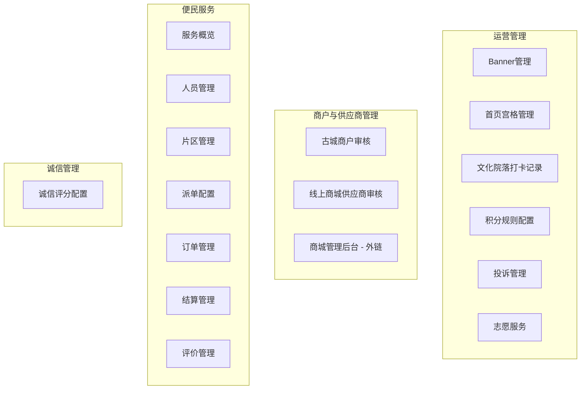

# 桌面端导航重构 + 新增管理面板 设计文档

## 1. 背景与目标

### 1.1 问题

当前桌面端导航存在以下问题：

- **导航分组不合理**："财务与预警"组同时包含结算管理、积分规则和人流量预警三个不同业务域；"社区管理"组只有孤零零的一个"公告下发管理"（且已确认移除）
- **功能切分过细**：便民服务 12 个子项平铺在导航上，占据了超过一半的侧边栏
- **业务逻辑模糊**：部分页面命名与实际业务不对应（如 `price-arbitration` 路由名实际上是取消审批）
- **功能缺口**：功能清单中有 4 个管理面板完全缺失（在线状态监控、付款凭证审核、诚信评分配置、评价管理）

### 1.2 目标

- 按业务逻辑重新组织导航分组，每组内的页面有清晰的业务关联
- 便民服务内的强关联页面合并为 Tab 内切换，减少导航条目
- 补齐 4 个缺失管理面板，使 Demo 覆盖更完整
- 清理路由命名不一致问题

---

## 2. 导航结构（最终确认）

### 整体结构：4 组 17 项



### 前后对比

| 维度 | 重构前 | 重构后 |
|---|---|---|
| 导航组数 | 6 组 | 4 组 |
| 导航条目数 | 22 项 | 17 项 |
| 便民服务条目 | 12 项平铺 | 7 项（含 Tab 内聚合） |

---

## 3. 各组详细设计

### 3.1 运营管理（6 项）

| 导航项 | 页面文件 | 来源 | 改动 |
|---|---|---|---|
| Banner管理 | `desktop/pages/gates/BannerManagePage` | 原运营管理 | 无 |
| 首页宫格管理 | `desktop/pages/gates/GridSettingsPage` | 原运营管理 | 无 |
| 文化院落打卡记录 | `desktop/pages/photo-records/list + show` | 原运营管理 | 无 |
| 积分规则配置 | `desktop/pages/gates/PointRulesPage` | 原财务与预警移入 | 无 |
| 投诉管理 | `features/complaints/desktop/pages/ComplaintPage` | 保留在原运营管理 | 无 |
| 志愿服务 | `features/volunteer/desktop/pages/VolunteerManagePage` | 原社区管理移入 | 无 |

**说明**：本组无新增页面，纯导航归类调整。

### 3.2 商户与供应商管理（3 项）

| 导航项 | 页面文件 | 来源 | 改动 |
|---|---|---|---|
| 古城商户审核 | `desktop/pages/gates/MerchantReviewPage` | 原社区管理移入 | 无 |
| 线上商城供应商审核 | `desktop/pages/supplier-applications/` | 原商家与供应商 | 无 |
| 商城管理后台 | 外部链接 → `CRMEB_ADMIN_URL` | 保留 | 无 |

**说明**：本组无新增页面。

### 3.3 便民服务（7 项）—— 核心重构

这是改动量最大的板块。7 个子项中：

#### 3.3.1 服务概览
- 文件：`features/convenience/desktop/pages/ConvenienceOverviewPage.tsx`
- 改动：**无**，保留当前 Dashboard 设计

#### 3.3.2 人员管理（含在线状态监控）
- 文件：`features/convenience/desktop/pages/ConvenienceStaffPage.tsx`（改造）
- 当前页面是一个服务人员列表（姓名/手机/服务类型/片区/状态/操作按钮）
- 改造方案：

```
人员管理（一个页面，内部 2 个 Tab）
├── Tab ① 人员列表 ← 现有列表增强
│   新增/增强字段：在线状态列（圆点图标，绿=在线/黄=忙碌/橙=休息/灰=离线）
│                 资质证件列（已上传/未上传）
│   筛选增强：按在线状态筛选 / 按服务类型筛选
│   编辑弹窗增强：资质证件展示区（占位）、所属片区多选
│
└── Tab ② 在线状态 ← 新视图
    顶部统计条：在线 X 人 / 忙碌 X 人 / 休息 X 人 / 离线 X 人
    主体区：人员状态卡片网格
      - 每张卡片含：头像（占位图）、姓名、服务技能标签、当前状态、当前接单数、最后活跃时间
      - 按服务类型筛选
    功能目的：替代"在线状态监控"独立页面，更轻量地满足查看在线人员列表的需求
```

#### 3.3.3 片区管理
- 文件：`features/convenience/desktop/pages/ZoneManagementPage.tsx`
- 改动：**无**

#### 3.3.4 派单配置
- 文件：`features/convenience/desktop/pages/DispatchConfigPage.tsx`
- 改动：**无**

#### 3.3.5 订单管理（含 5 个 Tab——核心改造）
- 文件：`features/convenience/desktop/pages/ConveniencePage.tsx`（重构为 Tab 壳）

现有 ConveniencePage 是一个"派单列表"平铺，改造为订单管理综合页面：

```
订单管理（一个页面，内部 5 个 Tab）
│
├── Tab ① 全部订单（原派单列表）
│   展示所有订单，默认按时间倒序
│   筛选：订单编号 / 服务类型 / 状态 / 支付状态 / 时间范围
│   操作：查看详情、派单、删除
│   改动：现有表格保留，仅移入 Tab 壳
│
├── Tab ② 待审核（新增——订单审核）
│   功能清单对应："便民服务订单审核"
│   展示待审核的订单（状态在 A20 已指派 / A35 已核价 等需审核节点）
│   操作：审核通过 / 不通过，填写审核意见
│   筛选：订单编号 / 申请时间范围
│   数据：基于 ConvenienceOrder 的 cancelRequested 等属性筛选
│
├── Tab ③ 取消审批（现有 PriceArbitrationPage 移入）
│   展示有取消申请标记（cancelRequested）的订单
│   操作：同意取消 / 拒绝取消
│   改动：逻辑不变，从独立页面改为 Tab ③
│   注意：路由从 price-arbitration 改为 cancel-approval
│
├── Tab ④ 报价审核（新增）
│   功能清单对应："报价审核"
│   展示已有报价待客户确认的订单
│   操作：通过报价 / 驳回报价（填写驳回原因）
│   价格争议标记：可标记为"有争议"，转入工处理（S90）
│
└── Tab ⑤ 付款凭证（新增）
    功能清单对应："付款凭证审核"
    展示服务人员已上传收款凭证（paymentProof 字段存在）的订单
    列表展示：订单编号 / 服务类型 / 金额 / 凭证缩略图（点击放大）/ 上传时间
    操作：确认收款 / 驳回（填写驳回原因）
    确认收款后订单状态流转到 S55（完工待确认）或 S40（已完成）
```

**通用 UI 框架**：

```
┌──────────────────────────────────────────────────┐
│ [全部订单] [待审核] [取消审批] [报价审核] [付款凭证] │  ← Tab 栏
│ ┌────────────────────────────────────────────────┐ │
│ │ 筛选栏：订单编号 ___  类型 [▼]  状态 [▼]  时间  │ │
│ │ ────────────────────────────────────────────── │ │
│ │ 表格区域（按 Tab 显示不同数据列）                  │ │
│ │                                                 │ │
│ │ 分页                                           │ │
│ └────────────────────────────────────────────────┘ │
└──────────────────────────────────────────────────┘
```

#### 3.3.6 结算管理
- 文件：`features/convenience/desktop/pages/SettlementPage.tsx`
- 改动：**无**，保留"收入统计"和"提现管理"两个 Tab

#### 3.3.7 评价管理（新增页面）
- 文件：`features/convenience/desktop/pages/ReviewManagementPage.tsx`（新）
- 功能清单对应："评价管理"

```
评价管理（独立页面）
├── 顶部统计卡片
│   总评价数 / 好评率（≥4 分为好评）/ 待回复数 / 差评数（≤2 分）
│
├── 评价列表
│   表格列：订单编号 / 服务人员 / 用户昵称 / 评分（星标） / 评价内容摘要 / 时间 / 回复状态
│   筛选：评分范围 / 时间范围 / 回复状态（已回复/未回复）/ 服务类型
│   操作：查看详情、回复评价
│
└── 评价详情侧面板或弹窗
    完整评价内容 + 评分 + 图片
    回复输入框 + 提交按钮
    差评（≤2 分）可标记为"需跟进"
```

**依赖数据**：
- 共享类型 `Review` 已存在（`src/shared/types/index.ts`）
- ConvenienceOrder 已有 `rating` / `ratedAt` 字段
- 新建 store：`features/convenience/store/review-store.ts`

---

### 3.4 诚信管理（1 项）

#### 诚信评分配置（新增页面）
- 文件：`features/trust-score/desktop/pages/TrustScoreConfigPage.tsx`（新）
- 功能清单对应："诚信评分配置"

```
诚信评分配置（独立页面）
├── 评分规则配置区
│   ├── 初始分值设定（默认 100 分）
│   ├── 扣分规则列表
│   │   每次差评（≤2分）扣 X 分 / 取消订单扣 X 分 / 被投诉扣 X 分
│   │   每条规则：规则名称 / 扣分值 / 启用状态 / 操作（编辑/停用）
│   ├── 加分规则列表
│   │   连续 N 天无差评加 X 分 / 好评率 >95% 加 X 分/月
│   │   每条规则：规则名称 / 加分值 / 启用状态 / 操作
│   └── 新增规则按钮 → 弹窗填写规则
│
├── 失信阈值配置区
│   失信分数线（默认 60 分，低于该值自动标记为"失信"）
│   失信恢复方式：达到 X 分自动恢复 / 需管理员手动恢复
│
└── 评分详情查看区
    选择服务人员 → 查看其评分变化时间线
    时间线展示：事件（差评/取消/投诉/按时完成等）+ 分值变化 + 当前总分
```

**依赖数据**：
- 已有 `features/trust-score/store/` 中的基础 store
- 新建 `features/trust-score/store/rules-store.ts` 补充规则配置 CRUD

---

## 4. 技术实现方案

### 4.1 文件改动清单

#### 新文件（4 个）

| 文件路径 | 用途 |
|---|---|
| `features/convenience/desktop/pages/ReviewManagementPage.tsx` | 评价管理页面 |
| `features/convenience/store/review-store.ts` | 评价数据 store |
| `features/trust-score/desktop/pages/TrustScoreConfigPage.tsx` | 诚信评分配置页面 |
| `features/trust-score/store/rules-store.ts` | 诚信评分规则 store |

#### 改造文件（5 个）

| 文件路径 | 改动 |
|---|---|
| `features/convenience/desktop/pages/ConveniencePage.tsx` | 重构为 Tab 壳，5 个 Tab 组件 |
| `features/convenience/desktop/pages/ConvenienceStaffPage.tsx` | 加 Tab 切换，增在线状态视图 |
| `features/convenience/desktop/pages/PriceArbitrationPage.tsx` | 改名（页面逻辑不变，改为被订单管理 Tab 引用） |
| `desktop/nav.ts` | 导航结构重写 |
| `desktop/App.tsx` | 路由调整，新页面注册 |

### 4.2 路由设计

```
/desktop/workbench
/desktop/banner
/desktop/grid-settings
/desktop/photo-records
/desktop/photo-records/:id
/desktop/point-rules
/desktop/complaints
/desktop/volunteer
/desktop/merchant-review
/desktop/supplier-applications
/desktop/convenience-overview
/desktop/convenience-staff          ← 人员管理（含两个 Tab）
/desktop/zones                      ← 片区管理
/desktop/dispatch-config            ← 派单配置
/desktop/convenience                ← 订单管理（含 5 个 Tab）
/desktop/cancel-approval            ← 取消审批（路由从 price-arbitration 改为 cancel-approval，但页面内容移入订单管理 Tab，此路由可能需要保留或废弃）
/desktop/settlement                 ← 结算管理
/desktop/review-management          ← 评价管理（新）
/desktop/trust-score-config         ← 诚信评分配置（新）
```

**注意**：`price-arbitration` 的路由需要改为 `cancel-approval`。考虑到取消审批已移入订单管理 Tab，该独立路由可直接废弃，订单管理自身路由 `/desktop/convenience` 通过 Tab 参数或 state 切换视图。

### 4.3 数据层设计

#### review-store.ts 设计

```typescript
interface ReviewData {
  id: string
  orderId: string
  serviceType: ConvenienceServiceType
  staffId: string
  staffName: string
  userId: string
  userName: string
  rating: number
  content: string
  images: string[]
  createdAt: string
  repliedAt?: string
  replyContent?: string
  autoRated?: boolean
  followUp?: boolean // 差评跟进标记
}

interface ReviewStore {
  reviews: ReviewData[]
  // 查询
  getStats: () => { total: number; positiveRate: number; pendingReply: number; negativeCount: number }
  getFiltered: (filters) => ReviewData[]
  // 操作
  replyReview: (id: string, content: string) => void
  markFollowUp: (id: string) => void
  // seed
  seedReviews: () => void
}
```

种子数据：每个服务人员有 2-3 条评价，含好评、中评、差评，部分已回复、部分未回复。

#### rules-store.ts 设计

```typescript
interface ScoreRule {
  id: string
  type: "deduct" | "reward"
  name: string
  condition: string   // 如 "差评（≤2分）", "取消订单", "被投诉"
  scoreChange: number  // 正=加分，负=扣分
  enabled: boolean
  description: string
}

interface TrustThreshold {
  defaultScore: number        // 100
  delinquentThreshold: number // 60
  autoRecover: boolean        // true
  recoverScore: number        // 70
}

interface RulesStore {
  rules: ScoreRule[]
  threshold: TrustThreshold
  updateThreshold: (t: Partial<TrustThreshold>) => void
  addRule: (rule: Omit<ScoreRule, 'id'>) => void
  updateRule: (id: string, rule: Partial<ScoreRule>) => void
  toggleRule: (id: string) => void
}
```

种子数据：6-8 条预设规则，含基础加减分。

---

## 5. 汇总：与原功能清单的缺口对照

| 功能清单条目 | 状态 | 实现方式 |
|---|---|---|
| 在线状态监控 | ✅ 新增 | 合并进"人员管理"Tab ② |
| 订单审核（便民服务） | ✅ 新增 | 订单管理 Tab ② 待审核 |
| 报价审核 | ✅ 新增 | 订单管理 Tab ④ 报价审核 |
| 付款凭证审核 | ✅ 新增 | 订单管理 Tab ⑤ 付款凭证 |
| 评价管理 | ✅ 新增 | 独立页面 ReviewManagementPage |
| 诚信评分配置 | ✅ 新增 | 独立页面 TrustScoreConfigPage |

---

## 6. 实施顺序建议

按依赖关系和改动量排序：

1. **导航层**：先改 `nav.ts` + `App.tsx`（纯结构调整，无业务风险）
2. **数据层**：新建 `review-store.ts` + `rules-store.ts`（独立模块，不依赖其他改动）
3. **订单管理 Tab 壳**：改造 ConveniencePage 为多 Tab 架构（核心基础设施）
4. **移入取消审批**：将 PriceArbitrationPage 内容搬入订单管理 Tab ③
5. **新增订单 Tab**：待审核 Tab ② + 报价审核 Tab ④ + 付款凭证 Tab ⑤
6. **人员管理 Tab 化**：改造 ConvenienceStaffPage
7. **评价管理页面**：新增 ReviewManagementPage
8. **诚信评分配置页面**：新增 TrustScoreConfigPage

---

## 7. 架构纪律

- 所有新页面放在对应 feature 的 `desktop/pages/` 目录下（不放在 `desktop/pages/gates/`）
- 评价管理归属 `convenience` feature（它是便民服务的评价闭环）
- 诚信评分配置归属 `trust-score` feature（它是诚信分的规则端）
- 使用 `lazy` 懒加载新页面，保持分包策略