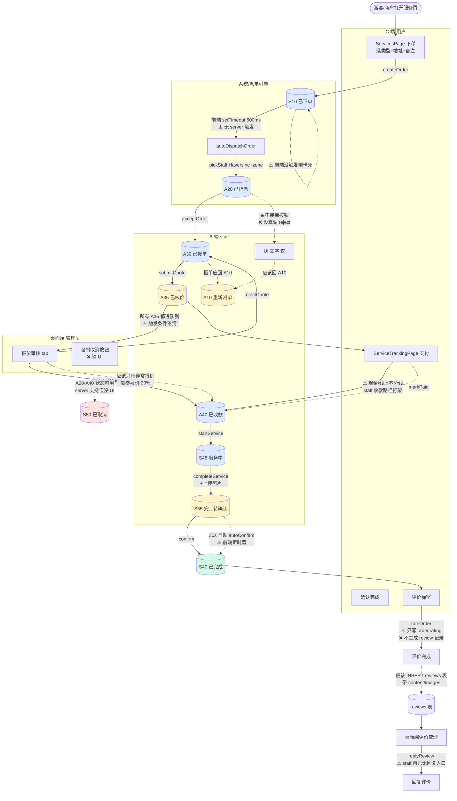
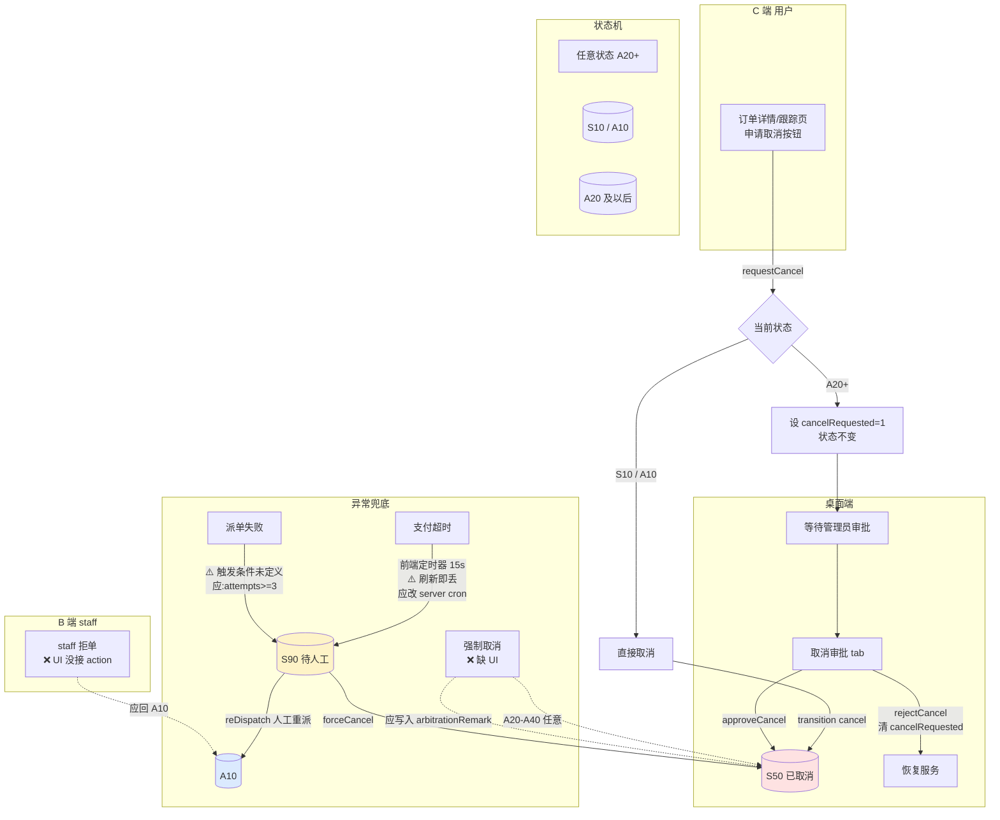
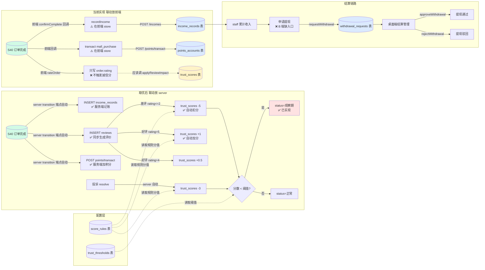

# 便民服务业务逻辑图

> **配套文档**: `docs/superpowers/specs/2026-07-07-convenience-refinement-design.md`
> **形式**: Mermaid 流程图,3 张子图
> **图例**: ✅=闭环 / ⚠️=半闭环 / ❌=断裂 / 💭=架构建议

---

## 图 1:下单主线(C 端下单 → 完成)

覆盖环节 #1-10(下单 / 派单 / 接单 / 报价 / 审核 / 支付 / 服务 / 完成 / 评价 / 回复)

**图 1 关键问题(对照 spec §4):**

| 状态/动作 | 问题 | spec 章节 |
|-----------|------|-----------|
| S10 → A20 | ⚠️ 仅前端 setTimeout 触发,server 无定时任务 | P1.5 |
| A20 → A10(拒单) | ❌ B 端 UI 没真接 reject | P1.1 |
| A35 审核 | ⚠️ 所有报价都进审核,触发条件不清 | P1.3 |
| A35 → A40(支付) | ⚠️ 现金/线上路径打架 | P2.2 |
| S55 → S40 | ⚠️ autoConfirm 靠前端定时器 | P2.4 |
| S40 + rate | ❌ 不生成 review 记录 | P0.1 |
| 回复评价 | ⚠️ staff 自己无入口 | (P1 范围外,补充) |

---

## 图 2:异常处理(取消 + 超时 + 派单失败)

覆盖环节 #13-17(用户取消 / 平台审批 / 强制取消 / 派单失败 / 支付超时)

**图 2 关键问题:**

| 环节 | 问题 | spec 章节 |
|------|------|-----------|
| 强制取消 | ❌ server 支持但桌面端无 UI | P1.2 |
| 支付超时 | ⚠️ 前端定时器,不可靠 | P1.6 |
| 派单失败 | ⚠️ 触发条件未定义(attempts 字段缺失) | P1.5 |
| staff 拒单 | ❌ UI 没接 reject action | P1.1 |
| requestCancel 元动作 | ✅ 已实现 | — |

---

## 图 3:结算 + 诚信分 + 联动(完成后的副作用链)

覆盖环节 #18-22(收入记录 / 提现审批 / 差评扣分 / 好评加分 / 观察期)

**图 3 关键问题:**

| 环节 | 问题 | spec 章节 |
|------|------|-----------|
| 收入记录 | ⚠️ 在前端 store,server 不调则不记 | P0.3 |
| 评价 → 诚信分 | ❌ 完全不触发 | P0.2 |
| 投诉 → 诚信分 | ❌ 完全不触发 | P0.2 |
| 提现申请 | ❌ B 端 staff 无入口 | P1.4 |
| 观察期 | ✅ 前端已自动算 | — |
| 配置源 | ✅ score_rules/trust_thresholds 已有 | — |

---

## 三张图汇总

**核心断层点(图上标 ❌ 的):**
1. 评价不生成 review 记录(图 1)
2. B 端拒单 UI 没接 action(图 1、图 2)
3. 桌面端无强制取消 UI(图 2)
4. 联动逻辑全在前端,server 不触发则不执行(图 3)
5. 诚信分完全不自动触发(图 3)
6. B 端 staff 无提现入口(图 3)

**半闭环(图上标 ⚠️ 的):**
- 自动派单靠前端 setTimeout
- 支付超时靠前端定时器
- 报价审核触发条件不清
- 支付路径现金/线上打架
- autoConfirm 靠前端定时器

**已经闭环的(图上标 ✅ 的):**
- 下单、接单、报价、服务、完成的主线
- requestCancel 元动作
- 投诉创建+处理
- 观察期自动判定
- 桌面端提现审批
- 片区/站点 CRUD

---

## 配套阅读

读完图后,可以对照 spec 的:
- §2 25 项闭环评审表(详细每项评级)
- §4 P0/P1/P2 优化清单(对应图中问题)
- §6 验收标准(每个修复后怎么测)
