# 丽江古城游 V2.0 全 Feature 提升方案

> **版本**：v2.0 · 2026-07-07
> **状态**：硬编码清理完成 · UI/UX 持续迭代

## 一、数据源总览

所有 22 个 feature 的数据来源：

| Feature | 数据源 | 状态 |
|---------|--------|------|
| convenience | API → DB (10 张表) | ✅ |
| complaints | API → DB (complaints 表) | ✅ |
| trust-score | API → DB (4 张表) | ✅ |
| bookings | API → DB (bookings 表) | ✅ |
| checkin | API → DB (2 张表) | ✅ |
| merchant-review | API → DB (2 张表) | ✅ |
| supplier | API → DB (2 张表) | ✅ |
| announcement | API → DB (announcements 表) | ✅ |
| points | API → DB (3 张表) | ✅ |
| address | API → DB (addresses 表) | ✅ |
| ai-knowledge | API → DB (ai_knowledge 表) | ✅ |
| content | API → DB (6 张表) | ✅ |
| homepage | API → DB (banners + grid_items) | ✅ |
| **route** | API → DB (content_routes.isFeatured) | ✅ **本次迁移** |
| **flow-warning** | API → DB (flow_areas 表) | ✅ **本次迁移** |
| heritage | 外部 API（硬编码过渡） | 🟢 spec 确认 |
| housing | 外部 API（硬编码过渡） | 🟢 spec 确认 |
| info | 跨 feature content/news-store | ✅ |
| notification | localStorage (平台级) | 🟢 纯前端 |
| profile | 多 store 聚合 | 🟢 纯展示 |
| favorite | API → DB (favorites 表) | ✅ |
| volunteer | API → DB (3 张表) | ✅ |

## 二、业务流程图（22 个 Feature）

### 1. 便民服务 convenience
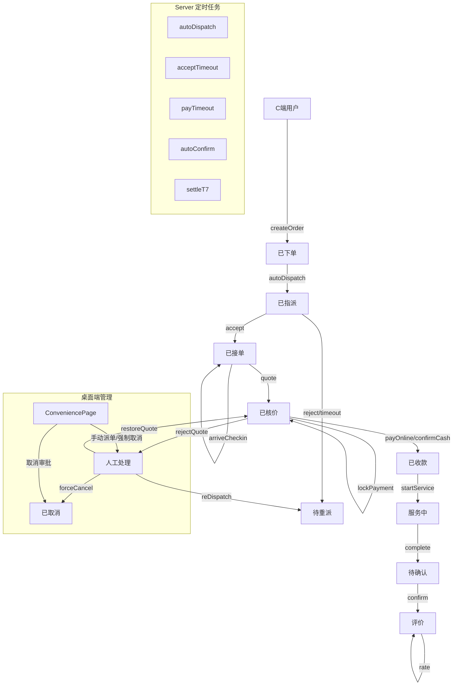

### 2. 投诉管理 complaints
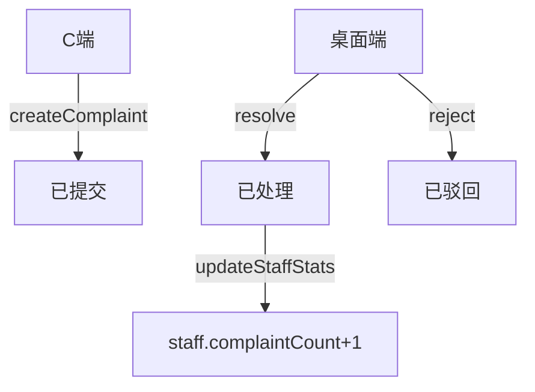

### 3. 诚信评分 trust-score
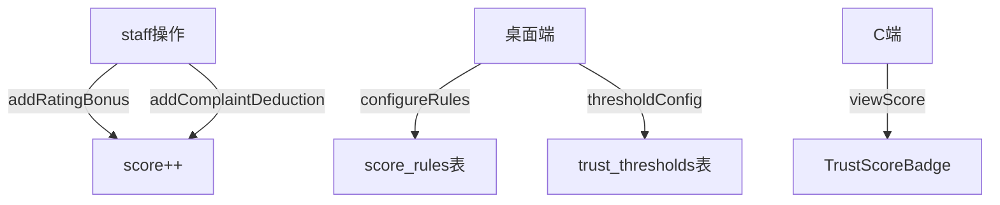

### 4. 院落预约 bookings
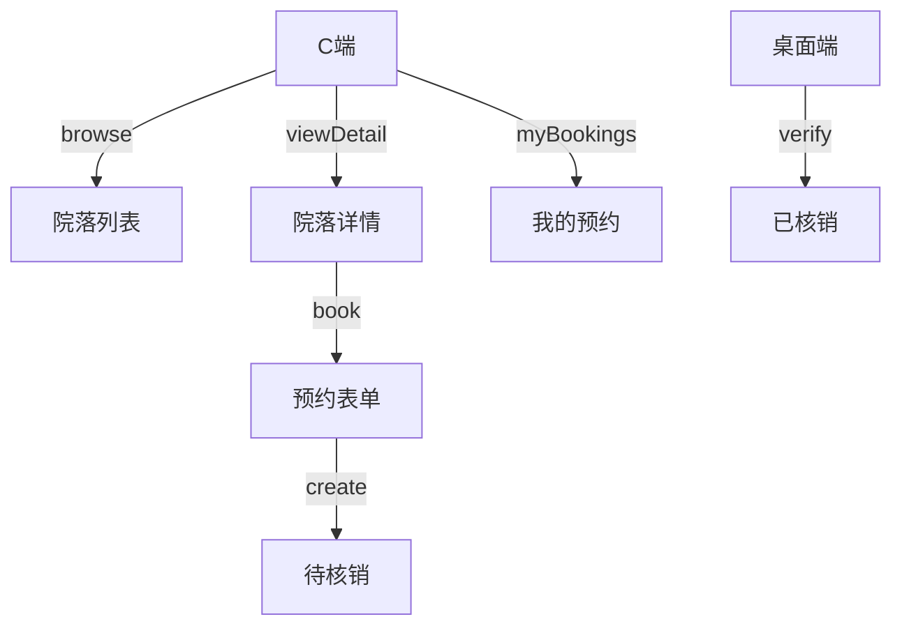

### 5. 签到打卡 checkin
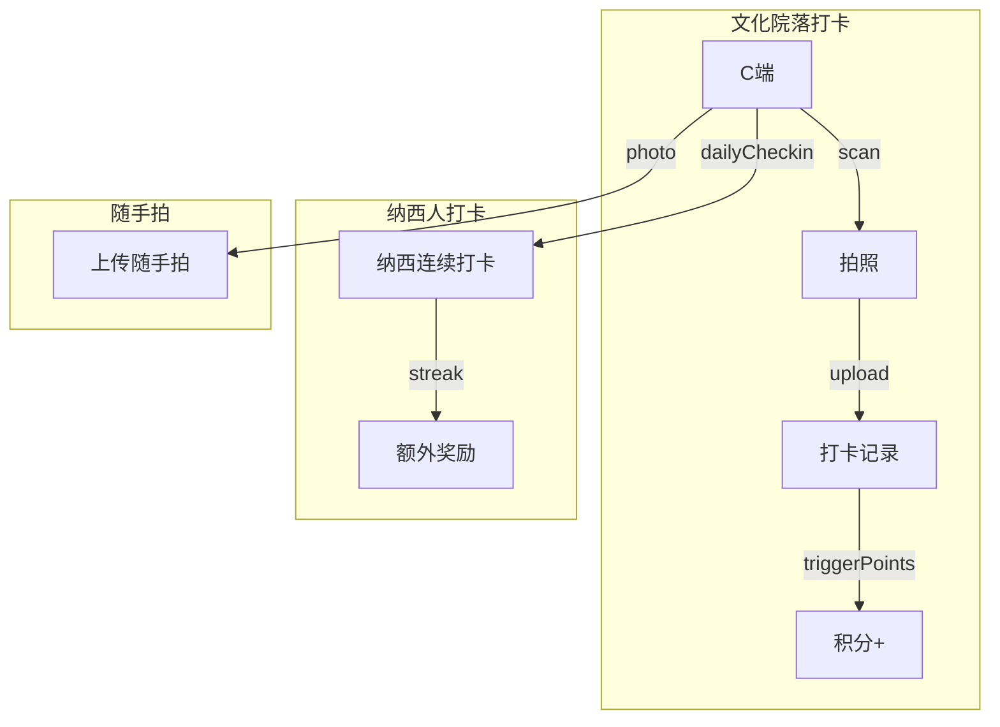

### 6. 商户审核 merchant-review
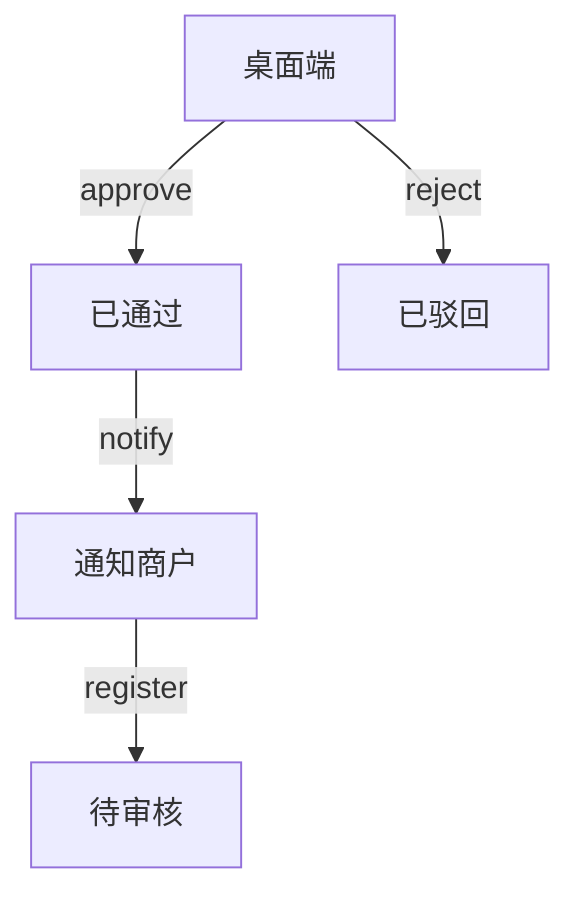

### 7. 供应商管理 supplier
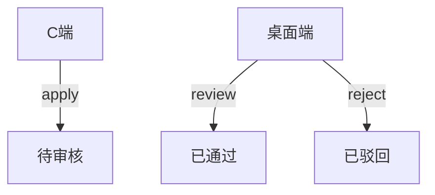

### 8. 内容管理 content
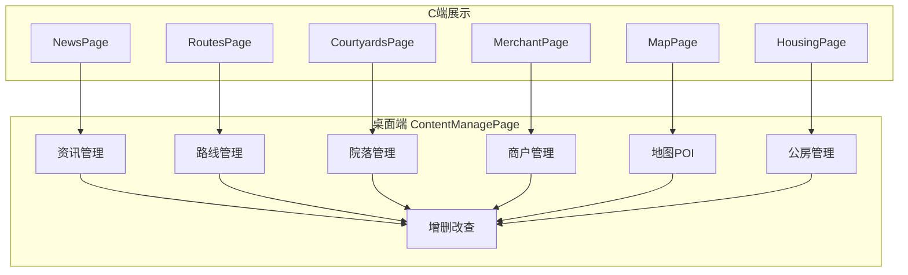

### 9. 积分系统 points
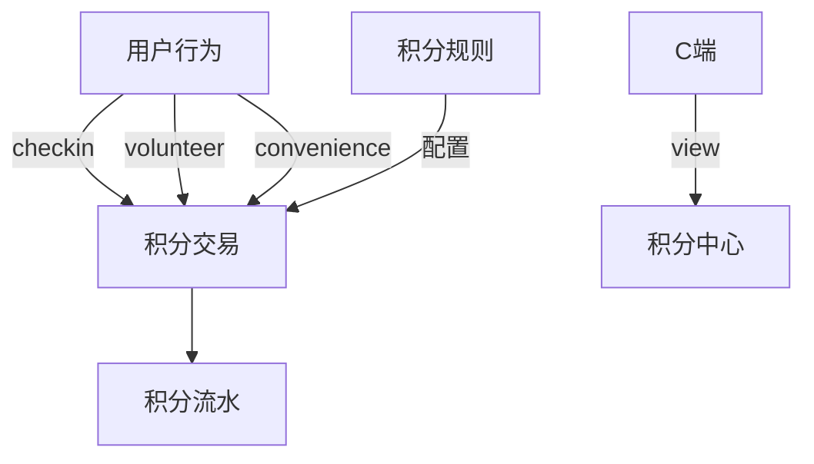

### 10. 志愿服务 volunteer
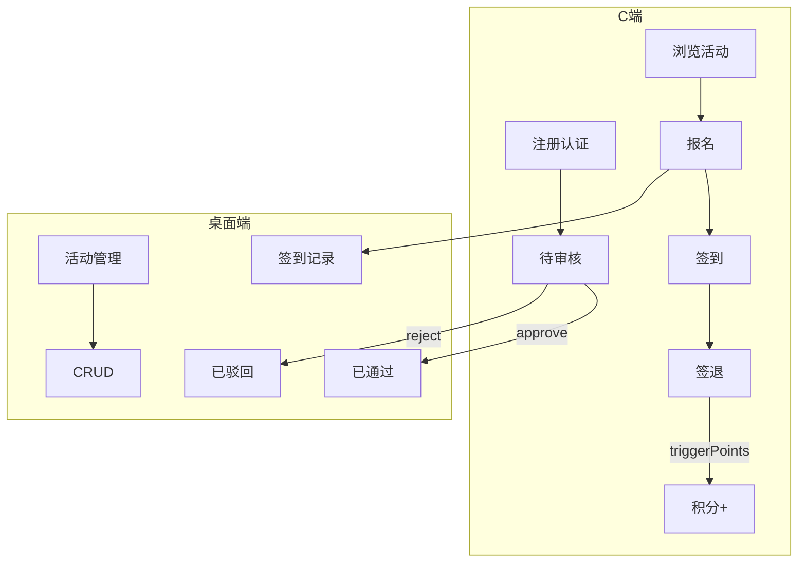

### 11. 公告通知 announcement
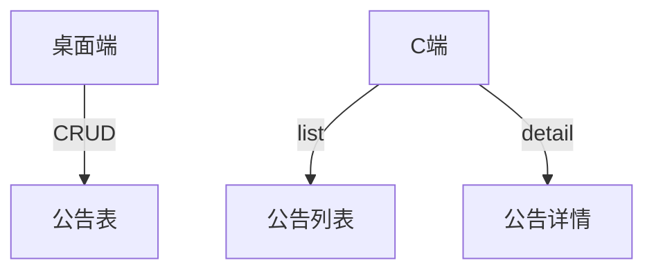

### 12. AI 知识库 ai-knowledge
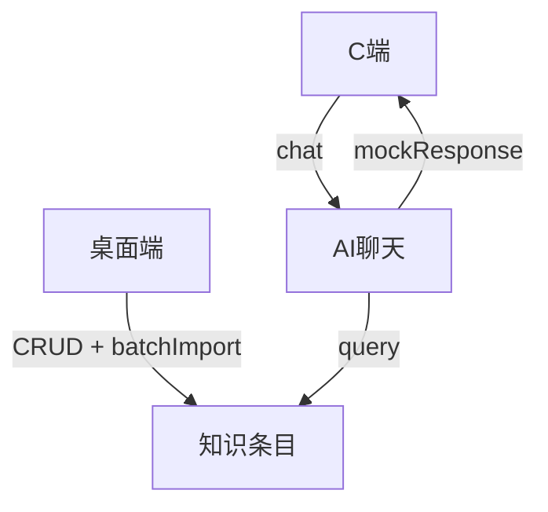

### 13. 地址管理 address
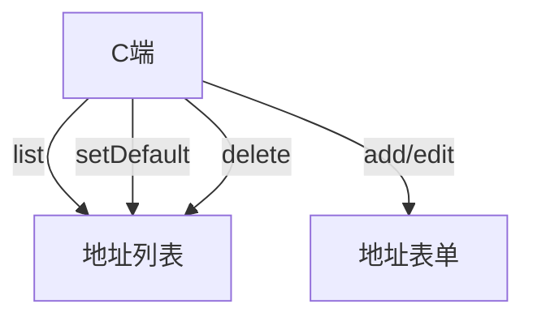

### 14. 收藏管理 favorite
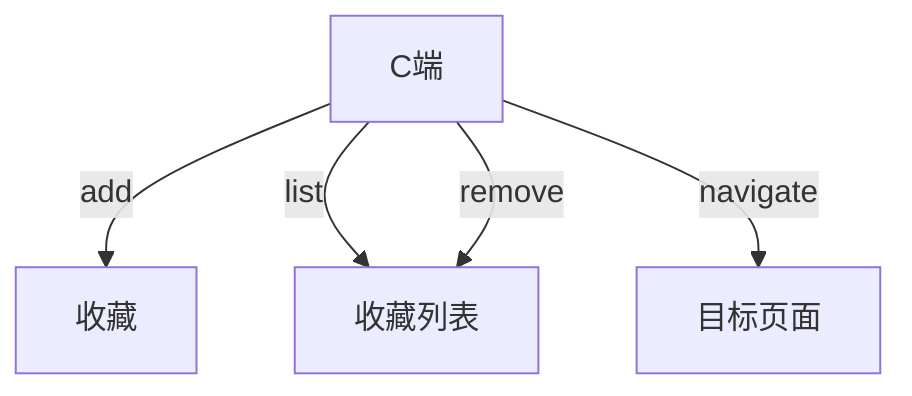

### 15. 首页配置 homepage
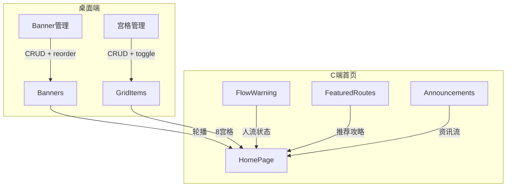

### 16. 消息通知 notification
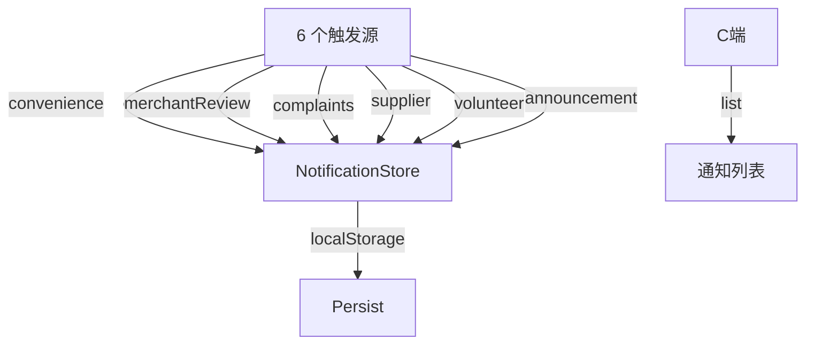

### 17-22. 剩余功能（展示型）
- **profile**：聚合仪表盘，读多 store 纯展示
- **route**：路线浏览 + 详情 + 模拟导航预览
- **heritage**：8 类遗产百科，接外部 API
- **housing**：公房信息展示，接外部 API
- **info**：资讯 + 新闻列表
- **flow-warning**：人流量实时看板

## 三、API 端点对照表

| 资源 | 端点 | 方法 | 说明 |
|------|------|------|------|
| staff | `/api/v1/staff` | CRUD + PATCH disable | ✅ |
| orders | `/api/v1/orders` | CRUD + dispatch/transition/pay | ✅ |
| zones | `/api/v1/zones` | CRUD | ✅ |
| complaints | `/api/v1/complaints` | CRUD + resolve/reject | ✅ |
| reviews | `/api/v1/reviews` | CRUD | ✅ |
| points/rules | `/api/v1/points/rules` | CRUD | ✅ |
| trust-scores | `/api/v1/trust-scores` | CRUD + threshold | ✅ |
| content/news | `/api/v1/content/news` | CRUD | ✅ |
| content/routes | `/api/v1/content/routes` | CRUD | ✅ |
| content/courtyards | `/api/v1/content/courtyards` | CRUD | ✅ |
| content/merchants | `/api/v1/content/merchants` | CRUD | ✅ |
| content/pois | `/api/v1/content/pois` | CRUD | ✅ |
| content/housing | `/api/v1/content/housing` | CRUD | ✅ |
| banners | `/api/v1/banners` | CRUD + reorder | ✅ |
| grid-items | `/api/v1/grid-items` | CRUD | ✅ |
| volunteers | `/api/v1/volunteers` | CRUD | ✅ |
| volunteer-activities | `/api/v1/volunteer-activities` | CRUD | ✅ |
| ai-knowledge | `/api/v1/ai-knowledge` | CRUD | ✅ |
| favorites | `/api/v1/favorites` | CRUD | ✅ |
| addresses | `/api/v1/addresses` | CRUD | ✅ |
| bookings | `/api/v1/bookings` | CRUD + /check | ✅ |
| checkins | `/api/v1/checkins` | CRUD | ✅ |
| naxi-checkins | `/api/v1/naxi-checkins` | CRUD | ✅ |
| **flow-areas** | `/api/v1/flow-areas` | CRUD | ✅ **新增** |
| system-configs | `/api/v1/system-configs` | CRUD | ✅ |
| announcements | `/api/v1/announcements` | CRUD | ✅ |
| flow-warnings | `/api/v1/flow-warnings` | CRUD | ✅ |
| dispatch-configs | `/api/v1/dispatch-configs` | CRUD | ✅ |
| income-records | `/api/v1/incomes` | CRUD | ✅ |
| withdrawals | `/api/v1/withdrawals` | CRUD | ✅ |
| suppliers | `/api/v1/suppliers` | CRUD | ✅ |
| supplier-applications | `/api/v1/supplier-applications` | CRUD | ✅ |
| merchant-registrations | `/api/v1/merchant-registrations` | CRUD | ✅ |
| merchant-reviews | `/api/v1/merchant-reviews` | CRUD | ✅ |

## 四、已完成的清理工作

1. ✅ 删除 3 个死文件（AuditPage + 2 个 FlowWarningPage）
2. ✅ 删除 2 个死路由（B 端 quote + C 端 /c/info/create）
3. ✅ 内联 2 个瘦路由文件（announcements.js + flow-warnings.js）
4. ✅ 抽 crudApi() 工厂 + lazyImport() 辅助
5. ✅ 删除 9 个无价值 store barrel 文件
6. ✅ route 推荐路线硬编码 → API 驱动
7. ✅ flow-warning 硬编码种子数据 → DB + API 驱动
8. ✅ 22 个 feature 需求文档全部产出
9. ✅ 桌面端菜单全面注册（announcement / ai-knowledge / booking / staff-review）
10. ✅ 入驻审核流程 + B 端入驻表单 + 桌面端审核页
11. ✅ 结算 GMV 报表（线上/现金分开统计）
12. ✅ 取消扣费自动计算

## 五、后续迭代（持续）

- **UI/UX 打磨**：全页面三态覆盖（Loading/Empty/Error）
- **业务闭环**：逐 feature 审缺损流转路径补完
- **版本管理**：每次改动独立 commit，分支管理