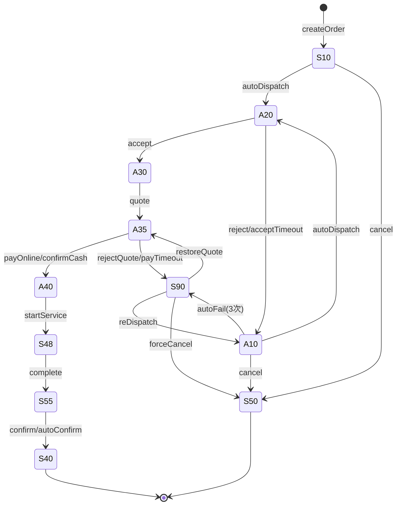

# 便民服务平台 — 生产级设计文档

> **文档版本**: v1.0
> **日期**: 2026-07-10
> **状态**: 待评审
> **适用范围**: 生产级前后端开发

---

## 目录

1. [项目概述](#1-项目概述)
2. [系统架构](#2-系统架构)
3. [角色与权限模型](#3-角色与权限模型)
4. [订单状态机（核心）](#4-订单状态机核心)
5. [业务详细流程](#5-业务详细流程)
6. [API 契约](#6-api-契约)
7. [数据模型](#7-数据模型)
8. [前端功能规格](#8-前端功能规格)
9. [定时任务设计](#9-定时任务设计)
10. [派单引擎设计](#10-派单引擎设计)
11. [双支付方案设计](#11-双支付方案设计)
12. [结算与提现设计](#12-结算与提现设计)
13. [评价体系设计](#13-评价体系设计)
14. [配置体系](#14-配置体系)
15. [错误码与异常处理](#15-错误码与异常处理)
16. [验收标准](#16-验收标准)
17. [实施建议](#17-实施建议)

---

## 1. 项目概述

### 1.1 项目定位

丽江古城便民服务平台 —— 面向古城居民、商户、游客提供六类标准化便民服务（建筑垃圾清运、生活垃圾清运、送水、布草配送、行李搬运、送货），覆盖用户下单 → 系统派单 → 师傅接单 → 到场服务 → 支付 → 评价的完整闭环。

### 1.2 三类角色

| 角色 | 端 | 核心诉求 |
|------|----|----------|
| C 端用户（游客/商户/居民） | 移动端 H5 | 快速找到师傅、价格透明、服务有保障 |
| B 端服务人员（staff） | 移动端 H5 | 接到订单、按时拿到钱 |
| 平台管理员（admin） | 桌面端后台 | 管订单、管人员、管钱、处理异常 |

### 1.3 六类服务

| 服务类型 | 派单模式 | 单位 | 计价方式 |
|----------|----------|------|----------|
| 建筑垃圾清运 | 片区型（zone） | 方 | 按方报价 |
| 生活垃圾清运 | 片区型（zone） | 方 | 按方报价 |
| 送水服务 | 片区型（zone） | 桶 | 按桶报价 |
| 布草配送 | 片区型（zone） | 包 | 按包报价 |
| 行李搬运 | 点对点（距离开）+ 古城内 | 件 | 按趟报价 |
| 送货服务 | 点对点（方向） | 趟 | 按趟报价 |

### 1.4 MVP 边界

**MVP 必须**: 主流程闭环、数据结构完整、Server 端驱动状态机、双支付方案、异常人工兜底

**MVP 不做**: 平台抽成、保证金、智能派单（仅距离+好评率）、用户自选师傅、抢单模式、到场 GPS 校验、电子发票、多级代理、实时位置追踪、改单/加项线上流程

---

## 2. 系统架构

### 2.1 整体架构

```
┌──────────────┐  ┌──────────────┐  ┌────────────────┐
│  C 端 H5     │  │  B 端 H5     │  │  桌面端后台     │
│  (移动端)    │  │  (移动端)    │  │  (Web 后台)    │
└──────┬───────┘  └──────┬───────┘  └───────┬────────┘
       │                  │                   │
       └──────────────────┼───────────────────┘
                          │
                    ┌─────▼──────┐
                    │  API 网关   │
                    │  /api/v1/* │
                    └─────┬──────┘
                          │
              ┌───────────┼───────────┐
              │           │           │
        ┌─────▼────┐ ┌───▼───┐ ┌────▼────┐
        │ 订单服务  │ │派单引擎│ │结算服务   │
        │ 状态机    │ │定时器 │ │营收管理   │
        └─────┬────┘ └───┬───┘ └────┬────┘
              │           │          │
              └───────────┼──────────┘
                          │
                    ┌─────▼──────┐
                    │   SQLite DB │
                    │ (prod: PG) │
                    └────────────┘
```

### 2.2 架构红线

1. **所有状态变更由 Server 端驱动** —— 前端只发请求，不直接改状态
2. **所有定时任务在 Server 端执行** —— 前端定时器只做 UI 倒计时提示
3. **状态流转副作用在 Server 端完成** ——（记账、生成评价记录、更新计数等）
4. **支付接口必须幂等** —— 重复请求不重复扣款
5. **所有 transition 自动记录操作日志**

### 2.3 依赖关系

```
orders.js（路由层）
  ├─ transition() / logic/transitions.js
  ├─ pickStaff() / logic/dispatch.js
  ├─ calcCancelFee() / logic/pricing.js
  ├─ logOperation() / crud.js
  ├─ createNotification() / routes/notifications.js
  └─ onOrderCompleted()（订单完成副作用链）

scheduler.js（定时任务）
  ├─ autoDispatch() → orders.js /dispatch 端点（或直接 DB）
  ├─ acceptTimeout()
  ├─ payTimeout()
  ├─ autoConfirm()
  └─ recalcGoodRate() / resetTodayOrders() / settleT7()

dispatch.js（派单引擎）
  ├─ pickStaff() → haversineKm()
  └─ lookupStaff()

pricing.js（定价、扣费）
  └─ calcCancelFee() → GET from system_configs
```

---

## 3. 角色与权限模型

### 3.1 角色

| 角色标识 | 平台 | 说明 |
|----------|------|------|
| `tourist` | C 端 | 游客/普通用户，可下单 |
| `supplier` | C/B/Desktop | 叠加角色，商户可管理店铺和接单 |
| `service` | B 端 | 便民服务人员（staff） |
| `platform_admin` | B/Desktop | 平台管理员 |

### 3.2 权限矩阵

| 功能 | tourist | supplier | service | admin |
|------|---------|----------|---------|-------|
| 浏览服务、下单 | ✅ | ✅ | ❌ | ❌ |
| 查看/跟踪订单 | ✅ | ✅ | ❌ | ❌ |
| 评价 | ✅ | ✅ | ❌ | ❌ |
| 投诉 | ✅ | ✅ | ❌ | ❌ |
| 接单/拒单 | ❌ | ❌ | ✅ | ❌ |
| 报价/打卡/完工 | ❌ | ❌ | ✅ | ❌ |
| 提现 | ❌ | ❌ | ✅ | ❌ |
| 订单管理 | ❌ | ❌ | ❌ | ✅ |
| 人员管理 | ❌ | ❌ | ❌ | ✅ |
| 取消审批 | ❌ | ❌ | ❌ | ✅ |
| 结算管理 | ❌ | ❌ | ❌ | ✅ |
| 配置管理 | ❌ | ❌ | ❌ | ✅ |

---

## 4. 订单状态机（核心）

### 4.1 状态定义（11 个）

| 状态码 | 名称 | 阶段 | 是否终态 |
|--------|------|------|----------|
| S10 | 已下单 | 派单阶段 | 否 |
| A10 | 待重新派单 | 派单阶段 | 否 |
| A20 | 已指派 | 派单阶段 | 否 |
| A30 | 已接单 | 服务准备 | 否 |
| A35 | 已核价 | 支付阶段 | 否 |
| A40 | 已收款 | 支付阶段 | 否 |
| S48 | 服务中 | 服务阶段 | 否 |
| S55 | 完工待确认 | 验收阶段 | 否 |
| S40 | 已完成 | 完成 | 是 |
| S50 | 已取消 | 终止 | 是 |
| S90 | 待人工处理 | 异常 | 否 |

### 4.2 状态流转表

| 源状态 | 目标状态 | 动作 | 触发方 | 前置条件 |
|--------|----------|------|--------|----------|
| - | S10 | createOrder | C 端用户 | 必填：serviceType, address；可选：remark, lat, lng |
| S10 | A20 | autoDispatch | Server 定时 | - |
| S10 | A10 | dispatchFailed | Server 定时 | 首次无可用 staff |
| S10 | S50 | cancel | C 端用户 | S10 直接取消，不扣费 |
| A10 | A20 | autoDispatch | Server 定时 | - |
| A10 | S90 | autoFail | Server 定时 | dispatchAttempts >= 3 |
| A10 | S50 | cancel | C 端用户 | 直接取消，不扣费 |
| A20 | A30 | accept | B 端 staff | - |
| A20 | A10 | reject | B 端 staff | 更新 dispatch_logs |
| A20 | A10 | acceptTimeout | Server 定时 | 超 5 分钟未接 |
| A20 | S50 | forceCancel | 管理员 | - |
| A30 | A35 | quote | B 端 staff | arrivedAt 不为空 |
| A30 | S90 | payTimeout | Server 定时 | 报价超 30 分钟未完成 |
| A30 | S50 | forceCancel | 管理员 | - |
| A35 | A35(元) | lockPayment | C 端用户 | 写 paymentMethod + paymentMethodLocked=1 |
| A35 | A40 | payOnline | C 端用户 | paymentMethodLocked=1, paymentMethod=online |
| A35 | A40 | confirmCash | B 端 staff | paymentMethodLocked=1, paymentMethod=cash |
| A35 | S90 | rejectQuote | C 端用户 | 写 manualReason=quote_rejected |
| A35 | S90 | payTimeout | Server 定时 | quotedAt 超 30 分钟 |
| A35 | S50 | forceCancel | 管理员 | - |
| A40 | S48 | startService | B 端 staff | - |
| A40 | S50 | forceCancel | 管理员 | 退款处理 |
| S48 | S55 | complete | B 端 staff | 上传 completionPhotos |
| S55 | S40 | confirm | C 端用户 | - |
| S55 | S40 | autoConfirm | Server 定时 | 超 24 小时 |
| S55 | S40 | confirmPayment | 管理员 | 付款凭证审核通过 |
| S90 | A10 | reDispatch | 管理员 | - |
| S90 | A35 | restoreQuote | 管理员 | manualReason=quote_rejected，重置 quotedAt |
| S90 | S50 | forceCancel | 管理员 | - |

### 4.3 元动作（不改状态，只改字段）

| 元动作 | 字段改动 | 触发方 | 说明 |
|--------|----------|--------|------|
| arriveCheckin | `arrivedAt = now` | B 端 staff | 到场打卡，A30 可用 |
| lockPayment | `paymentMethod`, `paymentMethodLocked=1` | C 端用户 | A35 可用，锁定后不可改 |
| requestCancel | `cancelRequested=1` | C 端用户 | A30+ 可用，状态不变 |
| rejectCancel | `cancelRequested=0` | 管理员 | 拒绝取消申请 |
| approveCancel | `cancelRequested=0 + status=S50` | 管理员 | 批准取消 |

### 4.4 状态流转图



---

## 5. 业务详细流程

### 5.1 下单主流程（完整时序）

```
C端用户                   Server                   B端staff               Server定时任务
   │                        │                        │                        │
   │── createOrder ────────→│                        │                        │
   │                        │── INSERT INTO orders ─→│── 状态：S10             │
   │                        │── logOperation ───────→│                        │
   │←── 返回 order ────────│                        │                        │
   │                        │                        │                        │
   │                        │                        │                        │── 每10秒扫S10/A10
   │                        │                        │                        │── autoDispatch()
   │                        │── UPDATE status=A20 ──→│                        │
   │                        │── UPDATE staff         │                        │
   │                        │── INSERT dispatch_logs │                        │
   │                        │── logOperation         │                        │
   │                        │── createNotification ─→│── "新派单" 通知         │
   │                        │                        │                        │
   │                        │                        │── acceptOrder ────────→│
   │                        │── UPDATE status=A30 ──→│                        │
   │                        │── 减 assignedOrders ──→│                        │
   │                        │── 加 todayOrders ─────→│                        │
   │                        │── logOperation         │                        │
   │←── 通知 "已接单" ────│                        │                        │
   │                        │                        │                        │
   │                        │                        │── arriveCheckin ──────→│
   │                        │── UPDATE arrivedAt ───→│                        │
   │                        │── logOperation         │                        │
   │                        │                        │                        │
   │                        │                        │── quote(price) ───────→│
   │                        │── UPDATE quoteAmt=A35─→│                        │
   │                        │── logOperation         │                        │
   │←── 通知 "已报价" ────│                        │                        │
   │                        │                        │                        │
   │── lockPayment(online)─→│                        │                        │
   │                        │── UPDATE payMethodLock  │                        │
   │                        │── logOperation         │                        │
   │── payOnline ──────────→│                        │                        │
   │                        │── UPDATE A40            │                        │
   │                        │── INSERT payment_records│                        │
   │                        │── logOperation         │                        │
   │                        │── createNotification ─→│── "用户已付款"          │
   │                        │                        │                        │
   │                        │                        │── startService ───────→│
   │                        │── UPDATE S48 ─────────→│                        │
   │                        │                        │                        │
   │                        │                        │── complete(photos) ───→│
   │                        │── UPDATE S55 ─────────→│                        │
   │                        │── logOperation         │                        │
   │←── 通知 "服务完成" ──│                        │                        │
   │                        │                        │                        │
   │── confirm ────────────→│                        │                        │
   │                        │── UPDATE S40            │                        │
   │                        │── onOrderCompleted()    │                        │
   │                        │   ├─ INSERT income_rec  │                        │
   │                        │   └─ UPDATE reviewStatus│                        │
   │                        │── logOperation         │                        │
   │                        │── createNotification ─→│── "订单完成"            │
   │                        │                        │                        │
   │── rate(rating,content)─→│                        │                        │
   │                        │── INSERT reviews ─────→│                        │
   │                        │── UPDATE reviewStatus  │                        │
   │                        │── logOperation         │                        │
```

### 5.2 取消流程

```
C端用户                   Server                    桌面端管理员
   │                        │                          │
   │── requestCancel ──────→│                          │
   │                        │── cancelRequested=1      │
   │                        │── logOperation           │
   │                        │                          │
   │                        │                          │── 查看取消审批列表
   │                        │                          │── approveCancel / rejectCancel
   │                        │←── approveCancel ────────│
   │                        │── UPDATE status=S50      │
   │                        │── calcCancelFee          │
   │                        │── INSERT payment_records │
   │                        │── logOperation           │
   │←── 通知 "取消已同意"   │                          │
```

### 5.3 报价争议流程

```
C端用户                   Server                    桌面端管理员
   │                        │                          │
   │── rejectQuote(reason) ─→│                          │
   │                        │── UPDATE S90             │
   │                        │── beforeManualStatus=A35 │
   │                        │── manualReason=          │
   │                        │   quote_rejected         │
   │                        │                          │
   │                        │                          │── 查看S90人工处理池
   │                        │                          │── restoreQuote / forceCancel
   │                        │←── restoreQuote ────────│
   │                        │── UPDATE A35             │
   │                        │── reset quotedAt         │
```

---

## 6. API 契约

### 6.1 通用规范

- **统一前缀**: `/api/v1`
- **响应格式**:
  ```json
  // 成功
  { "ok": true, "data": { ... } }
  // 列表
  { "ok": true, "data": { "items": [...], "total": 100 } }
  // 失败
  { "ok": false, "msg": "错误描述" }
  ```
- **分页参数**: `?page=1&pageSize=20&sort=-createdAt`
- **筛选参数**: `?status=S10&serviceType=送水服务`
- **认证**: 请求头 `Authorization: Bearer <jwt_token>`

### 6.2 订单 API

| 方法 | 路径 | 说明 | 请求体 |
|------|------|------|--------|
| POST | `/api/v1/orders` | 创建订单 | `{ serviceType, address, remark?, lat?, lng? }` |
| GET | `/api/v1/orders` | 列表（分页+筛选） | 查询参数 |
| GET | `/api/v1/orders/:id` | 详情 | - |
| POST | `/api/v1/orders/:id/dispatch` | 派单（手动/自动） | `{ mode: "auto"\|"manual", staffId? }` |
| POST | `/api/v1/orders/:id/transition` | 通用状态流转 | `{ action, ...extraFields }` |
| POST | `/api/v1/orders/:id/arrive-checkin` | 到场打卡 | `{ staffId }` |
| POST | `/api/v1/orders/:id/lock-payment` | 锁定支付方式 | `{ paymentMethod: "online"\|"cash" }` |
| POST | `/api/v1/orders/:id/pay-online` | 线上支付 | `{ userId }` |
| POST | `/api/v1/orders/:id/confirm-cash` | 现金确认收款 | `{ staffId }` |
| POST | `/api/v1/orders/:id/reject-quote` | 拒绝报价 | `{ reason, userId }` |
| POST | `/api/v1/orders/:id/restore-quote` | 恢复报价（S90→A35） | `{ adminId }` |
| POST | `/api/v1/orders/:id/rate` | 评价 | `{ rating, content?, images?, userId }` |
| GET | `/api/v1/orders/gmv-stats` | GMV 统计 | `?period=day\|week\|month` |

### 6.3 人员 API

| 方法 | 路径 | 说明 |
|------|------|------|
| GET/POST/PATCH/DELETE | `/api/v1/staff` | CRUD |
| GET | `/api/v1/staff?online=true` | 在线人员列表 |

### 6.4 片区/站点 API

| 方法 | 路径 | 说明 |
|------|------|------|
| GET/POST/PATCH/DELETE | `/api/v1/zones` | 片区 CRUD |

### 6.5 结算 API

| 方法 | 路径 | 说明 |
|------|------|------|
| POST | `/api/v1/withdrawals` | 创建提现申请 |
| GET | `/api/v1/withdrawals?staffId=` | 提现列表 |
| PATCH | `/api/v1/withdrawals/:id` | 审批提现 |
| GET | `/api/v1/incomes?staffId=` | 收入明细 |

### 6.6 评价 API

| 方法 | 路径 | 说明 |
|------|------|------|
| GET | `/api/v1/reviews?staffId=` | 评价列表 |
| PATCH | `/api/v1/reviews/:id` | 回复/软删评价 |

### 6.7 投诉 API

| 方法 | 路径 | 说明 |
|------|------|------|
| POST | `/api/v1/complaints` | 提交投诉 |
| GET | `/api/v1/complaints` | 投诉列表 |
| PATCH | `/api/v1/complaints/:id` | 审核投诉 |

### 6.8 系统配置 API

| 方法 | 路径 | 说明 |
|------|------|------|
| GET | `/api/v1/system-configs` | 配置列表 |
| PATCH | `/api/v1/system-configs/:id` | 更新配置 |

### 6.9 通知 API

| 方法 | 路径 | 说明 |
|------|------|------|
| GET | `/api/v1/notifications?staffId=` | 通知列表 |
| POST | `/api/v1/notifications/:id/read` | 标记已读 |
| POST | `/api/v1/notifications/read-all` | 全部已读 |

### 6.10 transition 动作列表

`POST /api/v1/orders/:id/transition` 的 `action` 字段取值：

| action | 说明 | 源状态 | 目标状态 |
|--------|------|--------|----------|
| accept | 接单 | A20 | A30 |
| reject | 拒单 | A20 | A10 |
| quote | 报价 | A30 | A35 |
| pay | 支付 | A35 | A40 |
| payTimeout | 支付超时 | A30/A35 | S90 |
| startService | 开始服务 | A40 | S48 |
| complete | 完工 | S48 | S55 |
| confirm | 确认完成 | S55 | S40 |
| cancel | 取消 | S10/A10 | S50 |
| forceCancel | 强制取消 | 多种 | S50 |
| requestCancel | 申请取消（元） | A30+ | (不变) |
| rejectCancel | 拒绝取消（元） | A30+ | (不变) |
| approveCancel | 批准取消 | A30+ | S50 |
| reDispatch | 重新派单 | S90 | A10 |
| autoFail | 派单失败 | A10 | S90 |

---

## 7. 数据模型

### 7.1 convenience_orders（订单）

| 字段 | 类型 | 约束 | 说明 |
|------|------|------|------|
| id | TEXT | PK | 订单 ID |
| orderNo | TEXT | | 业务单号（可选） |
| userId | TEXT | NOT NULL, FK→users | 下单用户 |
| serviceType | TEXT | NOT NULL | 服务类型 |
| address | TEXT | NOT NULL | 服务地址 |
| addressTo | TEXT | | 目标地址（点对点用） |
| images | TEXT | DEFAULT '[]' | 用户上传图片（JSON） |
| note | TEXT | | 用户备注 |
| preferredTime | TEXT | | 预约时间 |
| status | TEXT | DEFAULT 'S10' | 订单状态 |
| priceQuote | REAL | | 报价金额 |
| refPrice | REAL | | 参考价 |
| staffId | TEXT | FK→staff | 服务人员 |
| staffName | TEXT | | 冗余 |
| staffPhone | TEXT | | 冗余 |
| paymentMethod | TEXT | | online/cash |
| paymentMethodLocked | INTEGER | DEFAULT 0 | 已锁定 |
| paidAmount | REAL | | 实付金额 |
| arrivedAt | TEXT | | 到场打卡时间 |
| quotedAt | TEXT | | 报价时间（超时计时用） |
| dispatchAttempts | INTEGER | DEFAULT 0 | 派单尝试次数 |
| cancelRequested | INTEGER | DEFAULT 0 | 是否申请取消 |
| cancelReason | TEXT | | 取消原因 |
| cancelFee | REAL | | 取消费用 |
| rejectQuoteReason | TEXT | | 拒绝报价原因 |
| reviewStatus | TEXT | DEFAULT 'pending' | 评价状态：pending/done/expired |
| beforeManualStatus | TEXT | | 进入 S90 前状态 |
| manualReason | TEXT | | 进入 S90 原因 |
| completionPhotos | TEXT | DEFAULT '[]' | 完工照片（JSON） |
| rating | INTEGER | | 评分（1-5） |
| ratedAt | TEXT | | 评价时间 |
| completedAt | TEXT | | 完成时间 |
| lat | REAL | | 纬度 |
| lng | REAL | | 经度 |
| arbitrationRemark | TEXT | | 仲裁备注 |
| createdAt | TEXT | DEFAULT now | 创建时间 |
| updatedAt | TEXT | DEFAULT now | 更新时间 |

**索引**: userId, staffId, status, createdAt

### 7.2 staff（服务人员）

| 字段 | 类型 | 约束 | 说明 |
|------|------|------|------|
| id | TEXT | PK | 人员 ID |
| name | TEXT | NOT NULL | 姓名 |
| phone | TEXT | NOT NULL | 手机号 |
| staffType | TEXT | DEFAULT 'partner' | partner/employee |
| idCard | TEXT | | 身份证号 |
| idCardFront | TEXT | | 身份证正面 URL |
| idCardBack | TEXT | | 身份证反面 URL |
| serviceTypes | TEXT(JSON) | DEFAULT '[]' | 服务类型数组 |
| zoneId | TEXT | FK→zones | 所属片区 |
| zoneIds | TEXT(JSON) | DEFAULT '[]' | 多片区 |
| lat | REAL | | 当前位置纬度 |
| lng | REAL | | 当前位置经度 |
| enabled | INTEGER | DEFAULT 1 | 启用/禁用 |
| onlineStatus | TEXT | DEFAULT 'online' | online/busy/offline |
| goodRate | REAL | DEFAULT 1.0 | 好评率（冗余） |
| complaintCount | INTEGER | DEFAULT 0 | 投诉次数 |
| penaltyScore | REAL | DEFAULT 0 | 处罚分 |
| totalOrders | INTEGER | DEFAULT 0 | 完成订单数 |
| todayOrders | INTEGER | DEFAULT 0 | 今日接单数 |
| assignedOrders | INTEGER | DEFAULT 0 | 已派未接单数 |
| balance | REAL | DEFAULT 0 | 可提现余额 |
| applyStatus | TEXT | DEFAULT 'approved' | pending/approved/rejected |
| rejectReason | TEXT | | 驳回原因 |
| lastOnlineAt | TEXT | | 最后上线时间 |
| createdAt | TEXT | DEFAULT now | 创建时间 |
| updatedAt | TEXT | DEFAULT now | 更新时间 |

### 7.3 reviews（评价）

| 字段 | 类型 | 约束 | 说明 |
|------|------|------|------|
| id | TEXT | PK | 评价 ID |
| orderId | TEXT | NOT NULL, FK→orders | 关联订单 |
| serviceType | TEXT | | 服务类型 |
| staffId | TEXT | FK→staff | 被评师傅 |
| staffName | TEXT | | 冗余 |
| userId | TEXT | FK→users | 评价用户 |
| userName | TEXT | | 冗余 |
| rating | INTEGER | CHECK(1-5) | 评分 |
| content | TEXT | DEFAULT '' | 评价内容 |
| images | TEXT(JSON) | DEFAULT '[]' | 图片 |
| replyContent | TEXT | | 管理层回复 |
| repliedAt | TEXT | | 回复时间 |
| isDeleted | INTEGER | DEFAULT 0 | 软删标记 |
| createdAt | TEXT | DEFAULT now | 创建时间 |
| updatedAt | TEXT | DEFAULT now | 更新时间 |

**规则**:
- 订单完成（S40）时 reviewStatus = pending，不生成空记录
- 用户主动提交评价才 INSERT
- 评价不可修改、不可删除（管理员可软删）
- 好评率 = (评分 ≥ 4 的评价数) / 总评价数，无评价默认 1.0

### 7.4 income_records（收入记录）

| 字段 | 类型 | 约束 | 说明 |
|------|------|------|------|
| id | TEXT | PK | 记录 ID |
| orderId | TEXT | NOT NULL, FK→orders | 关联订单 |
| staffId | TEXT | NOT NULL, FK→staff | 服务人员 |
| staffName | TEXT | | 冗余 |
| serviceType | TEXT | | 服务类型 |
| amount | REAL | NOT NULL | 金额（= priceQuote） |
| payMethod | TEXT | NOT NULL | online/cash |
| completedAt | TEXT | | 订单完成时间 |
| createdAt | TEXT | DEFAULT now | 创建时间 |

**规则**:
- 订单完成（S40）时 Server 端自动 INSERT
- 线上支付 → 后续 T+7 进入 balance，可提现
- 现金支付 → 仅记录流水，不进入 balance

### 7.5 withdrawal_requests（提现申请）

| 字段 | 类型 | 约束 | 说明 |
|------|------|------|------|
| id | TEXT | PK | 申请 ID |
| staffId | TEXT | NOT NULL, FK→staff | 申请人 |
| staffName | TEXT | | 冗余 |
| amount | REAL | NOT NULL | 金额 |
| status | TEXT | DEFAULT 'pending' | pending/approved/rejected |
| reviewedAt | TEXT | | 审核时间 |
| reviewer | TEXT | | 审核人 |
| rejectReason | TEXT | | 驳回原因 |
| createdAt | TEXT | DEFAULT now | 申请时间 |

### 7.6 dispatch_logs（派单日志）

| 字段 | 类型 | 约束 | 说明 |
|------|------|------|------|
| id | INTEGER | PK AUTOINCREMENT | |
| orderId | TEXT | FK→orders | 关联订单 |
| staffId | TEXT | FK→staff | 被派单师傅 |
| type | TEXT | | auto/manual |
| staffName | TEXT | | 冗余 |
| reason | TEXT | | 说明 |
| result | TEXT | | pending/accepted/rejected/timeout |
| rejectReason | TEXT | | 拒单原因 |
| timestamp | TEXT | | 派单时间 |
| respondedAt | TEXT | | 响应时间 |

### 7.7 payment_records（支付流水）

| 字段 | 类型 | 约束 | 说明 |
|------|------|------|------|
| id | TEXT | PK | 流水 ID |
| orderId | TEXT | FK→orders | 关联订单 |
| originPaymentId | TEXT | | 原流水（退款用） |
| paymentMethod | TEXT | NOT NULL | online/cash |
| amount | REAL | NOT NULL | 金额 |
| status | TEXT | DEFAULT 'success' | success/refunded |
| thirdTradeNo | TEXT | | 第三方交易号 |
| collectedByStaffId | TEXT | | 现金收款人 |
| paidAt | TEXT | | 支付时间 |
| createdAt | TEXT | DEFAULT now | 创建时间 |

### 7.8 order_operation_logs（操作日志）

| 字段 | 类型 | 约束 | 说明 |
|------|------|------|------|
| id | INTEGER | PK AUTOINCREMENT | |
| orderId | TEXT | FK→orders | 关联订单 |
| operatorType | TEXT | | user/staff/admin/system |
| operatorId | TEXT | | 操作人 ID |
| action | TEXT | | 动作名 |
| fromStatus | TEXT | | 之前状态 |
| toStatus | TEXT | | 之后状态 |
| remark | TEXT | | 说明 |
| createdAt | TEXT | DEFAULT now | 操作时间 |

**规则**: 所有 server transition 端点自动写日志，system 触发的 operatorType=system。

### 7.9 system_configs（系统配置）

| 字段 | 类型 | 约束 | 说明 |
|------|------|------|------|
| id | TEXT | PK | 配置 ID |
| configKey | TEXT | NOT NULL UNIQUE | 键 |
| configValue | TEXT | NOT NULL | 值（JSON） |
| description | TEXT | | 说明 |
| updatedBy | TEXT | | 更新人 |
| updatedAt | TEXT | DEFAULT now | 更新时间 |

**预置配置项**:

| configKey | 默认值 | 说明 |
|-----------|--------|------|
| cancelFeeRules | `{"beforeAccept":0,"afterAccept":0.1,"afterPay":0.2,"minAmount":5,"maxAmount":50}` | 取消扣费规则 |
| dispatchRetryTimes | 3 | 派单重试次数 |
| acceptTimeoutMinutes | 5 | 接单超时（分） |
| payTimeoutMinutes | 30 | 支付超时（分） |
| autoConfirmHours | 24 | 自动确认完工（小时） |
| settlementTDays | 7 | 结算 T+N 天 |
| minWithdrawalAmount | 100 | 最低提现金额 |
| dailyOrderLimit | 20 | 每日接单上限 |

### 7.10 complaints（投诉）

| 字段 | 类型 | 约束 | 说明 |
|------|------|------|------|
| id | TEXT | PK | 投诉 ID |
| orderId | TEXT | FK→orders | 关联订单 |
| userId | TEXT | FK→users | 投诉人 |
| type | TEXT | NOT NULL | 投诉类型 |
| content | TEXT | NOT NULL | 投诉内容 |
| images | TEXT(JSON) | DEFAULT '[]' | 证据图片 |
| status | TEXT | DEFAULT 'C10' | C10/C40/CR |
| result | TEXT | | 处理结论 |
| handledAt | TEXT | | 处理时间 |
| createdAt | TEXT | DEFAULT now | 创建时间 |
| updatedAt | TEXT | DEFAULT now | 更新时间 |

---

## 8. 前端功能规格

### 8.1 C 端（游客/商户）

| 页面/模块 | 功能 | 备注 |
|-----------|------|------|
| ServicesPage | 展示 6 类服务卡片（名称、价格、图片、说明） | 价格从 API 动态读 |
| OrderCreatePage | 选服务类型 → 填地址/备注 → 提交订单 | 不选支付方式 |
| OrderListPage | 查看自己的订单列表（按状态分组） | |
| OrderDetailPage | 订单跟踪：状态进度条、师傅信息、联系、操作按钮 | 根据状态动态展示 |
| PaymentPage | A35 时：确认报价 + 选支付方式 + 锁定 + 支付 | 线上支付模拟 |
| ReviewDialog | S40 时：评分 1-5 + 文字 + 图片 | |
| CancelRequest | 申请取消（A10/A20 直接；A30+ 需审批） | |
| ComplaintPage | 提交投诉 + 证据图片 | |

### 8.2 B 端（服务人员）

| 页面/模块 | 功能 | 备注 |
|-----------|------|------|
| ServiceWorkbench | 待接单/进行中/历史订单概览 | 底部 5-Tab |
| ServiceTasks | 待接单列表（A20）+ 操作（接单/拒单） | |
| ServiceOrderDetail | 订单详情 + 状态操作 | 根据状态显示不同按钮 |
| QuoteAndPhotoFlow | 报价入口（置灰 if 未打卡）→ 打卡 → 报价 → 完工拍照 | 完整操作流 |
| ServiceHistory | 已完成订单历史 + 收入统计 | |
| ServiceProfile | 个人信息 + 可提现余额 + 提现申请 | |
| StaffRegister | 入驻申请（姓名、手机、身份证、服务类型） | |
| Notifications | 新派单/付款/完成等通知 | |

### 8.3 桌面端（管理员）

| 页面/模块 | 功能 |
|-----------|------|
| ConveniencePage | 订单管理（全部/待派单/S90/取消审批/报价审核 tab） |
| OrderTableTab | 订单列表（含搜索/筛选/分页/操作） |
| OrderDialogs | 手动派单/取消审批/强制取消/详情弹窗 |
| ConvenienceStaffPage | 人员管理（列表/新增/编辑/禁用+处理进行中订单） |
| StaffFormDialog | 人员表单弹窗 |
| StaffListTab | 人员列表 tab |
| StaffStatusTab | 员工状态/在线情况 tab |
| ZoneManagementPage | 片区+站点管理（JSON 配置） |
| StaffReviewPage | 入驻审核（通过/驳回） |
| ReviewManagementPage | 评价管理（查看/回复/软删） |
| SettlementPage | 结算管理（收入明细/提现审批） |
| ConvenienceOverviewPage | 全局统计概览 |
| DispatchConfigPage | 派单配置 |
| SystemConfigPage | 系统配置（扣费规则/超时时间/每日上限等） |
| FinancialReportPage | 财务报表（线上/现金 GMV 统计） |

---

## 9. 定时任务设计

### 9.1 任务清单

| # | 任务 | 频率 | 说明 | Server 实现 |
|---|------|------|------|-------------|
| 1 | autoDispatch | 每 10 秒 | 扫 S10/A10 订单，执行派单 | scheduler.js |
| 2 | acceptTimeout | 每分钟 | A20 超时未接 → 回 A10 | scheduler.js |
| 3 | payTimeout | 每分钟 | A35 超时未付 → S90 | scheduler.js |
| 4 | autoConfirm | 每小时 | S55 超时未确认 → S40 | scheduler.js |
| 5 | recalcGoodRate | 每 6 小时 | 重算所有 staff 好评率 | scheduler.js |
| 6 | resetTodayOrders | 每 6 小时 | 跨天时重置 todayOrders | scheduler.js |
| 7 | settleT7 | 每 6 小时 | 线上支付 T+7 → 可提现 | scheduler.js |

### 9.2 并发安全

- **单机 MVP**: setInterval 简单可靠
- **生产多实例**: 需加分布式锁（Redis 锁 / 数据库乐观锁）
- **幂等保障**: 每次执行用 `WHERE status='X' AND updatedAt < ?` 条件更新，避免重复处理
- **失败处理**: 每个任务 try/catch 隔离，一个任务失败不影响其他任务

### 9.3 监控要求（生产）

- 每个定时任务执行后写日志（执行次数、处理订单数、失败数）
- 超过 3 次失败报警
- 自动派单超过 10 秒无候选报警（可能是配置缺失）

---

## 10. 派单引擎设计

### 10.1 算法

**硬筛选**（不满足直接出局）:
1. `enabled = 1`（账号未禁用）
2. `onlineStatus = 'online'`（在线）
3. `serviceTypes` 包含订单服务类型
4. `todayOrders < dailyOrderLimit`（未达每日上限）
5. `assignedOrders < 3`（已派未接单数 < 3，防堆积）

**排序**（合格池内）:
1. `todayOrders` 升序（今日单最少的优先）
2. 同单数 → 距离升序（Haversine 公式）（点对点服务）
   - 片区型服务 → zone 匹配后随机
3. 同距离 → `goodRate` 降序

**派单逻辑**:
- 取第一名派单
- 拒单/超时 → 取下一个
- 最多重试 N 次（默认 3），失败转 S90

### 10.2 并发约束

`acceptOrder` 时原子校验 `todayOrders < dailyOrderLimit`：

```sql
-- 条件更新
UPDATE staff SET todayOrders = todayOrders + 1
WHERE id = ? AND todayOrders < ?
```

- 更新成功 → 接单成功
- 更新失败（受影响行数 = 0）→ 接单失败（已达上限）

### 10.3 距离计算

Haversine 公式（球面距离）：

```js
R = 6371 // 地球半径 km
a = sin²(Δlat/2) + cos(lat1)·cos(lat2)·sin²(Δlng/2)
c = 2 · atan2(√a, √(1-a))
d = R · c
```

---

## 11. 双支付方案设计

### 11.1 核心原则

- 下单时**不选支付方式**
- 师傅上门报价后，用户与师傅协商决定
- 用户确认报价时**一并选择并锁定**支付方式
- 锁定后**不可修改**
- 线上/现金两套路径互不干扰

### 11.2 五层防护

| 层级 | 实现 |
|------|------|
| 第一层：阶段隔离 | A35 且 `paymentMethodLocked = 0`，不显示任何支付/收款按钮 |
| 第二层：UI 隔离 | 锁定 online：B 端无"确认现金已收"；锁定 cash：C 端无"线上支付" |
| 第三层：Server 校验 | payOnline 要求 `paymentMethod = 'online'`；confirmCash 要求 `paymentMethod = 'cash'` |
| 第四层：状态幂等 | A40 后 payOnline/confirmCash 均返回成功（幂等 GET） |
| 第五层：操作日志 | 所有支付操作写 order_operation_logs + payment_records |

### 11.3 线上支付

```
A35 → C端用户 lockPayment('online') → A35(锁定)
     → C端用户 payOnline → Server校验(paymentMethod=online + 幂等)
     → UPDATE status='A40'
     → INSERT payment_records(method=online, amount, status=success)
     → logOperation
     → notify B端 "用户已付款 ¥xx"
```

### 11.4 现金支付

```
A35 → C端用户 lockPayment('cash') → A35(锁定)
     → C端显示 "请向服务人员支付现金 ¥xx"
     → B端 staff 确认已收 → confirmCash
     → Server校验(paymentMethod=cash + 幂等)
     → UPDATE status='A40'
     → INSERT payment_records(method=cash, collectedByStaffId, status=success)
     → logOperation
```

### 11.5 超时兜底

Server 定时任务每分钟扫 `A35` 且 `quotedAt < now - 30min`：
- 无论是否已锁定 paymentMethod
- 未完成支付/确认收款 → 自动转 S90（`manualReason = pay_timeout`）

---

## 12. 结算与提现设计

### 12.1 收入记录生成

- 触发时机：订单到达 S40 时
- 触发方式：Server 端 transition 到 S40 时自动调用 `onOrderCompleted()`
- 生成内容：INSERT income_records（staffId, amount, payMethod, orderId）

### 12.2 支付方式区分

| 支付方式 | 可提现 | 结算周期 | 说明 |
|----------|--------|----------|------|
| online | ✅ 全额 | T+7 | 资金在平台，需提现给师傅 |
| cash | ❌ | 即时 | 师傅直接收了现金，仅记录流水 |

### 12.3 结算流程

```
S40 → INSERT income_records
     ├─ online: withdrawableAmount = amount(待结算)
     │     ↓ T+7定时任务
     │   settlementStatus: pending → settled
     │   staff.balance += amount
     │     ↓ 师傅申请提现
     │   withdrawal_requests(status=pending)
     │     ↓ 管理员审批
     │   withdrawal_requests(status=approved/paid)
     │
     └─ cash: withdrawableAmount = 0（仅记录对账）
           ↓
         不计入 balance
```

### 12.4 提现约束

- 最低提现金额：可配（默认 100 元）
- 审批流程：师傅发起 → 管理员审批 → 平台打款
- 可提现余额计算：`balance - 所有 pending 提现金额`

---

## 13. 评价体系设计

### 13.1 评价生成

```
S40 → reviewStatus = pending（不生成空记录）
     ↓ 用户主动提交
   INSERT reviews(rating, content, images)
   UPDATE order.rating, order.ratedAt, order.reviewStatus='done'
```

### 13.2 好评率计算

**口径**:
```
goodRate = (rating >= 4 的评价数) / (总评价数)
```
- 无评价的 staff 默认 goodRate = 1.0
- 定时任务（每 6 小时）重算所有 staff
- 投诉成立不改 goodRate（产品明确）
- 软删的评价从计算中排除（is_deleted = 1）

### 13.3 评价管理

- 用户：提交评价后不可修改
- 管理员：可回复评价、可软删违规评价
- 管理员：可标记投诉跟进

---

## 14. 配置体系

### 14.1 可配置项

| 配置键 | 说明 | 修改途径 |
|--------|------|----------|
| cancelFeeRules | 取消扣费比例/上下限 | 桌面端系统配置页 |
| dispatchRetryTimes | 派单重试次数 | 同上 |
| acceptTimeoutMinutes | 接单超时（分） | 同上 |
| payTimeoutMinutes | 支付超时（分） | 同上 |
| autoConfirmHours | 自动确认完工（小时） | 同上 |
| settlementTDays | 结算 T+N 天 | 同上 |
| minWithdrawalAmount | 最低提现金额 | 同上 |
| dailyOrderLimit | 每日接单上限 | 同上 |

### 14.2 价格配置

当前服务价格由 `services-store.ts` 中的硬编码改为从 API 动态读取：
- 服务列表 + 价格从 `service_configs` 表读取
- 价格模板支持模板变量（`¥{startPrice}/{unit} 起`）
- 超距加价规则可配

---

## 15. 错误码与异常处理

### 15.1 通用错误码

| HTTP | code | 说明 |
|------|------|------|
| 200 | - | 正常业务响应（在 `{ ok, msg }` 中判断） |
| 401 | - | 未登录/Token 过期 |
| 403 | - | 无权限 |
| 404 | - | 资源不存在 |
| 422 | validate_failed | 参数校验失败 |
| 500 | - | 服务器内部错误 |

### 15.2 业务错误码

| code | 说明 |
|------|------|
| order_not_found | 订单不存在 |
| invalid_status | 当前状态不支持该操作 |
| not_arrived_yet | 未完成到场打卡，不能报价 |
| payment_already_locked | 支付方式已锁定 |
| payment_method_mismatch | 支付方式不匹配（线上/现金打架） |
| quote_already_locked | 报价已锁定 |
| quote_already_paid | 已支付，不能重复操作 |
| staff_not_available | 无可用服务人员 |
| cancel_already_requested | 已申请取消，不能重复申请 |
| already_rated | 已评价，不可修改 |
| invalid_rating | 评分无效（1-5） |
| withdrawal_amount_too_small | 提现金额低于最低限额 |
| withdrawal_insufficient_balance | 可提现余额不足 |
| config_not_found | 配置不存在 |
| dispatch_limit_reached | 接单已达上限 |

### 15.3 异常订单 S90 原因分类

| manualReason | 进入前状态 | 管理员可执行动作 |
|-------------|-----------|----------------|
| dispatch_failed | S10/A10 | reDispatch / forceCancel |
| quote_rejected | A35 | restoreQuote / forceCancel |
| pay_timeout | A30/A35 | reDispatch / forceCancel |
| cancel_dispute | 任意 | approveCancel / rejectCancel |
| other | 任意 | forceCancel |

---

## 16. 验收标准

### 16.1 主线流程

- [ ] 用户完整走完「下单→派单→接单→到场打卡→报价→确认报价+支付→支付→服务→完工→确认→评价」
- [ ] 线上支付成功状态正确，payment_records 有流水
- [ ] 现金支付师傅确认收款后状态正确，payment_records 有记录
- [ ] 订单完成后自动生成 income_records
- [ ] 用户提交评价后生成 reviews 记录，goodRate 更新
- [ ] 所有状态变更 Server 端驱动，刷新页面不丢失

### 16.2 异常流程

- [ ] 师傅拒单后自动重新派单
- [ ] 派单 3 次失败转 S90
- [ ] S10/A10/A20 用户可直接取消（不扣费）
- [ ] A30+ 取消需管理员审批（扣费按规则计算）
- [ ] 管理员可强制取消未完成订单
- [ ] 支付超时（30 分钟）自动转 S90
- [ ] 用户拒绝报价转 S90，管理员可协调恢复
- [ ] 取消扣费计算正确，后台可配置

### 16.3 后台管理

- [ ] 订单管理：查看、筛选、手动派单、强制取消
- [ ] S90 人工处理池：展示 beforeManualStatus + manualReason
- [ ] 服务人员管理：入驻审核、增删改、禁用（含进行中订单处理弹窗）
- [ ] 取消审批：含扣费计算，管理员可调
- [ ] 结算管理：收入明细、提现审批
- [ ] 财务报表：线上/现金 GMV 分开统计
- [ ] 评价管理：查看、回复、软删
- [ ] 系统配置：可在后台修改并生效

### 16.4 非功能

- [ ] 关闭前端页面后，定时任务（自动派单/超时检测等）正常执行
- [ ] 所有状态变更记 order_operation_logs
- [ ] 支付接口幂等：重复请求不重复扣款
- [ ] 派单算法兼顾距离和公平性

---

## 17. 实施建议

### 17.1 阶段划分

**第一阶段：Server 核心 + 数据库（2-3 天）**
1. 建表 + 迁移
2. 状态机 + 路由端点
3. 定时任务框架
4. 派单引擎
5. 支付分线 + 五层防护
6. 自动记账 + 操作日志

**第二阶段：C 端 + B 端前端（2-3 天）**
1. C 端：服务浏览/下单/订单跟踪/支付/评价
2. B 端：接单/打卡/报价/收款/完工/提现
3. 双支付方案 UI 隔离

**第三阶段：桌面端后台（2 天）**
1. 订单管理（含 S90 池）
2. 人员管理（含入驻审核）
3. 结算管理
4. 配置页
5. 评价/投诉管理

**第四阶段：收尾（1 天）**
1. 通知系统
2. 权限校验
3. 验收测试
4. 文档同步

> ***注意**: 以上为按现有 Demo 代码重构为生产级的预估。若完全从零开发，需加 30-50%。*